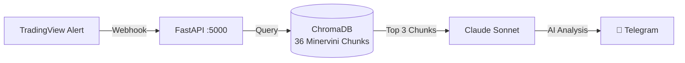

# 📈 TradingView Webhook Server

Hệ thống tự động nhận tín hiệu từ **TradingView Alerts**, thực thi lệnh trên **Binance**, ghi log vào **SQLite**, và thông báo real-time qua **Telegram/Discord**.

> Dựa trên chiến lược **SEPA (Specific Entry Point Analysis)** của **Mark Minervini**.

---

## 🏗️ Architecture

```
TradingView Alert (Pine Script v5)
        │
        ▼
  Cloudflare Tunnel
        │
        ▼
  FastAPI Webhook Server (:5000)
        │
        ├── 🔐 IP Whitelist + Secret Auth
        ├── 💾 SQLite (signals + trades)
        ├── 🧠 RAG Agent (ChromaDB + Claude)  ← [P5 NEW]
        ├── 📊 Binance Order Execution
        └── 📱 Telegram / Discord Notification
```

---

## ⚡ Quick Start

```bash
cd server
pip install -r requirements.txt
cp .env.example .env       # Cấu hình API keys
python main.py             # Start server on :5000
```

---

## 📂 Project Structure

```
TradingViewProject/
├── server/
│   ├── main.py              # FastAPI v5.0 (Webhook + RAG endpoints)
│   ├── rag.py               # [P5] RAG module (ChromaDB + Claude)
│   ├── config.py            # Environment config
│   ├── database.py          # SQLite async operations
│   ├── notifier.py          # Telegram + Discord notifications
│   ├── requirements.txt     # Python dependencies
│   ├── .env.example         # Environment template
│   ├── chroma_db/           # [P5] Vector database (auto-generated)
│   └── static/
│       └── dashboard.html   # Performance Dashboard UI
│
├── pine/                    # Pine Script v5 strategies
│   ├── V1/                  # Trend Template Indicator
│   └── V2/                  # SEPA Strategy (Backtest)
│
├── docs/
│   ├── knowledge/
│   │   └── trading_wizard/
│   │       ├── chunks/      # 36 Minervini knowledge chunks (RAG source)
│   │       ├── mindmaps/    # Strategy mind maps
│   │       └── index.md
│   ├── RAG_ARCHITECTURE_FLOW.md
│   └── TRADINGVIEW_ALERT_SETUP.md
│
├── architecture_mermaid.md  # [P5] Sơ đồ kiến trúc RAG (Mermaid)
├── implementation_log.md    # [P5] Log triển khai + checklist
└── README.md                # ← Bạn đang đọc file này
```

---

## 🔌 API Endpoints

| Method | Endpoint | Mô tả |
|--------|----------|-------|
| `GET`  | `/` | Dashboard UI |
| `GET`  | `/tv_health_check` | Health check + RAG status |
| `POST` | `/webhook` | Nhận TradingView alerts |
| `GET`  | `/trades` | Lịch sử giao dịch |
| `GET`  | `/trades/stats` | Win Rate, Profit Factor, Drawdown |
| `GET`  | `/trades/equity` | Equity curve data (Chart.js) |
| `GET`  | `/api/rag/query?q=...` | **[P5]** Test truy vấn Knowledge Base |
| `GET`  | `/api/rag/status` | **[P5]** Trạng thái Vector DB |

---

## 🧠 P5 — RAG & AI Agent (Knowledge Base Integration)

### Tổng quan

Hệ thống RAG cho phép AI Agent tự động tra cứu bộ quy tắc của Mark Minervini mỗi khi nhận tín hiệu giao dịch từ TradingView. Kết quả phân tích được gửi kèm thông báo qua Telegram.



### Cách hoạt động

1. **TradingView** bắn webhook khi Pine Script phát hiện VCP/Trend Template/Volume Surge
2. **RAG Query Builder** tự động tạo câu truy vấn ngữ nghĩa từ payload
3. **ChromaDB** tìm 3 đoạn kiến thức Minervini liên quan nhất (cosine similarity)
4. **Claude** phân tích tín hiệu + context → đưa ra khuyến nghị Mua/Bán/Chờ
5. **Telegram** nhận báo cáo đầy đủ kèm phân tích AI

### Config RAG trong `.env`

```env
ANTHROPIC_API_KEY=sk-ant-xxxxxxxxxxxxxxxx
RAG_ENABLED=true
RAG_TOP_K=3
```

### Dependencies P5

| Package | Chức năng |
|---------|----------|
| `chromadb` ≥0.5.0 | Vector Database (offline, persistent) |
| `sentence-transformers` ≥3.0.0 | Embedding multilingual (tiếng Việt) |
| `anthropic` ≥0.25.0 | Claude API client |

> 📖 Chi tiết: xem [`architecture_mermaid.md`](architecture_mermaid.md) và [`implementation_log.md`](implementation_log.md)

---

## 📋 Webhook Payload (TradingView)

```json
{
  "secret": "your_super_secret_key",
  "action": "{{strategy.order.action}}",
  "symbol": "{{ticker}}",
  "price": "{{close}}",
  "quoteQty": 50,
  "time": "{{timenow}}"
}
```

Xem chi tiết: [`docs/TRADINGVIEW_ALERT_SETUP.md`](docs/TRADINGVIEW_ALERT_SETUP.md)

---

## 🗺️ Roadmap

- [x] Sprint 1: FastAPI Async + IP Whitelist middleware
- [x] Sprint 2: Dynamic order sizing + Async Binance
- [x] Sprint 3: Real-time Telegram/Discord notifications
- [x] Sprint 4: Trade Logging SQLite ✅
- [x] Sprint 5: TradingView MCP Integration ✅
- [x] Sprint 6: Performance Dashboard (Web UI) ✅
- [x] **P5: RAG & Vector Database — ChromaDB + Claude AI ✅**
- [ ] P6: Multi-strategy Support (RSI, MACD, Custom)
- [ ] P7: Portfolio Risk Management Module
- [ ] P8: Production Deployment (VPS + CI/CD)

---

## 📚 References

- Mark Minervini — *Trade Like a Stock Market Wizard*
- Mark Minervini — *Think & Trade Like a Champion*
- [Pine Script v5 Manual](https://www.tradingview.com/pine-script-docs/)
- [Anthropic Claude API Docs](https://docs.anthropic.com/)
- [ChromaDB Documentation](https://docs.trychroma.com/)
