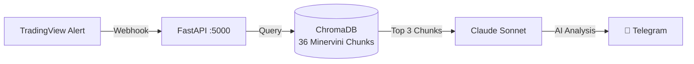
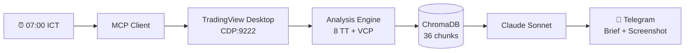

# 📈 TradingView Webhook Server — v6.0

Hệ thống tự động nhận tín hiệu từ **TradingView Alerts**, thực thi lệnh trên **Binance**, phân tích bằng **RAG AI Agent**, scan **Trend Template + VCP**, và gửi **Morning Brief** tự động qua Telegram.

> Dựa trên chiến lược **SEPA (Specific Entry Point Analysis)** của **Mark Minervini**.

---

## 🏗️ Architecture

```
TradingView Alert (Pine Script v5)
        │
        ▼
  Cloudflare Tunnel
        │
        ▼
  FastAPI Webhook Server v6.0 (:5000)
        │
        ├── 🔐 IP Whitelist + Secret Auth
        ├── 💾 SQLite (signals + trades)
        ├── 🧠 RAG Agent (ChromaDB + Claude)          ← [P5]
        ├── 🖥️ TradingView MCP (CDP:9222)              ← [P6 NEW]
        │     ├── Trend Template Scanner (8 criteria)
        │     ├── VCP Detector (volume + range)
        │     └── Chart Screenshot capture
        ├── ⏰ Morning Brief Scheduler (07:00 ICT)     ← [P6 NEW]
        ├── 📊 Binance Order Execution
        └── 📱 Telegram / Discord (text + screenshot)
```

---

## ⚡ Quick Start

```bash
cd server
pip install -r requirements.txt
cp .env.example .env       # Cấu hình API keys
python main.py             # Start server on :5000
```

---

## 📂 Project Structure

```
TradingViewProject/
├── server/
│   ├── main.py              # FastAPI v6.0 (17 endpoints)
│   ├── rag.py               # [P5] RAG module (ChromaDB + Claude)
│   ├── mcp_client.py        # [P6] TradingView MCP wrapper (CDP)
│   ├── watchlist.py         # [P6] Watchlist CRUD + JSON persistence
│   ├── analysis.py          # [P6] Trend Template + VCP detector
│   ├── brief.py             # [P6] Morning Brief orchestrator
│   ├── scheduler.py         # [P6] APScheduler cron (07:00 ICT)
│   ├── config.py            # Environment config
│   ├── database.py          # SQLite async operations
│   ├── notifier.py          # Telegram (text + photo) + Discord
│   ├── requirements.txt     # Python dependencies
│   ├── .env.example         # Environment template
│   └── static/
│       └── dashboard.html   # Performance Dashboard UI
│
├── tradingview-mcp/         # [P6] Git submodule — CDP bridge
│
├── pine/                    # Pine Script v5 strategies
│   ├── V1/                  # Trend Template Indicator
│   └── V2/                  # SEPA Strategy (Backtest)
│
├── docs/
│   ├── knowledge/
│   │   └── trading_wizard/
│   │       ├── chunks/      # 36 Minervini knowledge chunks (RAG source)
│   │       ├── mindmaps/    # Strategy mind maps
│   │       └── index.md
│   ├── RAG_ARCHITECTURE_FLOW.md
│   ├── TRADINGVIEW_ALERT_SETUP.md
│   └── plans/
│       ├── P4/README.md     # [P4] FastAPI Production Server
│       ├── P5/              # [P5] RAG architecture + implementation log
│       └── P6/              # [P6] 4 sprint docs + README
│
└── README.md                # ← Bạn đang đọc file này
```

---

## 🔌 API Endpoints

### Core
| Method | Endpoint | Mô tả |
|--------|----------|-------|
| `GET`  | `/` | Dashboard UI |
| `GET`  | `/tv_health_check` | Health check + version + feature flags |
| `POST` | `/webhook` | Nhận TradingView alerts |
| `GET`  | `/trades` | Lịch sử giao dịch |
| `GET`  | `/trades/stats` | Win Rate, Profit Factor, Drawdown |
| `GET`  | `/trades/equity` | Equity curve data (Chart.js) |

### P5 — RAG
| Method | Endpoint | Mô tả |
|--------|----------|-------|
| `GET`  | `/api/rag/query?q=...` | Truy vấn Knowledge Base |
| `GET`  | `/api/rag/status` | Trạng thái Vector DB |

### P6 — MCP + Morning Brief
| Method | Endpoint | Mô tả |
|--------|----------|-------|
| `GET`  | `/api/mcp/status` | CDP connection health |
| `GET`  | `/api/watchlist` | List symbols |
| `POST` | `/api/watchlist` | Add symbol `{"symbol": "FPT"}` |
| `DELETE`| `/api/watchlist/{symbol}` | Remove symbol |
| `PUT`  | `/api/watchlist/sync` | Sync từ TradingView Desktop |
| `GET`  | `/api/scan/watchlist` | Trend Template + VCP scan |
| `POST` | `/api/brief/trigger` | Chạy Morning Brief ngay |
| `GET`  | `/api/brief/latest` | Xem brief mới nhất |

---

## 🧠 P5 — RAG & AI Agent (Knowledge Base Integration)

### Tổng quan

Hệ thống RAG cho phép AI Agent tự động tra cứu bộ quy tắc của Mark Minervini mỗi khi nhận tín hiệu giao dịch từ TradingView. Kết quả phân tích được gửi kèm thông báo qua Telegram.



### Cách hoạt động

1. **TradingView** bắn webhook khi Pine Script phát hiện VCP/Trend Template/Volume Surge
2. **RAG Query Builder** tự động tạo câu truy vấn ngữ nghĩa từ payload
3. **ChromaDB** tìm 3 đoạn kiến thức Minervini liên quan nhất (cosine similarity)
4. **Claude** phân tích tín hiệu + context → đưa ra khuyến nghị Mua/Bán/Chờ
5. **Telegram** nhận báo cáo đầy đủ kèm phân tích AI

### Config RAG trong `.env`

```env
ANTHROPIC_API_KEY=sk-ant-xxxxxxxxxxxxxxxx
RAG_ENABLED=true
RAG_TOP_K=3
```

### Dependencies P5

| Package | Chức năng |
|---------|----------|
| `chromadb` ≥0.5.0 | Vector Database (offline, persistent) |
| `sentence-transformers` ≥3.0.0 | Embedding multilingual (tiếng Việt) |
| `anthropic` ≥0.25.0 | Claude API client |

> 📖 Chi tiết: xem [`architecture_mermaid.md`](docs/plans/P5/architecture_mermaid.md) và [`implementation_log.md`](docs/plans/P5/implementation_log.md)

---

## 🖥️ P6 — TradingView MCP × Morning Brief

### Tổng quan

Tích hợp **TradingView Desktop** qua Chrome DevTools Protocol (CDP), kết hợp với RAG System để tạo:
- **Morning Brief tự động** (07:00 ICT) — scan watchlist, chấm Trend Template, phát hiện VCP, gửi Telegram kèm screenshot chart
- **Watchlist Scanner API** — CRUD symbols, scan on-demand
- **Analysis Engine** — 8 tiêu chí Minervini Trend Template + VCP detector



### Config P6 trong `.env`

```env
MCP_ENABLED=true
BRIEF_ENABLED=true
BRIEF_CRON_TIME=07:00
WATCHLIST_SYMBOLS=BTCUSDT,ETHUSDT,SOLUSDT
```

### Dependencies P6

| Package | Chức năng |
|---------|----------|
| `apscheduler` ≥3.10.4 | Cron scheduler (07:00 ICT daily) |
| `pillow` ≥10.0.0 | Image processing cho screenshot |
| `requests` ≥2.31.0 | Telegram photo upload |

> 📖 Chi tiết: xem [`docs/plans/P6/`](docs/plans/P6/) (4 sprint docs)

---

## 📋 Webhook Payload (TradingView)

```json
{
  "secret": "your_super_secret_key",
  "action": "{{strategy.order.action}}",
  "symbol": "{{ticker}}",
  "price": "{{close}}",
  "quoteQty": 50,
  "time": "{{timenow}}"
}
```

Xem chi tiết: [`docs/TRADINGVIEW_ALERT_SETUP.md`](docs/TRADINGVIEW_ALERT_SETUP.md)

---

## 🗺️ Roadmap

### ✅ Completed
- [x] P4 Sprint 1: FastAPI Async + IP Whitelist middleware
- [x] P4 Sprint 2: Dynamic order sizing + Async Binance (aiohttp)
- [x] P4 Sprint 3: Real-time Telegram/Discord notifications
- [x] P4 Sprint 4: Trade Logging SQLite
- [x] P4 Sprint 5: TradingView MCP submodule setup
- [x] P4 Sprint 6: Performance Dashboard (Web UI)
- [x] P4 Sprint 7: Server Testing (pytest)
- [x] **P5: RAG & Vector Database — ChromaDB + Claude AI**
- [x] **P6: TradingView MCP × RAG Morning Brief** ← NEW
  - [x] Sprint 6.1: MCP Foundation (MCPClient wrapper)
  - [x] Sprint 6.2: Watchlist Management (CRUD + JSON)
  - [x] Sprint 6.3: Analysis Engine (Trend Template + VCP)
  - [x] Sprint 6.4: Morning Brief + Scheduler (07:00 ICT)

### 🚧 In Progress
- [ ] **feat/p6-mcp-morning-brief** — End-to-end test with TradingView Desktop
- [ ] **feat/minervini-strategy** — Pine Script V2 Backtest + VCP

### 🗓️ Planned — Binance SDK Upgrade
- [ ] **feat/binance-oco-orders** — OCO Orders: Stop-Loss + Take-Profit tự động
- [ ] **feat/binance-websocket-stream** — WebSocket real-time price stream
- [ ] **feat/binance-futures-margin** — Futures / Margin trading support

### 🔭 Backlog
- [ ] P7: Portfolio Risk Management Module
- [ ] P8: Production Deployment (VPS + CI/CD)
- [ ] P9: Multi-strategy Support (RSI, MACD, Custom)

---

## 📚 References

- Mark Minervini — *Trade Like a Stock Market Wizard*
- Mark Minervini — *Think & Trade Like a Champion*
- [Pine Script v5 Manual](https://www.tradingview.com/pine-script-docs/)
- [Anthropic Claude API Docs](https://docs.anthropic.com/)
- [ChromaDB Documentation](https://docs.trychroma.com/)
- [TradingView MCP (CDP)](https://github.com/tradesdontlie/tradingview-mcp)
- [APScheduler Docs](https://apscheduler.readthedocs.io/)
