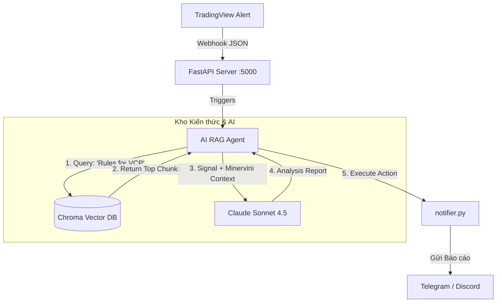
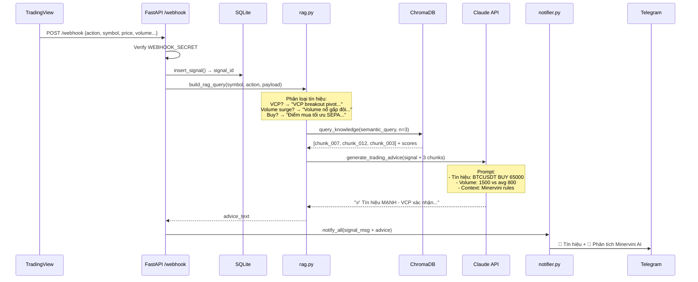

# Kiến trúc Hệ thống: Automated RAG Flow (TradingView & AI Agent)

Tài liệu này mô tả luồng kiến trúc (Architecture Flow) kết nối tín hiệu từ TradingView Webhook với Hệ thống Trí tuệ Nhân tạo (AI Agent) sử dụng cơ chế RAG (Retrieval-Augmented Generation). Mục đích là để AI tự động tra cứu bộ quy tắc của Mark Minervini (từ Knowledge Base) và phân tích tín hiệu giao dịch trước khi gửi thông báo.

## 1. Sơ đồ Luồng hoạt động (Architecture Flow)



## 2. Chi tiết các Bước thực thi

1. **TradingView bắn Webhook (Trigger):**
   - Khi công cụ Pine Script phát hiện tín hiệu (ví dụ: `VCP Breakout` hoặc đạt chuẩn `Trend Template`), TradingView bắn một gói dữ liệu JSON về server thông qua Cloudflare Tunnel (`localhost:5000/webhook`).

2. **Agent Nhận Tín Hiệu & Truy Vấn (Retrieval):**
   - Server FastAPI không gửi thông báo ngay. Thay vào đó, nó kích hoạt AI Agent.
   - Dựa trên loại tín hiệu (ví dụ: VCP), Agent tự động tạo truy vấn tìm kiếm và gọi vào **Vector Database** (được xây dựng từ các file `chunks` Markdown của cuốn sách).
   - Vector DB tính toán độ tương đồng và trả về 2-3 đoạn trích dẫn luật giao dịch chuẩn xác nhất liên quan đến điểm mua VCP.

3. **LLM Phân Tích (Generation):**
   - Agent nạp Dữ liệu Tín Hiệu (Mã cổ phiếu, Giá, Volume) + Dữ liệu Kiến Thức (Đoạn trích luật Minervini) vào cho LLM (Large Language Model).
   - LLM sẽ đóng vai trò là một chuyên gia giao dịch, đối chiếu tín hiệu thực tế với lý thuyết trong sách để đánh giá chất lượng của tín hiệu này (Tốt, Xấu, Cần lưu ý gì).

4. **Gửi Báo Cáo (Action):**
   - Thông qua module `notifier.py`, hệ thống đẩy một bản báo cáo phân tích chuyên sâu (kèm đánh giá của AI) về điện thoại của người dùng qua Telegram hoặc Discord.

---

## 3. Triển khai P5 (Đã hoàn thành ✅)

### Tech Stack

| Thành phần | Công nghệ | Vai trò |
|-----------|-----------|---------|
| Vector DB | **ChromaDB** (local, persistent) | Lưu trữ và truy vấn embedding vectors |
| Embedding | **sentence-transformers** (`paraphrase-multilingual-MiniLM-L12-v2`) | Chuyển text → vectors, hỗ trợ tiếng Việt |
| LLM | **Claude Sonnet** (`claude-sonnet-4-5` via Anthropic API) | Phân tích tín hiệu dựa trên context Minervini |
| Framework | **FastAPI v5.0** | Webhook server + RAG endpoints |

### Files đã triển khai

```
server/
├── rag.py              ← [NEW] RAG core module
│   ├── init_vector_db()          # Embed 36 chunks → ChromaDB (startup)
│   ├── query_knowledge()         # Semantic search (cosine similarity)
│   ├── build_rag_query()         # Tạo query từ webhook payload
│   └── generate_trading_advice() # Gọi Claude phân tích
│
├── config.py           ← [UPDATED] + ANTHROPIC_API_KEY, KNOWLEDGE_DIR, RAG_ENABLED
├── main.py             ← [UPDATED] v5.0 + RAG lifespan + /api/rag/* endpoints
├── requirements.txt    ← [UPDATED] + chromadb, sentence-transformers, anthropic
└── .env.example        ← [UPDATED] + RAG config section
```

### API Endpoints mới

| Method | Endpoint | Mô tả |
|--------|----------|-------|
| `GET` | `/api/rag/query?q=VCP+breakout&n=3` | Test truy vấn Knowledge Base |
| `GET` | `/api/rag/status` | Kiểm tra trạng thái Vector DB |

### Cấu hình `.env`

```env
ANTHROPIC_API_KEY=sk-ant-xxxxxxxxxxxxxxxx
RAG_ENABLED=true
RAG_TOP_K=3
```

---

## 4. Sơ đồ chi tiết: Webhook Processing Flow



---

## 5. Tài liệu liên quan

- [`docs/plans/P5/architecture_mermaid.md`](plans/P5/architecture_mermaid.md) — 5 sơ đồ Mermaid chi tiết
- [`docs/plans/P5/implementation_log.md`](plans/P5/implementation_log.md) — Log kỹ thuật & checklist deploy
- [`docs/TRADINGVIEW_ALERT_SETUP.md`](TRADINGVIEW_ALERT_SETUP.md) — Hướng dẫn setup TradingView Alert
