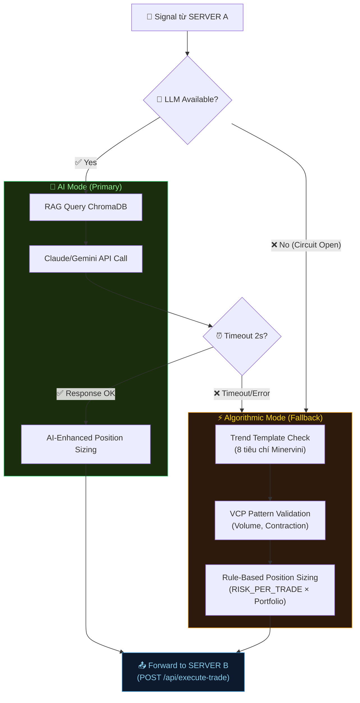

# 🛡️ V2 Operational Hardening Report
## 5 Điểm Kỹ Thuật Nghiêm Trọng Khi Triển Khai 3-Server Pipeline Forwarding

> **Version:** 2.0-RC1 | **Date:** 2026-05-29  
> **Classification:** ⚠️ PRE-DEPLOYMENT MANDATORY  
> **Applies to:** SERVER A (Gateway) · SERVER C (AI Core) · SERVER B (Execution Vault)

---

## 📋 MỤC LỤC

1. [NTP Time Synchronization](#1-ntp-time-synchronization)
2. [Tối Ưu Luồng Poll (Long Polling / WebSocket)](#2-tối-ưu-luồng-poll)
3. [Fail-safe LLM API Calls & Algorithmic Fallback](#3-fail-safe-llm-api-calls)
4. [Log Rotation — Giới Hạn Dung Lượng Log](#4-log-rotation)
5. [Keep-Alive & Liveness Check Bên Ngoài](#5-keep-alive--liveness-check)
6. [Checklist Triển Khai V2](#6-checklist-triển-khai-v2)

---

## 1. NTP Time Synchronization

### 1.1 Phân Tích Rủi Ro

> [!CAUTION]
> **Severity: 🔴 CRITICAL** — Clock drift giữa 3 server có thể gây ra:
> - Signal bị đánh dấu STALE sai (SERVER A ghi `received_at` sớm hơn thực tế → SERVER C tính `age_minutes` quá cao)
> - Lệnh bị sàn giao dịch **từ chối** do timestamp trong request quá lệch so với server time của sàn (Binance cho phép tối đa ±1000ms)
> - Position Sizing sai do dữ liệu nến (candle) bị lệch khung thời gian

### 1.2 Ma Trận Tác Động

| Hiện tượng | Clock Drift | Hậu quả |
|-----------|------------|---------|
| Signal bị STALE giả | A sớm hơn C > 30s | Tín hiệu hợp lệ bị bỏ qua |
| Lệnh bị sàn reject | B lệch sàn > 1000ms | `TimestampException` → TradeFailed |
| Candle data sai | C lệch A > 5s | VCP/Breakout tính sai pivot |
| Audit log lộn xộn | Bất kỳ | Không trace được luồng xử lý |

### 1.3 Giải Pháp Triển Khai

#### SERVER A & C (Linux — systemd-timesyncd / chrony)

```bash
# ═══════════════════════════════════════════════════════
# Phương án 1: systemd-timesyncd (Đủ cho hầu hết trường hợp)
# ═══════════════════════════════════════════════════════

# Kiểm tra trạng thái hiện tại
timedatectl status

# Cấu hình NTP servers
sudo tee /etc/systemd/timesyncd.conf << 'EOF'
[Time]
NTP=0.pool.ntp.org 1.pool.ntp.org 2.pool.ntp.org 3.pool.ntp.org
FallbackNTP=time.google.com time.cloudflare.com
PollIntervalMinSec=32
PollIntervalMaxSec=2048
EOF

# Kích hoạt
sudo systemctl enable --now systemd-timesyncd
sudo timedatectl set-ntp true

# Verify
timedatectl timesync-status
# → Server: 0.pool.ntp.org
# → Offset: +0.000234s  ← Phải < 50ms


# ═══════════════════════════════════════════════════════
# Phương án 2: chrony (Chính xác hơn, khuyến nghị cho trading)
# ═══════════════════════════════════════════════════════

sudo apt install chrony -y

sudo tee /etc/chrony/chrony.conf << 'EOF'
# NTP Sources — Ưu tiên server gần nhất
server 0.pool.ntp.org iburst
server 1.pool.ntp.org iburst
server time.google.com iburst prefer
server time.cloudflare.com iburst

# Cho phép đồng bộ lớn khi boot
makestep 1.0 3

# Ghi log drift
driftfile /var/lib/chrony/chrony.drift
logdir /var/log/chrony
log tracking measurements statistics

# Mức độ chính xác tối thiểu
maxdistance 0.1
EOF

sudo systemctl enable --now chrony
chronyc tracking
# → System time: 0.000000234 seconds fast  ← Microsecond accuracy
```

#### SERVER B (Windows Server — W32Time)

```powershell
# ═══════════════════════════════════════════════════════
# Windows Server NTP Configuration
# ═══════════════════════════════════════════════════════

# 1. Cấu hình NTP servers
w32tm /config /manualpeerlist:"0.pool.ntp.org,0x9 1.pool.ntp.org,0x9 time.google.com,0x9" /syncfromflags:manual /reliable:YES /update

# 2. Restart Windows Time service
Restart-Service w32time

# 3. Force sync ngay lập tức
w32tm /resync /force

# 4. Kiểm tra trạng thái
w32tm /query /status
# → Leap Indicator: 0 (no warning)
# → Stratum: 3
# → Root Delay: 0.0156250s

# 5. Kiểm tra offset
w32tm /stripchart /computer:time.google.com /samples:5 /dataonly
# → Offset: +00.0002345s  ← Phải < 50ms

# 6. Thiết lập auto-sync mỗi 15 phút (thay vì mặc định 7 ngày!)
Set-ItemProperty -Path "HKLM:\SYSTEM\CurrentControlSet\Services\W32Time\TimeProviders\NtpClient" -Name "SpecialPollInterval" -Value 900 -Type DWord

# 7. Verify cấu hình
w32tm /query /configuration
```

### 1.4 Monitoring Script — Cross-Server Clock Drift Check

```python
# server/workers/ntp_monitor.py — Chạy trên SERVER C (cron mỗi 5 phút)
"""
Kiểm tra clock drift giữa 3 server.
Gửi alert Telegram nếu drift > 500ms.
"""
import asyncio
import httpx
import time
import logging

log = logging.getLogger(__name__)

SERVERS = {
    "SERVER_A": "http://100.x.x.1:5000/health",
    "SERVER_B": "http://100.x.x.2:5000/health",
}

DRIFT_THRESHOLD_MS = 500  # Alert nếu > 500ms

async def check_clock_drift():
    """So sánh timestamp trả về từ /health endpoint với thời gian local."""
    async with httpx.AsyncClient(timeout=5.0) as client:
        local_time = time.time()
        
        for name, url in SERVERS.items():
            try:
                resp = await client.get(url)
                remote_ts = resp.json().get("server_time_epoch", 0)
                
                if remote_ts:
                    drift_ms = abs(local_time - remote_ts) * 1000
                    
                    if drift_ms > DRIFT_THRESHOLD_MS:
                        log.critical(
                            f"⏰ CLOCK DRIFT ALERT: {name} drift = {drift_ms:.0f}ms "
                            f"(threshold: {DRIFT_THRESHOLD_MS}ms)"
                        )
                        # Gửi Telegram alert
                        await _send_drift_alert(name, drift_ms)
                    else:
                        log.info(f"⏰ {name} clock OK: drift = {drift_ms:.1f}ms")
                        
            except Exception as e:
                log.warning(f"⏰ Cannot reach {name} for clock check: {e}")

async def _send_drift_alert(server_name: str, drift_ms: float):
    """Gửi alert Telegram khi clock drift vượt ngưỡng."""
    import config
    msg = (
        f"🚨 <b>CLOCK DRIFT ALERT</b>\n\n"
        f"Server: <b>{server_name}</b>\n"
        f"Drift: <b>{drift_ms:.0f}ms</b>\n"
        f"Threshold: {DRIFT_THRESHOLD_MS}ms\n\n"
        f"⚠️ Hệ thống có thể gặp lỗi timestamp.\n"
        f"Kiểm tra NTP configuration ngay!"
    )
    # Sử dụng notifier module
    from notifier import notify_all
    await notify_all(msg)
```

### 1.5 Health Endpoint Enhancement

Cần bổ sung `server_time_epoch` vào response của `/health` trên cả 3 server:

```python
# Thêm vào mọi /health endpoint
import time

@router.get("/health")
async def health():
    return {
        "status": "healthy",
        "server_time_epoch": time.time(),        # ← THÊM
        "server_time_iso": datetime.utcnow().isoformat() + "Z",  # ← THÊM
        "uptime_seconds": int(time.time() - _START_TIME),
    }
```

---

## 2. Tối Ưu Luồng Poll

### 2.1 Phân Tích Rủi Ro

> [!WARNING]
> **Severity: 🟠 HIGH** — Short polling liên tục sẽ:
> - Tiêu hao CPU trên SERVER A (1U2G — rất ít tài nguyên) cho request trống
> - Tạo hàng nghìn log entries vô nghĩa mỗi ngày
> - Tăng latency không cần thiết (trung bình = poll_interval / 2)

### 2.2 So Sánh 3 Phương Án

| Phương án | Latency | CPU Server A | Độ phức tạp | Khuyến nghị |
|-----------|---------|-------------|-------------|-------------|
| **Short Polling** (hiện tại, 15-30s) | ~15s trung bình | 🔴 Cao (nhiều request trống) | ⭐ Đơn giản | ❌ Không nên cho V2 |
| **Long Polling** (hold 30s) | ~0-2s | 🟢 Rất thấp | ⭐⭐ Vừa phải | ✅ **Khuyến nghị V2** |
| **WebSocket Push** | ~0ms (real-time) | 🟢 Rất thấp | ⭐⭐⭐ Phức tạp | 🔮 V3 (tối ưu nhất) |

### 2.3 Phương Án Khuyến Nghị: Long Polling

```
SERVER C (Analyzer)                    SERVER A (Gateway)
    │                                      │
    │  GET /consume-long?timeout=30s       │
    │─────────────────────────────────────▶│
    │                                      │ ← Chờ tối đa 30s
    │                                      │    Nếu có signal mới
    │                                      │    → Trả về ngay lập tức
    │  200 [{signal data}]                 │
    │◀─────────────────────────────────────│
    │                                      │
    │  (Xử lý signal...)                   │
    │                                      │
    │  GET /consume-long?timeout=30s       │
    │─────────────────────────────────────▶│
    │                                      │ ← Không có signal
    │                                      │    Giữ kết nối 30s
    │  200 {"signals": [], "count": 0}     │    Timeout → trả về rỗng
    │◀─────────────────────────────────────│
    │                                      │
```

#### Implementation: VBS Long Polling Endpoint

```python
# vbs/router.py — Thêm endpoint Long Polling

import asyncio
from datetime import datetime

# In-memory event để notify khi có signal mới
_new_signal_event = asyncio.Event()

def notify_new_signal():
    """Gọi khi INSERT signal mới vào DB (trong /ingest)."""
    _new_signal_event.set()

@router.get("/consume-long")
async def consume_long_poll(
    consumer_id: str = Query(...),
    limit: int = Query(10, ge=1, le=100),
    timeout: int = Query(30, ge=5, le=60),  # Giữ kết nối tối đa N giây
    x_buffer_secret: str = Header(None, alias="X-Buffer-Secret"),
):
    """
    Long Polling endpoint — SERVER C gọi endpoint này.
    Nếu có signal PENDING → trả về ngay.
    Nếu không có → giữ kết nối tối đa `timeout` giây, trả về khi có signal mới.
    """
    verify_buffer_secret(x_buffer_secret)
    
    # 1. Kiểm tra ngay lập tức
    signals = await database.consume_signals(consumer_id, limit)
    if signals:
        return {"signals": signals, "count": len(signals), "waited_seconds": 0}
    
    # 2. Không có signal → chờ (Long Poll)
    _new_signal_event.clear()
    
    try:
        await asyncio.wait_for(_new_signal_event.wait(), timeout=timeout)
        # Signal mới đã đến! Fetch lại
        signals = await database.consume_signals(consumer_id, limit)
        return {"signals": signals, "count": len(signals), "waited_seconds": "instant"}
    except asyncio.TimeoutError:
        # Hết thời gian chờ, trả về rỗng
        return {"signals": [], "count": 0, "waited_seconds": timeout}


# Trong hàm ingest_signal() — trigger event khi có signal mới
@router.post("/ingest")
async def ingest_signal(request: Request, ...):
    # ... (logic hiện tại) ...
    queue_id, expires_at = await database.insert_signal(payload)
    
    # ← THÊM: Đánh thức Long Poll waiters
    notify_new_signal()
    
    return {"queued": True, "queue_id": queue_id, ...}
```

#### Implementation: Analyzer Worker sử dụng Long Polling

```python
# server/workers/vps_analyzer.py — Sử dụng long poll

class VpsAnalyzerWorker:
    """Analyzer Worker chạy trên SERVER C."""
    
    LONG_POLL_TIMEOUT = 30  # Giữ kết nối tối đa 30s
    
    async def poll_loop(self):
        """Main loop — sử dụng Long Polling thay vì Short Polling."""
        log.info("[Analyzer] Starting long-poll loop...")
        
        while True:
            try:
                signals = await self._long_poll()
                
                for signal in signals:
                    await self.analyze_and_forward(signal)
                    
            except asyncio.CancelledError:
                log.info("[Analyzer] Poll loop cancelled.")
                break
            except Exception as e:
                log.exception(f"[Analyzer] Error in poll loop: {e}")
                await asyncio.sleep(5)  # Back-off khi lỗi
    
    async def _long_poll(self) -> list:
        """Gọi /consume-long — kết nối sẽ giữ tối đa 30s."""
        url = f"{config.VPS_BUFFER_URL}/consume-long"
        params = {
            "consumer_id": "server-c-analyzer",
            "limit": 5,
            "timeout": self.LONG_POLL_TIMEOUT,
        }
        headers = {"X-Buffer-Secret": config.VPS_BUFFER_SECRET}
        
        async with httpx.AsyncClient() as client:
            resp = await client.get(
                url, params=params, headers=headers,
                timeout=self.LONG_POLL_TIMEOUT + 5  # HTTP timeout > long poll timeout
            )
            data = resp.json()
            return data.get("signals", [])
```

### 2.4 Lợi Ích So Với Short Polling

| Metric | Short Polling (15s) | Long Polling (30s) |
|--------|--------------------|--------------------|
| Requests/giờ (khi rảnh) | **240 req/h** | **~120 req/h** (giảm 50%) |
| CPU utilization Server A | ~5-8% liên tục | ~0.5% (gần như idle) |
| Signal delivery latency | ~7.5s trung bình | **< 1s** (gần real-time) |
| Log noise | Rất nhiều "0 signals" | Gần như không có |

---

## 3. Fail-safe LLM API Calls

### 3.1 Phân Tích Rủi Ro

> [!CAUTION]
> **Severity: 🔴 CRITICAL** — Nếu LLM API bị lỗi mà không có fallback:
> - Signal bị **kẹt** tại SERVER C — không bao giờ đến SERVER B
> - Cơ hội giao dịch breakout VCP **bị mất** hoàn toàn
> - Hàng chục signals bị queue up → khi LLM phục hồi → thực thi hàng loạt lệnh cũ (nguy hiểm!)

### 3.2 Ma Trận Lỗi LLM & Hành Vi Mong Muốn

| Lỗi | Tần suất | Timeout | Hành vi V2 |
|-----|----------|---------|------------|
| `429 Rate Limit` | Thường xuyên (burst) | — | Retry với exponential backoff (1s → 2s → 4s), max 3 lần |
| `500/502/503 Server Error` | Hiếm | — | Retry 1 lần → Fallback sang Algorithmic Mode |
| `ReadTimeout` (LLM chậm) | Trung bình | >2s | Abort → Fallback ngay lập tức |
| `ConnectionError` (mạng) | Rất hiếm | — | Fallback ngay → Alert Telegram |
| `AuthenticationError` (key sai) | Một lần | — | **BLOCK** — không fallback, cần fix config |

### 3.3 Kiến Trúc Dual-Mode: AI + Algorithmic Fallback



### 3.4 Implementation: Circuit Breaker + Timeout + Fallback

```python
# server/workers/ai_circuit_breaker.py

"""
Circuit Breaker cho LLM API calls.
Pattern: Closed → Open → Half-Open

- Closed: Mọi request đi qua LLM bình thường
- Open: LLM bị chặn hoàn toàn → Fallback sang Algorithmic Mode
- Half-Open: Thử 1 request → Nếu thành công → Đóng lại (Closed)
"""

import asyncio
import time
import logging
from enum import Enum
from dataclasses import dataclass, field

log = logging.getLogger(__name__)


class CircuitState(Enum):
    CLOSED = "closed"         # Bình thường — LLM hoạt động
    OPEN = "open"             # LLM bị lỗi — chặn hoàn toàn
    HALF_OPEN = "half_open"   # Đang thử phục hồi


@dataclass
class LLMCircuitBreaker:
    """Circuit Breaker bảo vệ hệ thống khỏi LLM downtime."""
    
    # Cấu hình
    failure_threshold: int = 3          # Số lần lỗi liên tiếp → mở circuit
    recovery_timeout_sec: float = 60.0  # Thời gian chờ trước khi thử lại
    call_timeout_sec: float = 2.0       # Timeout mỗi LLM call (2 giây!)
    
    # Trạng thái nội bộ
    state: CircuitState = CircuitState.CLOSED
    failure_count: int = 0
    last_failure_time: float = 0.0
    total_fallbacks: int = 0
    
    def is_available(self) -> bool:
        """Kiểm tra LLM có sẵn sàng không."""
        if self.state == CircuitState.CLOSED:
            return True
        
        if self.state == CircuitState.OPEN:
            # Đã đủ thời gian recovery chưa?
            elapsed = time.time() - self.last_failure_time
            if elapsed >= self.recovery_timeout_sec:
                log.info("[CircuitBreaker] Chuyển sang HALF_OPEN — thử gọi LLM...")
                self.state = CircuitState.HALF_OPEN
                return True
            return False
        
        if self.state == CircuitState.HALF_OPEN:
            return True  # Cho phép 1 request thử
        
        return False
    
    def record_success(self):
        """Ghi nhận LLM call thành công."""
        if self.state == CircuitState.HALF_OPEN:
            log.info("[CircuitBreaker] ✅ LLM phục hồi → CLOSED")
        self.state = CircuitState.CLOSED
        self.failure_count = 0
    
    def record_failure(self, error: str):
        """Ghi nhận LLM call thất bại."""
        self.failure_count += 1
        self.last_failure_time = time.time()
        
        if self.state == CircuitState.HALF_OPEN:
            log.warning(f"[CircuitBreaker] ❌ Half-open test failed: {error} → OPEN")
            self.state = CircuitState.OPEN
            return
        
        if self.failure_count >= self.failure_threshold:
            log.critical(
                f"[CircuitBreaker] 🚨 {self.failure_count} failures → OPEN "
                f"(fallback for {self.recovery_timeout_sec}s)"
            )
            self.state = CircuitState.OPEN
            self.total_fallbacks += 1


# Singleton instance
llm_breaker = LLMCircuitBreaker()
```

### 3.5 Implementation: Analyzer với Dual-Mode

```python
# server/workers/vps_analyzer.py — analyze_signal() method

import asyncio
import config
from workers.ai_circuit_breaker import llm_breaker

class VpsAnalyzerWorker:
    
    async def analyze_signal(self, signal: dict) -> dict:
        """
        Phân tích signal với AI Mode hoặc Algorithmic Fallback.
        Trả về payload đặt lệnh hoàn chỉnh.
        """
        symbol = signal["symbol"]
        action = signal["action"]
        price = signal.get("price", 0)
        payload = signal.get("payload", {})
        
        analysis_mode = "ai"
        rag_advice = ""
        ai_confidence = 0
        
        # ═══ AI MODE (Primary) ═══
        if llm_breaker.is_available():
            try:
                # 1. RAG Query — ChromaDB local (nhanh, không cần circuit breaker)
                from rag import query_knowledge, build_rag_query, generate_trading_advice
                
                rag_query = build_rag_query(symbol, action, payload)
                rag_chunks = query_knowledge(rag_query, n_results=3)
                
                # 2. LLM Call — CÓ timeout chặt chẽ
                rag_advice = await asyncio.wait_for(
                    generate_trading_advice(symbol, action, str(price), payload, rag_chunks),
                    timeout=llm_breaker.call_timeout_sec  # 2 giây!
                )
                
                # 3. Parse confidence từ AI response
                ai_confidence = self._extract_confidence(rag_advice)
                
                llm_breaker.record_success()
                analysis_mode = "ai"
                
            except asyncio.TimeoutError:
                llm_breaker.record_failure("LLM timeout (>2s)")
                log.warning(f"[Analyzer] ⏰ LLM timeout for {symbol}. Falling back to algorithmic mode.")
                analysis_mode = "algorithmic"
                
            except Exception as e:
                llm_breaker.record_failure(str(e))
                log.warning(f"[Analyzer] ❌ LLM error for {symbol}: {e}. Falling back.")
                analysis_mode = "algorithmic"
        else:
            analysis_mode = "algorithmic"
            log.info(f"[Analyzer] ⚡ Circuit OPEN — Using algorithmic mode for {symbol}")
        
        # ═══ ALGORITHMIC MODE (Fallback) ═══
        if analysis_mode == "algorithmic":
            rag_advice, ai_confidence = self._algorithmic_analysis(signal)
        
        # ═══ POSITION SIZING (Chung cho cả 2 mode) ═══
        quantity = self._calculate_position_size(price, action)
        sl_price, tp_price = self._calculate_sl_tp(price, action)
        
        return {
            "symbol": symbol,
            "action": action,
            "price": price,
            "quantity": quantity,
            "sl_price": sl_price,
            "tp_price": tp_price,
            "exchange": signal.get("exchange", config.DEFAULT_EXCHANGE),
            "rag_advice": rag_advice,
            "ai_confidence": ai_confidence,
            "analysis_mode": analysis_mode,  # "ai" hoặc "algorithmic"
            "vbs_queue_id": signal["queue_id"],
        }
    
    def _algorithmic_analysis(self, signal: dict) -> tuple[str, int]:
        """
        Phân tích thuần thuật toán — KHÔNG cần LLM.
        Dựa trên 8 tiêu chí Trend Template của Minervini.
        """
        payload = signal.get("payload", {})
        symbol = signal["symbol"]
        action = signal["action"]
        price = signal.get("price", 0)
        
        checks = []
        score = 0
        total = 5  # Số tiêu chí kiểm tra
        
        # 1. Volume Check
        volume = float(payload.get("volume", 0) or 0)
        volume_avg = float(payload.get("volume_avg", 0) or 0)
        if volume_avg > 0 and volume > volume_avg * 1.5:
            checks.append("✅ Volume > 150% trung bình (Breakout confirmation)")
            score += 1
        elif volume_avg > 0:
            checks.append(f"⚠️ Volume = {volume/volume_avg*100:.0f}% trung bình")
        else:
            checks.append("⬜ Volume data không có")
        
        # 2. RSI Check
        rsi = float(payload.get("rsi", 0) or 0)
        if 50 < rsi < 80:
            checks.append(f"✅ RSI = {rsi:.0f} (Vùng momentum tích cực)")
            score += 1
        elif rsi >= 80:
            checks.append(f"⚠️ RSI = {rsi:.0f} (Quá mua — cẩn thận)")
        elif rsi > 0:
            checks.append(f"⬜ RSI = {rsi:.0f} (Chưa đủ momentum)")
        
        # 3. Signal Type Check
        alert_type = payload.get("alert_type", "").lower()
        if "vcp" in alert_type or "breakout" in alert_type:
            checks.append("✅ Pattern: VCP/Breakout detected")
            score += 1
        elif "trend" in alert_type:
            checks.append("✅ Pattern: Trend Template confirmed")
            score += 1
        else:
            checks.append(f"⬜ Pattern: {alert_type or 'generic'}")
        
        # 4. Price vs SL distance
        sl = float(payload.get("sl", 0) or 0)
        if sl > 0 and price > 0:
            risk_pct = abs(price - sl) / price * 100
            if risk_pct <= 8:  # Minervini max 8% SL
                checks.append(f"✅ Risk = {risk_pct:.1f}% (≤ 8% Minervini rule)")
                score += 1
            else:
                checks.append(f"⚠️ Risk = {risk_pct:.1f}% (> 8% — vượt ngưỡng)")
        
        # 5. Action validation
        if action in ("buy", "sell"):
            checks.append(f"✅ Action = {action.upper()} (hợp lệ)")
            score += 1
        
        # Tính confidence
        confidence = int(score / total * 100) if total > 0 else 50
        
        # Build report
        advice = (
            f"⚡ **ALGORITHMIC MODE** (LLM unavailable)\n\n"
            f"📊 Điểm: {score}/{total} ({confidence}%)\n\n"
            + "\n".join(checks)
            + f"\n\n{'✅ PASS — Đủ điều kiện đặt lệnh' if score >= 3 else '❌ FAIL — Chưa đủ tiêu chí'}"
        )
        
        return advice, confidence
    
    def _calculate_position_size(self, price: float, action: str) -> float:
        """Tính position size theo Minervini SEPA risk rules."""
        if not price or price <= 0:
            return 0.0
        
        portfolio = float(getattr(config, "MAX_QUOTE_QTY", 1000))
        risk_pct = float(getattr(config, "RISK_PER_TRADE", 0.02))
        sl_pct = float(getattr(config, "STOP_LOSS_PCT", 0.08))
        
        risk_amount = portfolio * risk_pct  # 2% of portfolio
        quantity = risk_amount / (price * sl_pct) if sl_pct > 0 else 0
        
        return round(quantity, 6)
    
    def _calculate_sl_tp(self, price: float, action: str) -> tuple[float, float]:
        """Tính SL/TP theo Minervini default ratios."""
        sl_pct = float(getattr(config, "STOP_LOSS_PCT", 0.08))
        tp_pct = float(getattr(config, "TAKE_PROFIT_PCT", 0.20))
        
        if action == "buy":
            sl = round(price * (1 - sl_pct), 2)
            tp = round(price * (1 + tp_pct), 2)
        else:
            sl = round(price * (1 + sl_pct), 2)
            tp = round(price * (1 - tp_pct), 2)
        
        return sl, tp
    
    def _extract_confidence(self, advice: str) -> int:
        """Trích xuất confidence score từ AI advice text."""
        advice_lower = advice.lower()
        if "mạnh" in advice_lower or "strong" in advice_lower:
            return 85
        elif "trung bình" in advice_lower or "medium" in advice_lower:
            return 60
        elif "yếu" in advice_lower or "weak" in advice_lower:
            return 30
        return 50
```

### 3.6 Cấu Hình Env Mới Cho Fail-safe

```dotenv
# ── LLM Fail-safe Configuration (Phase V2) ───────────
LLM_CALL_TIMEOUT_SEC=2              # Timeout mỗi LLM call
LLM_FAILURE_THRESHOLD=3             # Số lỗi liên tiếp → Circuit Open
LLM_RECOVERY_TIMEOUT_SEC=60         # Thời gian chờ trước khi thử lại
LLM_ALGORITHMIC_MIN_SCORE=3         # Score tối thiểu để pass Algorithmic Mode (3/5)
```

### 3.7 Telegram Alert Khi Chuyển Mode

```
🚨 LLM CIRCUIT BREAKER — OPEN

Hệ thống đã chuyển sang chế độ
⚡ ALGORITHMIC MODE (Thuần thuật toán)

Lý do: 3 lỗi LLM liên tiếp
Thời gian phục hồi: 60s
Tín hiệu vẫn được xử lý bình thường
(chỉ thiếu phân tích AI chi tiết)

────────────────────────────────
✅ LLM CIRCUIT BREAKER — RECOVERED

Hệ thống đã trở lại chế độ
🧠 AI MODE (RAG + LLM)

Tổng fallbacks hôm nay: 2
```

---

## 4. Log Rotation — Giới Hạn Dung Lượng Log

### 4.1 Phân Tích Rủi Ro

> [!CAUTION]
> **Severity: 🔴 CRITICAL** — Server 2GB RAM thường có đĩa cứng chỉ 10-20GB.
> Nếu ghi log 24/7 không kiểm soát:
> - Đĩa đầy → **SQLite crash** (database corruption, `disk I/O error`)
> - Uvicorn không thể ghi access log → process bị kill
> - Docker overlay storage đầy → container không thể restart
> - **Mất toàn bộ signal queue** nếu DB bị corrupt

### 4.2 Ước Tính Dung Lượng Log

| Source | Log rate (production) | Dung lượng/ngày | Dung lượng/tháng |
|--------|----------------------|----------------|------------------|
| Uvicorn access log | ~5000 req/ngày | ~5 MB | ~150 MB |
| Application log (INFO) | ~2000 lines/ngày | ~2 MB | ~60 MB |
| Application log (DEBUG) | ~50000 lines/ngày | ~50 MB | **~1.5 GB** 🔴 |
| SQLite WAL file | Tuỳ tải | 1-10 MB | Biến động |
| Docker container logs | ~3000 lines/ngày | ~3 MB | ~90 MB |
| **Tổng (DEBUG bật)** | | | **~1.8 GB/tháng** 🔴 |
| **Tổng (INFO only)** | | | **~300 MB/tháng** ✅ |

### 4.3 Giải Pháp: Log Level Production

```python
# server/config.py — Thêm cấu hình log level
import os

# ── Logging Configuration ─────────────────────────────────
# Production: INFO (mặc định) — chỉ log thông tin cần thiết
# Debug: DEBUG — chỉ bật khi cần troubleshoot
LOG_LEVEL = os.getenv("LOG_LEVEL", "INFO").upper()
LOG_FILE = os.getenv("LOG_FILE", "logs/trading.log")
LOG_MAX_SIZE_MB = int(os.getenv("LOG_MAX_SIZE_MB", "10"))     # Mỗi file log tối đa
LOG_BACKUP_COUNT = int(os.getenv("LOG_BACKUP_COUNT", "5"))     # Giữ tối đa N file
LOG_JSON_FORMAT = os.getenv("LOG_JSON_FORMAT", "false").lower() == "true"
```

### 4.4 Giải Pháp: Python RotatingFileHandler

```python
# server/logging_config.py — Structured Logging với Rotation

import logging
import logging.handlers
import json
import os
from datetime import datetime, timezone

import config


class StructuredFormatter(logging.Formatter):
    """JSON structured logging — dễ parse bằng tool monitoring."""
    
    def format(self, record):
        log_entry = {
            "ts": datetime.now(timezone.utc).isoformat(),
            "level": record.levelname,
            "logger": record.name,
            "msg": record.getMessage(),
            "module": record.module,
            "line": record.lineno,
        }
        if record.exc_info:
            log_entry["exception"] = self.formatException(record.exc_info)
        return json.dumps(log_entry, ensure_ascii=False)


def setup_logging():
    """Cấu hình logging với rotation cho production."""
    
    # Tạo thư mục logs nếu chưa có
    log_dir = os.path.dirname(config.LOG_FILE)
    if log_dir:
        os.makedirs(log_dir, exist_ok=True)
    
    # Root logger
    root = logging.getLogger()
    root.setLevel(getattr(logging, config.LOG_LEVEL, logging.INFO))
    
    # ── Console Handler (stdout — Docker captures this) ──
    console = logging.StreamHandler()
    console.setLevel(logging.INFO)  # Console luôn INFO
    console.setFormatter(logging.Formatter(
        "%(asctime)s [%(levelname)s] %(name)s: %(message)s",
        datefmt="%H:%M:%S"
    ))
    root.addHandler(console)
    
    # ── File Handler với Rotation ──
    max_bytes = config.LOG_MAX_SIZE_MB * 1024 * 1024  # MB → bytes
    
    file_handler = logging.handlers.RotatingFileHandler(
        filename=config.LOG_FILE,
        maxBytes=max_bytes,          # 10 MB mỗi file
        backupCount=config.LOG_BACKUP_COUNT,  # Giữ 5 file cũ
        encoding="utf-8",
    )
    file_handler.setLevel(getattr(logging, config.LOG_LEVEL, logging.INFO))
    
    # Chọn format: JSON (production) hoặc plaintext (dev)
    if config.LOG_JSON_FORMAT:
        file_handler.setFormatter(StructuredFormatter())
    else:
        file_handler.setFormatter(logging.Formatter(
            "%(asctime)s [%(levelname)s] %(name)s:%(lineno)d — %(message)s"
        ))
    
    root.addHandler(file_handler)
    
    # ── Giảm noise từ thư viện bên thứ 3 ──
    logging.getLogger("uvicorn.access").setLevel(logging.WARNING)
    logging.getLogger("httpx").setLevel(logging.WARNING)
    logging.getLogger("httpcore").setLevel(logging.WARNING)
    logging.getLogger("chromadb").setLevel(logging.WARNING)
    
    logging.info(
        f"Logging configured: level={config.LOG_LEVEL}, "
        f"file={config.LOG_FILE}, "
        f"max={config.LOG_MAX_SIZE_MB}MB × {config.LOG_BACKUP_COUNT} backups "
        f"(total max: {config.LOG_MAX_SIZE_MB * (config.LOG_BACKUP_COUNT + 1)}MB)"
    )
```

### 4.5 Giải Pháp: Linux logrotate (cho Docker logs)

```bash
# /etc/logrotate.d/trading-bot — Cấu hình trên SERVER A & C

/var/lib/docker/containers/*/*.log {
    daily
    rotate 7
    maxsize 10M
    compress
    delaycompress
    missingok
    notifempty
    copytruncate
}

/opt/trading-bot/logs/*.log {
    daily
    rotate 5
    maxsize 10M
    compress
    delaycompress
    missingok
    notifempty
    copytruncate
}
```

### 4.6 Docker Compose Log Limits

```yaml
# Thêm vào tất cả services trong docker-compose.server-{a,b,c}.yml
services:
  vbs:
    # ... (config hiện tại)
    logging:
      driver: "json-file"
      options:
        max-size: "10m"    # Mỗi log file tối đa 10MB
        max-file: "3"      # Giữ tối đa 3 file (30MB total)
```

### 4.7 Disk Space Monitoring Script

```python
# server/workers/disk_monitor.py — Chạy cron mỗi 30 phút

import shutil
import logging
import os

log = logging.getLogger(__name__)

DISK_WARNING_THRESHOLD_PCT = 80   # Warning khi > 80% dung lượng
DISK_CRITICAL_THRESHOLD_PCT = 90  # Critical khi > 90%

async def check_disk_usage():
    """Kiểm tra dung lượng đĩa, alert Telegram nếu sắp đầy."""
    total, used, free = shutil.disk_usage("/")
    
    used_pct = (used / total) * 100
    free_gb = free / (1024 ** 3)
    
    if used_pct >= DISK_CRITICAL_THRESHOLD_PCT:
        log.critical(f"🚨 DISK CRITICAL: {used_pct:.0f}% used, {free_gb:.1f}GB free")
        await _send_disk_alert("CRITICAL", used_pct, free_gb)
    elif used_pct >= DISK_WARNING_THRESHOLD_PCT:
        log.warning(f"⚠️ DISK WARNING: {used_pct:.0f}% used, {free_gb:.1f}GB free")
        await _send_disk_alert("WARNING", used_pct, free_gb)
    else:
        log.info(f"💾 Disk OK: {used_pct:.0f}% used, {free_gb:.1f}GB free")

    # Kiểm tra kích thước log directory
    log_dir = "logs/"
    if os.path.exists(log_dir):
        log_size = sum(
            os.path.getsize(os.path.join(log_dir, f))
            for f in os.listdir(log_dir)
            if os.path.isfile(os.path.join(log_dir, f))
        )
        log_size_mb = log_size / (1024 * 1024)
        log.info(f"📁 Log directory size: {log_size_mb:.1f}MB")

async def _send_disk_alert(severity: str, used_pct: float, free_gb: float):
    """Gửi alert Telegram khi disk sắp đầy."""
    icon = "🚨" if severity == "CRITICAL" else "⚠️"
    msg = (
        f"{icon} <b>DISK {severity}</b>\n\n"
        f"Dung lượng: <b>{used_pct:.0f}%</b> đã sử dụng\n"
        f"Còn trống: <b>{free_gb:.1f} GB</b>\n\n"
    )
    if severity == "CRITICAL":
        msg += (
            "⚠️ <b>HÀNH ĐỘNG CẦN THIẾT:</b>\n"
            "• Xoá log cũ: <code>rm logs/*.log.*</code>\n"
            "• Dọn Docker: <code>docker system prune -f</code>\n"
            "• Kiểm tra DB: <code>ls -lh data/*.db</code>"
        )
    from notifier import notify_all
    await notify_all(msg)
```

### 4.8 Cấu Hình Env

```dotenv
# ── Log Configuration (Phase V2) ─────────────────────
LOG_LEVEL=INFO                     # Production: INFO | Debug: DEBUG
LOG_FILE=logs/trading.log
LOG_MAX_SIZE_MB=10                 # Mỗi file log tối đa 10MB
LOG_BACKUP_COUNT=5                 # Giữ 5 file cũ (tổng: 60MB max)
LOG_JSON_FORMAT=false              # true = JSON structured logging
```

### 4.9 Tổng Dung Lượng Tối Đa Sau Cấu Hình

| Component | Max Size | Ghi chú |
|-----------|----------|---------|  
| Python app logs | 60 MB | 10MB × 6 files (current + 5 backups) |
| Docker container logs | 30 MB | 10MB × 3 files (per container) |
| SQLite DB (signal_queue) | ~50 MB | 10.000 signals |
| SQLite WAL | ~10 MB | Auto-checkpoint |
| **Tổng maximum** | **~150 MB** ✅ | An toàn cho đĩa 10-20GB |

---

## 5. Keep-Alive & Liveness Check Bên Ngoài

### 5.1 Phân Tích Rủi Ro

> [!WARNING]
> **Severity: 🟠 HIGH** — Nếu không có monitoring bên ngoài:
> - Gateway sập lúc 3:00 AM → Không ai biết đến sáng hôm sau
> - Signal TradingView bị mất liên tục mà không có cảnh báo
> - Docker restart không phải lúc nào cũng hoạt động (ví dụ: OOM kill, disk full)

### 5.2 Kiến Trúc Monitoring 2 Lớp

```
┌─────────────────────────────────────────────────────────┐
│              LỚP 1: EXTERNAL MONITORING                 │
│           (UptimeRobot / Cloudflare HTTP Monitor)        │
│                                                         │
│  ┌───────────┐  ┌───────────┐  ┌───────────┐           │
│  │ SERVER A  │  │ SERVER B  │  │ SERVER C  │           │
│  │ /health   │  │ /health   │  │ /health   │           │
│  │ (public)  │  │ (Tailscale│  │ (Tailscale│           │
│  │           │  │  only)    │  │  only)    │           │
│  └─────┬─────┘  └─────┬─────┘  └─────┬─────┘           │
│        │              │              │                  │
│   UptimeRobot    Internal Only  Internal Only           │
│   monitors       (Lớp 2 check)  (Lớp 2 check)          │
│   every 5 min                                           │
└─────────────────────────────────────────────────────────┘

┌─────────────────────────────────────────────────────────┐
│              LỚP 2: INTERNAL CROSS-CHECK                │
│           (Server C kiểm tra A và B mỗi 5 phút)        │
│                                                         │
│  SERVER C (8U16G — có dư tài nguyên) chạy:             │
│  • GET http://100.x.x.1:5000/health  → check A        │
│  • GET http://100.x.x.2:5000/health  → check B        │
│  • Nếu bất kỳ server nào không respond → Telegram      │
└─────────────────────────────────────────────────────────┘
```

### 5.3 External Monitoring: UptimeRobot (Free Tier)

**Cấu hình cho SERVER A (Gateway) — endpoint duy nhất có public access:**

| Cấu hình | Giá trị |
|----------|--------|
| Monitor Type | HTTP(s) |
| URL | `https://bot.yourdomain.com/health` |
| Monitoring Interval | 5 minutes |
| Alert Contacts | Telegram Bot hoặc Email |
| Keyword | `"healthy"` (Alert nếu không chứa keyword) |
| Timeout | 30 seconds |

**Lý do chỉ monitor SERVER A từ bên ngoài:**
- SERVER B và C chỉ accessible qua Tailscale (không có public endpoint)
- SERVER A là "cửa ngõ" — nếu A sập = toàn bộ pipeline bị gián đoạn

### 5.4 External Monitoring: Cloudflare HTTP Monitor (Nếu đã dùng CF Tunnel)

```
Cloudflare Dashboard → Notifications → HTTP Health Check

Endpoint: https://bot.yourdomain.com/health
Check Rate: Every 5 minutes
Regions: All
Expected Status: 200
Expected Body Contains: "healthy"
Notification: Telegram Webhook hoặc Email
```

### 5.5 Internal Liveness: Cross-Server Health Check

```python
# server/workers/liveness_monitor.py — Chạy trên SERVER C

"""
Liveness monitor — SERVER C kiểm tra sức khỏe của A và B.
Chạy mỗi 5 phút qua APScheduler.
Gửi Telegram alert khi bất kỳ server nào down.
"""

import asyncio
import httpx
import logging
import time
from dataclasses import dataclass, field
from typing import Dict

log = logging.getLogger(__name__)


@dataclass
class ServerHealth:
    """Track trạng thái sức khỏe của mỗi server."""
    name: str
    url: str
    consecutive_failures: int = 0
    last_success: float = 0.0
    last_check: float = 0.0
    is_healthy: bool = True


SERVERS = [
    ServerHealth(name="SERVER_A (Gateway)", url="http://100.x.x.1:5000/health"),
    ServerHealth(name="SERVER_B (Execution)", url="http://100.x.x.2:5000/health"),
]

ALERT_AFTER_FAILURES = 2  # Alert sau 2 lần check liên tiếp thất bại (10 phút)
RECOVERY_NOTIFY = True     # Gửi thông báo khi server phục hồi


async def run_liveness_check():
    """Kiểm tra sức khỏe tất cả server."""
    async with httpx.AsyncClient(timeout=10.0) as client:
        for server in SERVERS:
            server.last_check = time.time()
            
            try:
                resp = await client.get(server.url)
                data = resp.json()
                
                if resp.status_code == 200 and data.get("status") == "healthy":
                    # ✅ Server healthy
                    was_unhealthy = not server.is_healthy
                    server.is_healthy = True
                    server.consecutive_failures = 0
                    server.last_success = time.time()
                    
                    # Thông báo phục hồi
                    if was_unhealthy and RECOVERY_NOTIFY:
                        await _send_recovery_alert(server, data)
                    
                    log.info(
                        f"✅ {server.name} healthy "
                        f"(uptime: {data.get('uptime_seconds', 0)}s, "
                        f"pending: {data.get('pending_count', '?')})"
                    )
                else:
                    await _handle_failure(server, f"Unhealthy response: {data}")
                    
            except httpx.ConnectError:
                await _handle_failure(server, "Connection refused")
            except httpx.ReadTimeout:
                await _handle_failure(server, "Read timeout (>10s)")
            except Exception as e:
                await _handle_failure(server, str(e))


async def _handle_failure(server: ServerHealth, error: str):
    """Xử lý khi health check thất bại."""
    server.consecutive_failures += 1
    server.is_healthy = False
    
    log.warning(
        f"❌ {server.name} FAILED (attempt #{server.consecutive_failures}): {error}"
    )
    
    if server.consecutive_failures >= ALERT_AFTER_FAILURES:
        await _send_down_alert(server, error)


async def _send_down_alert(server: ServerHealth, error: str):
    """Gửi alert Telegram khi server down."""
    downtime_min = 0
    if server.last_success > 0:
        downtime_min = int((time.time() - server.last_success) / 60)
    
    msg = (
        f"🚨 <b>SERVER DOWN</b>\n\n"
        f"Server: <b>{server.name}</b>\n"
        f"URL: <code>{server.url}</code>\n"
        f"Lỗi: {error}\n"
        f"Failures: {server.consecutive_failures} liên tiếp\n"
        f"Downtime: ~{downtime_min} phút\n\n"
        f"⚠️ Signal pipeline có thể bị gián đoạn!"
    )
    from notifier import notify_all
    await notify_all(msg)


async def _send_recovery_alert(server: ServerHealth, health_data: dict):
    """Gửi alert Telegram khi server phục hồi."""
    msg = (
        f"✅ <b>SERVER RECOVERED</b>\n\n"
        f"Server: <b>{server.name}</b>\n"
        f"Status: healthy\n"
        f"Uptime: {health_data.get('uptime_seconds', 0)}s\n"
        f"Pending signals: {health_data.get('pending_count', '?')}"
    )
    from notifier import notify_all
    await notify_all(msg)
```

### 5.6 Enhanced `/health` Endpoint (Tất Cả Server)

```python
# Nâng cấp /health endpoint trên mọi server
import time
import platform
import psutil  # pip install psutil
from datetime import datetime, timezone

_START_TIME = time.time()

@router.get("/health")
async def health():
    """Comprehensive health check — hỗ trợ cả external và internal monitoring."""
    
    uptime_s = int(time.time() - _START_TIME)
    
    response = {
        "status": "healthy",
        "server_time_epoch": time.time(),
        "server_time_iso": datetime.now(timezone.utc).isoformat(),
        "uptime_seconds": uptime_s,
        "hostname": platform.node(),
    }
    
    # Database check
    try:
        pending_count = await database.get_pending_count()
        response["db"] = "ok"
        response["pending_count"] = pending_count
    except Exception as e:
        response["status"] = "degraded"
        response["db"] = f"error: {str(e)}"
    
    # System resources (nếu psutil có sẵn)
    try:
        response["system"] = {
            "cpu_percent": psutil.cpu_percent(interval=0),
            "memory_percent": psutil.virtual_memory().percent,
            "disk_percent": psutil.disk_usage('/').percent,
        }
    except Exception:
        pass  # psutil optional
    
    return response
```

### 5.7 Cấu Hình APScheduler Cho Monitoring Jobs

```python
# Thêm vào scheduler setup trên SERVER C
from apscheduler.schedulers.asyncio import AsyncIOScheduler

scheduler = AsyncIOScheduler()

# Liveness check mỗi 5 phút
scheduler.add_job(
    liveness_monitor.run_liveness_check,
    'interval', minutes=5,
    id='liveness_check',
    name='Cross-server liveness check'
)

# Disk monitor mỗi 30 phút
scheduler.add_job(
    disk_monitor.check_disk_usage,
    'interval', minutes=30,
    id='disk_check',
    name='Disk space monitor'
)

# Clock drift check mỗi 5 phút
scheduler.add_job(
    ntp_monitor.check_clock_drift,
    'interval', minutes=5,
    id='clock_drift_check',
    name='Cross-server clock drift check'
)
```

### 5.8 Bảng Tổng Hợp Monitoring

| Lớp | Công cụ | Target | Interval | Alert |
|-----|---------|--------|----------|-------|
| **External** | UptimeRobot | SERVER A `/health` | 5 phút | Email + Telegram |
| **External** | Cloudflare HTTP | SERVER A `/health` | 5 phút | Webhook |
| **Internal** | `liveness_monitor.py` | A + B (từ C) | 5 phút | Telegram |
| **Internal** | `ntp_monitor.py` | A + B (từ C) | 5 phút | Telegram |
| **Internal** | `disk_monitor.py` | Self (mỗi server) | 30 phút | Telegram |
| **Docker** | `healthcheck` directive | Self (container) | 30 giây | Docker restart |

---

## 6. Checklist Triển Khai V2

### 6.1 Pre-Deployment

| # | Hạng mục | Server | Trạng thái |
|---|----------|--------|-----------|
| 1 | NTP đồng bộ (chrony/w32time) | A, B, C | ☐ |
| 2 | Clock drift < 50ms giữa 3 server | All | ☐ |
| 3 | `/health` trả về `server_time_epoch` + `system` metrics | A, B, C | ☐ |
| 4 | Long polling endpoint `/consume-long` | A | ☐ |
| 5 | Analyzer sử dụng long poll thay short poll | C | ☐ |
| 6 | Circuit Breaker module tạo và test | C | ☐ |
| 7 | Algorithmic fallback logic test | C | ☐ |
| 8 | LLM timeout = 2s cấu hình | C | ☐ |
| 9 | Telegram alert cho drift & circuit events | All | ☐ |
| 10 | Python `RotatingFileHandler` cấu hình (10MB × 5) | A, B, C | ☐ |
| 11 | Docker Compose `logging.options` giới hạn (10m × 3) | A, B, C | ☐ |
| 12 | Linux `logrotate` cấu hình cho Docker logs | A, C | ☐ |
| 13 | `LOG_LEVEL=INFO` trong production `.env` | A, B, C | ☐ |
| 14 | UptimeRobot monitor cho SERVER A `/health` | External | ☐ |
| 15 | Liveness monitor script trên SERVER C | C | ☐ |
| 16 | Disk space monitor script | A, B, C | ☐ |

### 6.2 Post-Deployment Monitoring

| Metric | Ngưỡng Alert | Tần suất kiểm tra |
|--------|-------------|-------------------|
| Clock drift | > 500ms | Mỗi 5 phút |
| LLM response time P95 | > 1.5s | Real-time |
| Circuit breaker open events | > 0 | Real-time (Telegram) |
| Fallback mode duration | > 5 phút | Real-time |
| Server A CPU usage | > 70% | Mỗi 1 phút |
| Long poll queue depth | > 50 pending | Mỗi 30 giây |
| **Disk usage** | > 80% warning / > 90% critical | Mỗi 30 phút |
| **Log directory size** | > 100 MB | Mỗi 30 phút |
| **Server uptime** | Any server down > 10 min | Mỗi 5 phút |
| **External HTTP check** | Response ≠ 200 or missing "healthy" | Mỗi 5 phút |

---

> [!IMPORTANT]
> **Ưu tiên triển khai:** NTP (#1) → Fail-safe (#3) → Log Rotation (#4) → Liveness (#5) → Long Polling (#2)
> 
> NTP phải được setup **TRƯỚC KHI** deploy bất kỳ service nào lên production.
> Fail-safe cần có ngay từ ngày đầu để tránh mất signal.
> Log Rotation phải có trước khi chạy 24/7 để tránh disk full.
> Liveness check nên bật song song với deployment.
> Long Polling có thể upgrade sau khi hệ thống chạy ổn định.
