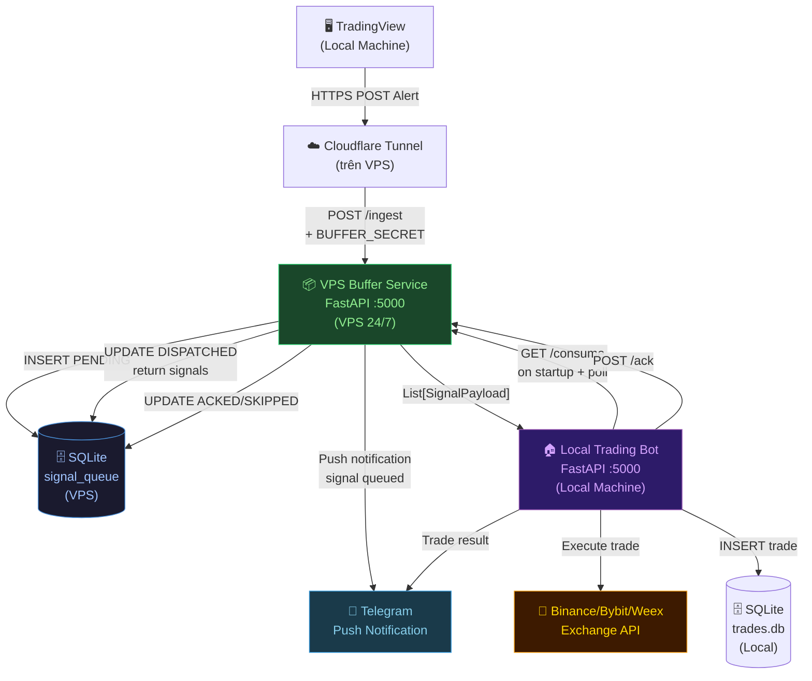
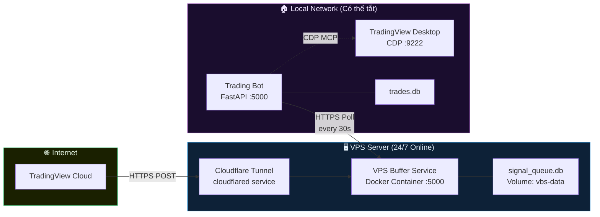
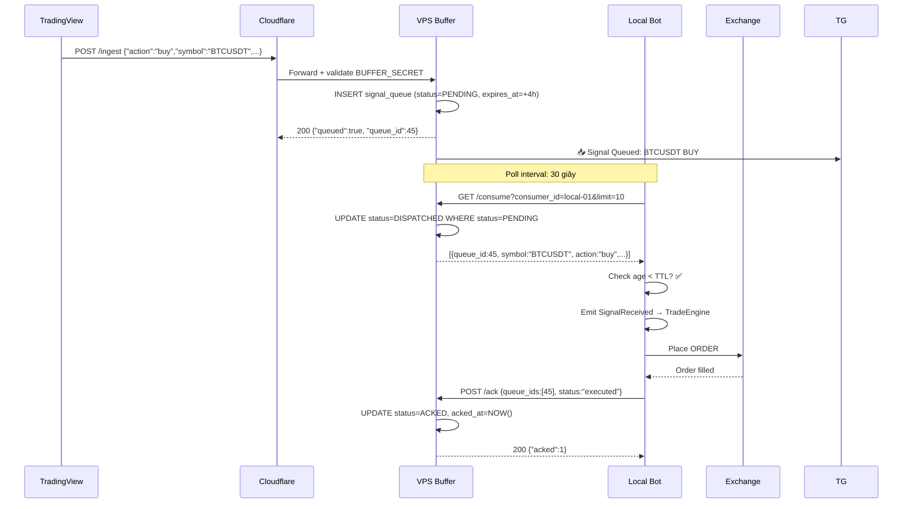
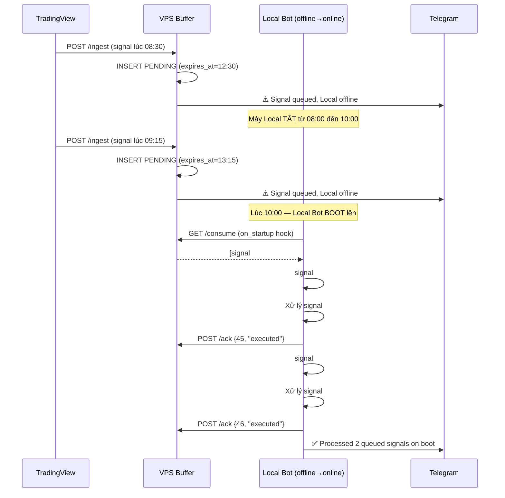
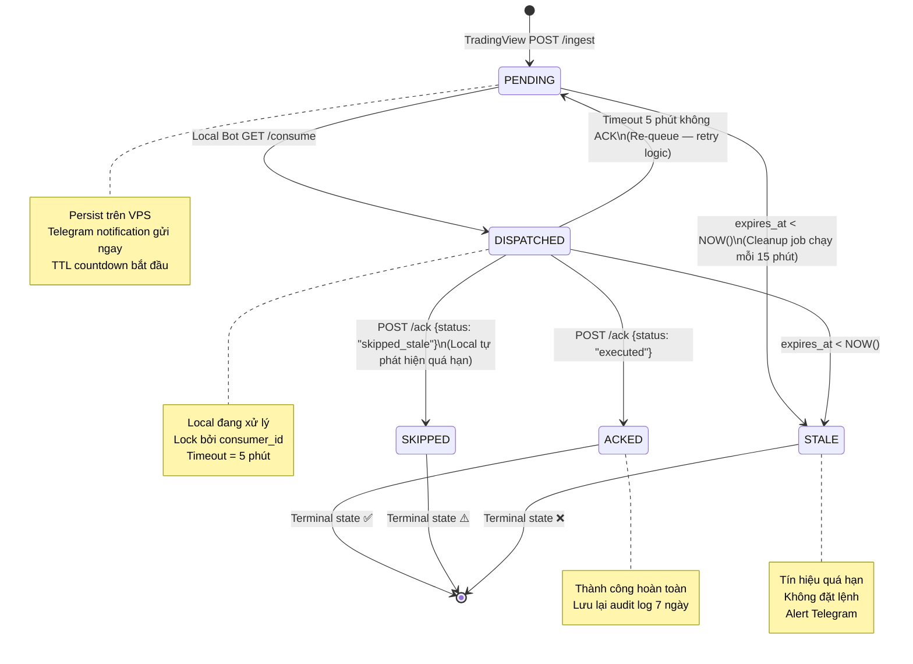

# 🏛️ VPS Buffer Server Architecture
## Tài Liệu Kiến Trúc — Minervini Trading Bot Signal Queue

> **Project:** TradingViewProject  
> **Module:** VPS Buffer Service (vbs)  
> **Version:** 1.0.0  
> **Date:** 2026-05-29  
> **Status:** 📋 Awaiting Review & Approval

---

## 📋 MỤC LỤC

1. [Vấn Đề & Bối Cảnh](#1-vấn-đề--bối-cảnh)
2. [Mục Tiêu Kiến Trúc](#2-mục-tiêu-kiến-trúc)
3. [Sơ Đồ Kiến Trúc Tổng Thể](#3-sơ-đồ-kiến-trúc-tổng-thể)
4. [State Machine — Vòng Đời Tín Hiệu](#4-state-machine--vòng-đời-tín-hiệu)
5. [Use Cases](#5-use-cases)
6. [Yêu Cầu Hệ Thống (Requirements)](#6-yêu-cầu-hệ-thống-requirements)
7. [API Contract](#7-api-contract)
8. [Database Schema](#8-database-schema)
9. [Chiến Lược Lõi (Core Strategy)](#9-chiến-lược-lõi-core-strategy)
10. [Deployment Plan](#10-deployment-plan)
11. [Yêu Cầu Kiểm Duyệt](#11-yêu-cầu-kiểm-duyệt)
12. [Rủi Ro & Biện Pháp Đối Phó](#12-rủi-ro--biện-pháp-đối-phó)

---

## 1. Vấn Đề & Bối Cảnh

### 1.1 Hiện Trạng

```
[TradingView Alert] ──HTTPS──> [Cloudflare Tunnel trên VPS] ──> [Bot Local Port 5000]
                                                                        ↑
                                                               ⚠️ Máy Local hay bị tắt
                                                               → Tín hiệu BỊ MẤT
```

**Pain Points:**
- Máy Local thường bị ngủ (sleep), sập nguồn, hoặc tắt máy ngoài giờ giao dịch
- TradingView gửi tín hiệu `buy/sell` đúng lúc breakout nhưng Bot không nhận được
- Không có cơ chế hứng và lưu tín hiệu khi Local offline
- Không có thông báo khi tín hiệu bị bỏ lỡ

### 1.2 Giải Pháp

Chèn một lớp **Buffer Service** vào giữa Cloudflare Tunnel và Local Bot. VPS đóng vai trò **Message Queue** nhẹ, hứng tín hiệu 24/7, cho phép Local Bot PULL và ACK khi bật lên.

---

## 2. Mục Tiêu Kiến Trúc

| ID | Mục Tiêu | Mức Độ |
|----|---------|--------|
| G-01 | **Không mất tín hiệu** khi Local offline — tất cả signals được persist trên VPS | 🔴 CRITICAL |
| G-02 | **Stale Signal Protection** — tín hiệu quá cũ (> TTL) bị loại, không đặt lệnh theo giá lỗi thời | 🔴 CRITICAL |
| G-03 | **Zero Local Dependency** — VPS Buffer chạy độc lập, không cần biết Local đang chạy hay không | 🟠 HIGH |
| G-04 | **At-Least-Once Delivery** — tín hiệu được xử lý ít nhất 1 lần, có ACK xác nhận | 🟠 HIGH |
| G-05 | **Telegram Push Notification** — thông báo ngay khi tín hiệu được đẩy vào queue | 🟡 MEDIUM |
| G-06 | **Dashboard Visibility** — sếp thấy được queue status trực tiếp trên Dashboard | 🟡 MEDIUM |
| G-07 | **Backward Compatible** — Codebase Local Bot hiện tại không bị break | 🟠 HIGH |

---

## 3. Sơ Đồ Kiến Trúc Tổng Thể

### 3.1 Component Diagram



### 3.2 Deployment Diagram



### 3.3 Sequence Diagram — Happy Path (Local Online)



### 3.4 Sequence Diagram — Local Offline → Recovery



---

## 4. State Machine — Vòng Đời Tín Hiệu



### 4.1 Bảng Chuyển Trạng Thái

| Từ | Đến | Trigger | Điều Kiện |
|----|-----|---------|----------|
| `[START]` | `PENDING` | `POST /ingest` thành công | BUFFER_SECRET hợp lệ |
| `PENDING` | `DISPATCHED` | `GET /consume` | Local Bot online + signal còn trong TTL |
| `PENDING` | `STALE` | Cleanup job (15 phút/lần) | `expires_at < NOW()` |
| `DISPATCHED` | `ACKED` | `POST /ack {executed}` | Bot đã đặt lệnh thành công |
| `DISPATCHED` | `SKIPPED` | `POST /ack {skipped_stale}` | Bot tự phát hiện signal quá cũ |
| `DISPATCHED` | `PENDING` | Timeout 5 phút | Bot không gửi ACK (crash/disconnect) |
| `DISPATCHED` | `STALE` | Cleanup job | `expires_at < NOW()` trong khi đang dispatch |
| `ACKED` | `[END]` | — | Terminal state |
| `SKIPPED` | `[END]` | — | Terminal state |
| `STALE` | `[END]` | — | Terminal state |

---

## 5. Use Cases

### UC-01: TradingView Gửi Tín Hiệu (Primary Flow)

| Trường | Nội dung |
|--------|---------|
| **Actor** | TradingView Alert System |
| **Precondition** | VPS đang chạy, Cloudflare Tunnel active |
| **Trigger** | Pine Script kích hoạt alert condition |
| **Main Flow** | 1. TV POST JSON payload đến CF Tunnel URL<br/>2. CF forward đến VPS Buffer Service<br/>3. VBS xác thực `BUFFER_SECRET`<br/>4. VBS INSERT vào `signal_queue` với status=PENDING<br/>5. VBS gửi Telegram notification<br/>6. VBS trả về `{"queued": true, "queue_id": N}` |
| **Alt Flow** | 3a. Secret sai → 401 Unauthorized, không ghi DB<br/>4a. DB lỗi → 500, retry tối đa 3 lần |
| **Postcondition** | Signal lưu trong DB, Telegram đã notify |

---

### UC-02: Local Bot Khởi Động & Kéo Tín Hiệu (Boot Recovery)

| Trường | Nội dung |
|--------|---------|
| **Actor** | Local Trading Bot |
| **Precondition** | VPS Buffer Service đang chạy |
| **Trigger** | Local Bot startup (FastAPI lifespan event) |
| **Main Flow** | 1. Bot kết nối đến VPS Buffer URL<br/>2. `GET /consume?consumer_id=local-01&limit=50`<br/>3. VBS trả về list signals PENDING<br/>4. Bot lọc theo TTL (bỏ signal quá cũ)<br/>5. Bot emit vào EventBus → TradeEngine xử lý<br/>6. Bot `POST /ack {queue_ids, status}` cho từng signal |
| **Alt Flow** | 2a. VPS không trả lời → log warning, bot vẫn boot bình thường<br/>4a. Signal > MAX_AGE → ACK với `skipped_stale` |
| **Postcondition** | Tất cả signals PENDING đã được xử lý hoặc đánh dấu skip |

---

### UC-03: Local Bot Poll Định Kỳ (Steady State)

| Trường | Nội dung |
|--------|---------|
| **Actor** | Local Trading Bot (Consumer Worker) |
| **Precondition** | Bot đang chạy, VPS accessible |
| **Trigger** | Background task, 30 giây/lần |
| **Main Flow** | 1. `GET /consume?limit=5` — chỉ lấy signal PENDING mới nhất<br/>2. Nếu rỗng → sleep, thử lại sau<br/>3. Nếu có signal → xử lý + ACK |
| **Postcondition** | Queue được drain gần như realtime khi Local online |

---

### UC-04: Xử Lý Signal Quá Hạn (Stale Cleanup)

| Trường | Nội dung |
|--------|---------|
| **Actor** | VPS Background Scheduler |
| **Trigger** | Cron job mỗi 15 phút |
| **Main Flow** | 1. Query tất cả signals có `expires_at < NOW()` và `status IN (PENDING, DISPATCHED)`<br/>2. UPDATE status = STALE<br/>3. Gửi Telegram: `❌ N signals expired without processing` |
| **Postcondition** | DB sạch, không còn orphan signals |

---

### UC-05: Dashboard Quan Sát Trạng Thái Queue

| Trường | Nội dung |
|--------|---------|
| **Actor** | Operator (Sếp xem Dashboard) |
| **Precondition** | Local Bot đang chạy |
| **Trigger** | Mở Dashboard hoặc tự động refresh 30s |
| **Main Flow** | 1. Dashboard gọi `GET /api/queue-status` trên Local Bot<br/>2. Local Bot gọi lên VPS Buffer `GET /queue-status`<br/>3. Trả về: pending_count, oldest_age, list signals<br/>4. Dashboard hiển thị badge + danh sách |
| **Postcondition** | Operator thấy được trạng thái real-time của queue |

---

## 6. Yêu Cầu Hệ Thống (Requirements)

### 6.1 Functional Requirements

| ID | Yêu Cầu | Priority |
|----|---------|----------|
| FR-01 | VPS Buffer Service PHẢI nhận và lưu tín hiệu từ TradingView 24/7 | MUST |
| FR-02 | Mỗi signal PHẢI có trạng thái rõ ràng: PENDING/DISPATCHED/ACKED/STALE/SKIPPED | MUST |
| FR-03 | Signal PHẢI có TTL cấu hình được (mặc định 4 giờ) | MUST |
| FR-04 | Signal quá TTL PHẢI được đánh dấu STALE tự động | MUST |
| FR-05 | Local Bot PHẢI kéo signals PENDING khi startup | MUST |
| FR-06 | Local Bot PHẢI poll định kỳ mỗi 30 giây | SHOULD |
| FR-07 | Local Bot PHẢI gửi ACK sau mỗi signal xử lý | MUST |
| FR-08 | Signal DISPATCHED không ACK trong 5 phút PHẢI được re-queue về PENDING | SHOULD |
| FR-09 | Telegram notification PHẢI gửi khi signal queued | SHOULD |
| FR-10 | Telegram notification PHẢI gửi khi signal STALE | SHOULD |
| FR-11 | Dashboard PHẢI hiển thị queue status (pending count, oldest age) | SHOULD |
| FR-12 | API PHẢI xác thực `BUFFER_SECRET` trên mọi endpoint | MUST |

### 6.2 Non-Functional Requirements

| ID | Yêu Cầu | Giá Trị Mục Tiêu |
|----|---------|-----------------|
| NFR-01 | Latency `/ingest` response | < 100ms |
| NFR-02 | Availability VPS Buffer Service | 99.9% (Docker restart policy) |
| NFR-03 | Max queue size | 1000 signals (configurable) |
| NFR-04 | Signal retention sau ACKED | 7 ngày (audit log) |
| NFR-05 | Disk usage | < 50MB cho 10.000 signals |
| NFR-06 | Backward compatibility | Codebase Local Bot không bị break |
| NFR-07 | Startup recovery time | < 30 giây kể từ khi Local boot |

### 6.3 Security Requirements

| ID | Yêu Cầu |
|----|---------|
| SEC-01 | `BUFFER_SECRET` phải là hex ngẫu nhiên ≥ 32 bytes, khác hoàn toàn với `WEBHOOK_SECRET` |
| SEC-02 | API endpoints PHẢI dùng HTTPS (qua Cloudflare, không expose HTTP trực tiếp) |
| SEC-03 | `BUFFER_SECRET` KHÔNG được lưu trong log hoặc trong payload signal |
| SEC-04 | `consumer_id` phải là identifier cố định per-machine (không random) để trace |
| SEC-05 | Rate limit: tối đa 60 requests/phút per IP cho `/ingest` |

---

## 7. API Contract

### 7.1 `POST /ingest` — Nhận Tín Hiệu Từ TradingView

**Request:**
```http
POST https://bot.yourdomain.com/ingest
X-Buffer-Secret: <BUFFER_SECRET>
Content-Type: application/json

{
  "action": "buy",
  "symbol": "BTCUSDT",
  "price": "68420.5",
  "quoteQty": "100",
  "interval": "1h",
  "exchange": "binance",
  "sl": "63000",
  "tp": "80000",
  "source": "strategy",
  "time": "2026-05-29T08:30:00Z"
}
```

**Response 200:**
```json
{
  "queued": true,
  "queue_id": 45,
  "expires_at": "2026-05-29T12:30:00Z",
  "status": "PENDING"
}
```

**Response 401:** Secret sai
**Response 429:** Rate limit exceeded

---

### 7.2 `GET /consume` — Local Bot PULL Signals

**Request:**
```http
GET https://vps-internal:5000/consume?consumer_id=local-01&limit=10
X-Buffer-Secret: <BUFFER_SECRET>
```

**Response 200:**
```json
{
  "signals": [
    {
      "queue_id": 45,
      "symbol": "BTCUSDT",
      "action": "buy",
      "price": 68420.5,
      "quote_qty": 100.0,
      "interval": "1h",
      "exchange": "binance",
      "sl": "63000",
      "tp": "80000",
      "received_at": "2026-05-29T08:30:00Z",
      "expires_at": "2026-05-29T12:30:00Z",
      "age_minutes": 12
    }
  ],
  "count": 1,
  "has_more": false
}
```

---

### 7.3 `POST /ack` — Local Bot Xác Nhận Đã Xử Lý

**Request:**
```http
POST https://vps-internal:5000/ack
X-Buffer-Secret: <BUFFER_SECRET>
Content-Type: application/json

{
  "acks": [
    {"queue_id": 45, "status": "executed"},
    {"queue_id": 46, "status": "skipped_stale"}
  ]
}
```

**Status values:** `executed` | `skipped_stale` | `failed`

**Response 200:**
```json
{
  "acked": 2,
  "results": [
    {"queue_id": 45, "status": "ACKED"},
    {"queue_id": 46, "status": "SKIPPED"}
  ]
}
```

---

### 7.4 `GET /queue-status` — Dashboard Visibility

**Request:**
```http
GET https://vps-internal:5000/queue-status
X-Buffer-Secret: <BUFFER_SECRET>
```

**Response 200:**
```json
{
  "summary": {
    "pending": 3,
    "dispatched": 1,
    "acked_today": 15,
    "stale_today": 0,
    "oldest_pending_age_minutes": 12
  },
  "pending_signals": [
    {
      "queue_id": 45,
      "symbol": "BTCUSDT",
      "action": "buy",
      "received_at": "2026-05-29T08:30:00Z",
      "ttl_remaining_minutes": 228
    }
  ]
}
```

---

### 7.5 `GET /health` — Health Check

**Response 200:**
```json
{
  "status": "healthy",
  "db": "ok",
  "pending_count": 3,
  "uptime_seconds": 86400
}
```

---

## 8. Database Schema

### 8.1 VPS Database (signal_queue.db)

```sql
-- ═══════════════════════════════════════════════════════
-- VPS Buffer Service: Signal Queue Schema
-- ═══════════════════════════════════════════════════════

CREATE TABLE IF NOT EXISTS signal_queue (
    id              INTEGER PRIMARY KEY AUTOINCREMENT,
    received_at     TEXT    NOT NULL DEFAULT (datetime('now')),
    dispatched_at   TEXT,                          -- Thời điểm Local PULL
    acked_at        TEXT,                          -- Thời điểm ACK hoàn tất
    expires_at      TEXT    NOT NULL,              -- TTL cutoff
    status          TEXT    NOT NULL DEFAULT 'PENDING',
                    -- CHECK (status IN ('PENDING','DISPATCHED','ACKED','SKIPPED','STALE'))
    symbol          TEXT    NOT NULL,
    action          TEXT    NOT NULL,
    price           REAL,
    quote_qty       REAL,
    interval        TEXT,
    exchange        TEXT    NOT NULL DEFAULT 'binance',
    sl              TEXT,
    tp              TEXT,
    source          TEXT,
    payload_json    TEXT    NOT NULL,              -- Full payload gốc (đã strip secret)
    consumer_id     TEXT,                          -- ID máy Local đã PULL
    retry_count     INTEGER NOT NULL DEFAULT 0,   -- Số lần re-queue
    ack_status      TEXT,                          -- "executed"|"skipped_stale"|"failed"
    error_msg       TEXT                           -- Lỗi nếu có
);

-- Indexes
CREATE INDEX IF NOT EXISTS idx_sq_status     ON signal_queue(status);
CREATE INDEX IF NOT EXISTS idx_sq_expires    ON signal_queue(expires_at);
CREATE INDEX IF NOT EXISTS idx_sq_symbol     ON signal_queue(symbol);
CREATE INDEX IF NOT EXISTS idx_sq_received   ON signal_queue(received_at);
CREATE INDEX IF NOT EXISTS idx_sq_status_exp ON signal_queue(status, expires_at);

-- ═══════════════════════════════════════════════════════
-- Audit Log (lưu 7 ngày)
-- ═══════════════════════════════════════════════════════
CREATE TABLE IF NOT EXISTS signal_audit_log (
    id              INTEGER PRIMARY KEY AUTOINCREMENT,
    queue_id        INTEGER NOT NULL,
    event           TEXT    NOT NULL,              -- "QUEUED"|"DISPATCHED"|"ACKED"|"STALE"|"REQUEUED"
    event_at        TEXT    NOT NULL DEFAULT (datetime('now')),
    consumer_id     TEXT,
    detail          TEXT
);

CREATE INDEX IF NOT EXISTS idx_sal_queue_id ON signal_audit_log(queue_id);
CREATE INDEX IF NOT EXISTS idx_sal_event_at ON signal_audit_log(event_at);
```

### 8.2 Environment Variables — VPS Buffer Service

```dotenv
# ── VPS Buffer Service Configuration ──────────────────
PORT=5000
HOST=0.0.0.0

# PHẢI khác WEBHOOK_SECRET của Local Bot!
BUFFER_SECRET=<generate: python -c "import secrets; print(secrets.token_hex(32))">

# TTL mặc định cho mỗi signal (giờ)
SIGNAL_TTL_HOURS=4

# Dispatch timeout — tự re-queue nếu không ACK (phút)
DISPATCH_TIMEOUT_MINUTES=5

# Giới hạn queue size (0 = không giới hạn)
MAX_QUEUE_SIZE=1000

# Telegram notification (dùng chung Bot Token với Local)
TELEGRAM_BOT_TOKEN=
TELEGRAM_CHAT_ID=

# Cleanup job interval (phút)
CLEANUP_INTERVAL_MINUTES=15

# Audit log retention (ngày)
AUDIT_RETENTION_DAYS=7

# Database path (trong Docker volume)
DB_PATH=/app/data/signal_queue.db
```

### 8.3 Environment Variables — Local Bot (Bổ Sung)

```dotenv
# ── VPS Buffer Consumer Config (thêm vào .env hiện tại) ──
VPS_BUFFER_ENABLED=true
VPS_BUFFER_URL=https://bot.yourdomain.com
VPS_BUFFER_SECRET=<cùng giá trị với BUFFER_SECRET trên VPS>
VPS_CONSUMER_ID=local-01           # Unique ID per machine
VPS_POLL_INTERVAL_SECONDS=30       # Tần suất poll
VPS_STARTUP_PULL_LIMIT=50          # Số signal kéo về lúc startup
MAX_SIGNAL_AGE_MINUTES=240         # Bỏ qua signal cũ hơn 4 giờ
```

---

## 9. Chiến Lược Lõi (Core Strategy)

### 9.1 The Decoupled Buffer Doctrine

> **Triết lý:** *"VPS không biết Local đang làm gì. Local không biết TradingView đang nghĩ gì. Chỉ có Queue là sự thật."*

```
TradingView ──[produce]──> Queue ──[consume]──> Local Bot
                            ↑
                    VPS là Single Source of Truth
                    về trạng thái "đã nhận tín hiệu"
```

**3 Invariants (Bất biến kiến trúc):**
1. **VPS không bao giờ push xuống Local** — Local chủ động PULL, tránh phụ thuộc Local luôn online
2. **Signal không bao giờ bị xóa khi chưa ACKED** — Audit trail đầy đủ
3. **Local không tin tưởng age của signal do chính nó tính** — Luôn dùng `received_at` từ VPS

### 9.2 At-Least-Once với Idempotency Guard

Vì Local có thể crash giữa chừng, một signal có thể được PULL 2 lần:

```python
# Local Bot: Idempotency Check trước khi execute
async def process_signal(signal: SignalPayload) -> str:
    # Kiểm tra xem signal này đã được xử lý chưa (theo queue_id)
    existing = await db.query_one(
        "SELECT id FROM trades WHERE vbs_queue_id = ?", 
        (signal.queue_id,)
    )
    if existing:
        log.warning(f"[VBS] Duplicate signal #{signal.queue_id}, already executed. Sending ACK.")
        return "executed"  # ACK lại để VPS cập nhật trạng thái
    
    # Thực thi bình thường...
```

> **Yêu cầu schema:** Thêm cột `vbs_queue_id INTEGER` vào bảng `trades` trên Local Bot để track.

### 9.3 Stale Signal TTL Matrix

| Loại Giao Dịch | TTL Đề Xuất | Lý Do |
|----------------|-------------|-------|
| Breakout Signal (BUY/SELL) | **1 giờ** | Giá breakout có thể đã bay xa sau 1h |
| Alert/Indicator Signal | **4 giờ** | Thông tin tham khảo, ít time-sensitive |
| Strategy Mode (Long-term) | **8 giờ** | Xu hướng dài hạn ít ảnh hưởng bởi timing |

### 9.4 Re-Queue Mechanism (Retry Logic)

```
DISPATCHED ──(5 phút không ACK)──> Re-queue về PENDING
                                    retry_count += 1

Max retry_count = 3:
  - retry_count < 3 → Re-queue về PENDING
  - retry_count >= 3 → Đánh dấu STALE + Telegram alert
```

---

## 10. Deployment Plan

### Phase 1: VPS Buffer Service (Ưu tiên cao nhất)

**Mục tiêu:** Dựng service nhận và lưu tín hiệu 24/7 trên VPS.

**Files cần tạo mới:**
```
vbs/                              ← Thư mục mới trên VPS
├── main.py                       ← FastAPI app entry point
├── router.py                     ← API endpoints (/ingest, /consume, /ack, /health)
├── database.py                   ← SQLite async operations
├── scheduler.py                  ← Cleanup job + re-queue job
├── notifier.py                   ← Telegram push (shared logic)
├── models.py                     ← Pydantic models
├── config.py                     ← Env config
├── requirements.txt
└── Dockerfile

docker-compose.vbs.yml            ← Separate compose file cho VBS
```

**Estimated time:** 2–3 giờ code

---

### Phase 2: Local Bot Consumer Worker

**Mục tiêu:** Tích hợp Consumer Worker vào Local Bot không làm hỏng code cũ.

**Files cần tạo/sửa:**
```
server/workers/
└── vps_consumer.py               ← [NEW] VpsSignalConsumer class

server/config.py                  ← [MODIFY] Thêm VPS_BUFFER_* env vars
server/main.py                    ← [MODIFY] Hook consumer vào lifespan startup
server/database.py                ← [MODIFY] Thêm cột vbs_queue_id vào trades
```

**Estimated time:** 1–2 giờ

---

### Phase 3: Dashboard & Observability

**Mục tiêu:** Sếp thấy được queue status trực tiếp trên Dashboard.

**Files cần tạo/sửa:**
```
server/main.py                    ← [MODIFY] Thêm GET /api/queue-status
server/static/js/dashboard.js     ← [MODIFY] Hiển thị queue badge
server/static/index.html          ← [MODIFY] Queue status panel
```

**Estimated time:** 1 giờ

---

### Checklist Deployment

```
VPS Setup:
[ ] VPS có Docker + Docker Compose
[ ] Cloudflare Tunnel đã config trỏ vào port 5000
[ ] DNS bot.yourdomain.com đã active
[ ] BUFFER_SECRET đã sinh ngẫu nhiên
[ ] Telegram Bot Token đã cấu hình

Local Bot:
[ ] .env đã thêm VPS_BUFFER_* vars
[ ] VPS_CONSUMER_ID đặt tên unique
[ ] MAX_SIGNAL_AGE_MINUTES match với SIGNAL_TTL_HOURS * 60

End-to-End Test:
[ ] POST /ingest → nhận 200 + queue_id
[ ] Telegram nhận notification
[ ] GET /consume → nhận signal đúng
[ ] POST /ack → signal chuyển ACKED
[ ] Test stale: đặt TTL = 1 phút, đợi → kiểm tra STALE
[ ] Test re-queue: không gửi ACK 5 phút → kiểm tra PENDING lại
```

---

## 11. Yêu Cầu Kiểm Duyệt

### 11.1 Review Checklist — Security

> [!CAUTION]
> Các mục này PHẢI được xác nhận trước khi deploy lên production.

- [ ] `BUFFER_SECRET` được sinh bằng `secrets.token_hex(32)`, không phải hardcode
- [ ] `BUFFER_SECRET` khác hoàn toàn với `WEBHOOK_SECRET` của Local Bot
- [ ] Không có endpoint nào public mà không cần xác thực
- [ ] Header `X-Buffer-Secret` không bao giờ được log ra file
- [ ] SQLite DB nằm trong Docker volume, không expose ra ngoài container
- [ ] Rate limiting `/ingest` đã được bật (60 req/min per IP)

### 11.2 Review Checklist — Business Logic

> [!IMPORTANT]
> Xác nhận các quyết định kinh doanh dưới đây với sếp.

- [ ] **TTL mặc định:** Đồng ý với `SIGNAL_TTL_HOURS=4`? Hay cần tùy chỉnh theo từng loại tín hiệu?
- [ ] **Xử lý đồng thời:** Khi bot PULL 5 signals cùng lúc, xử lý **tuần tự** (an toàn) hay **song song** (nhanh hơn)?
- [ ] **MAX_SIGNAL_AGE_MINUTES:** Bot từ chối signal cũ hơn bao nhiêu phút? (Đề xuất: 240 = 4 giờ)
- [ ] **Retry limit:** Tối đa 3 lần re-queue trước khi STALE là đủ?
- [ ] **Queue overflow:** Khi queue > 1000 signals, reject tín hiệu mới hay xóa cũ nhất?

### 11.3 Review Checklist — Architecture

- [ ] VBS chạy Docker với `restart: unless-stopped` để auto-recover
- [ ] SQLite trên VPS đủ dùng, hay cần upgrade lên PostgreSQL/Redis cho throughput cao hơn?
- [ ] `/consume` có cần WebSocket push thay vì HTTP poll không?
- [ ] Consumer Worker có cần Exponential Backoff khi VPS không respond không?

---

## 12. Rủi Ro & Biện Pháp Đối Phó

| Rủi Ro | Mức Độ | Biện Pháp |
|--------|--------|-----------|
| **Duplicate signal execution** — Local crash giữa chừng, PULL signal 2 lần | 🔴 HIGH | Idempotency check qua `vbs_queue_id` trong bảng `trades` |
| **VPS Database bị đầy** — Queue tích lũy nếu Local offline lâu | 🟠 MEDIUM | `MAX_QUEUE_SIZE` limit + cảnh báo Telegram |
| **Clock skew** — Đồng hồ VPS và Local lệch nhau | 🟡 LOW | Dùng `received_at` từ VPS làm authoritative timestamp |
| **BUFFER_SECRET bị lộ** — Kẻ xấu inject tín hiệu giả | 🔴 HIGH | Secret rotation procedure + IP whitelist Cloudflare |
| **VPS downtime** — VPS bị sập | 🟠 MEDIUM | Docker auto-restart + monitoring alert |
| **Signal flood** — TradingView bắn quá nhiều signal | 🟡 LOW | Rate limiter 60 req/min per IP trên VBS |
| **Stale execution** — Local bật lên sau 8 giờ tắt | 🔴 HIGH | TTL enforcement + MAX_SIGNAL_AGE_MINUTES double-check |

---

## 📌 Open Questions (Cần Sếp Xác Nhận)

> [!IMPORTANT]
> Trả lời các câu hỏi sau để em bắt đầu code Phase 1:

1. **TTL:** Signal hết hạn sau bao nhiêu giờ? `4h` hay tùy chỉnh theo loại tín hiệu?
2. **Concurrent execution:** Xử lý tuần tự hay song song khi có nhiều signals PENDING?
3. **VPS specs:** VPS chạy hệ điều hành gì (Ubuntu/Debian)? Đã có Docker chưa?
4. **Domain:** Tên miền đã có chưa? Cloudflare Tunnel đã setup chưa hay cần setup mới?
5. **Bot Telegram:** Dùng chung Bot Token hay tạo Bot phụ cho VBS notifications?
