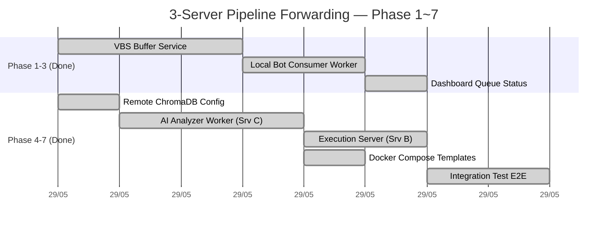

# 🗺️ MASTER PHASE MAP — 3-Server Pipeline Forwarding

> **Version:** 2.0 | **Date:** 2026-05-29  
> **Architecture:** [VPS_BUFFER_ARCHITECTURE.md](file:///c:/Users/pesil/working/mj_trading/TradingViewProject/docs/plans/arhitectures/VPS_BUFFER_ARCHITECTURE.md)  
> **Branch:** `feature/vps-buffer-service`

---

## 📊 Tổng Quan Tiến Trình



---

## ✅ Phase 1: VPS Buffer Service — `HOÀN THÀNH`

> **Server:** A (Linux 1U2G) | **Thời lượng:** ~3 giờ | **Trạng thái:** ✅ Done

**Mục tiêu:** Dựng service nhận và lưu tín hiệu TradingView 24/7 trên VPS.

### Deliverables

| # | File | Vai trò |
|---|------|---------|
| 1 | [`vbs/main.py`](file:///c:/Users/pesil/working/mj_trading/TradingViewProject/vbs/main.py) | FastAPI app entry point, lifespan init DB + scheduler |
| 2 | [`vbs/router.py`](file:///c:/Users/pesil/working/mj_trading/TradingViewProject/vbs/router.py) | 5 API endpoints: `/ingest`, `/consume`, `/ack`, `/queue-status`, `/health` |
| 3 | [`vbs/database.py`](file:///c:/Users/pesil/working/mj_trading/TradingViewProject/vbs/database.py) | SQLite async layer (aiosqlite), schema `signal_queue` + `signal_audit_log` |
| 4 | [`vbs/scheduler.py`](file:///c:/Users/pesil/working/mj_trading/TradingViewProject/vbs/scheduler.py) | APScheduler: Cleanup stale (15p), Re-queue timeout (5p), Audit cleanup (1d) |
| 5 | [`vbs/notifier.py`](file:///c:/Users/pesil/working/mj_trading/TradingViewProject/vbs/notifier.py) | Telegram push: signal queued, stale alert, recovery notice |
| 6 | [`vbs/models.py`](file:///c:/Users/pesil/working/mj_trading/TradingViewProject/vbs/models.py) | Pydantic: `IngestResponse`, `ConsumeResponse`, `AckRequest`, `QueueStatusResponse` |
| 7 | [`vbs/config.py`](file:///c:/Users/pesil/working/mj_trading/TradingViewProject/vbs/config.py) | Env config: `BUFFER_SECRET`, `SIGNAL_TTL_HOURS`, `MAX_QUEUE_SIZE`... |
| 8 | [`vbs/requirements.txt`](file:///c:/Users/pesil/working/mj_trading/TradingViewProject/vbs/requirements.txt) | fastapi, uvicorn, aiosqlite, apscheduler, httpx, pydantic |
| 9 | [`vbs/Dockerfile`](file:///c:/Users/pesil/working/mj_trading/TradingViewProject/vbs/Dockerfile) | Multi-stage build, non-root user, health check |
| 10 | [`vbs/.env.example`](file:///c:/Users/pesil/working/mj_trading/TradingViewProject/vbs/.env.example) | Template cấu hình cho VBS |
| 11 | [`docker-compose.vbs.yml`](file:///c:/Users/pesil/working/mj_trading/TradingViewProject/docker-compose.vbs.yml) | Compose riêng cho VBS, volume `vbs-data` |

### Luồng Dữ Liệu Phase 1

```
TradingView Alert
    │ HTTPS POST
    ▼
Cloudflare Tunnel (VPS)
    │ Forward + BUFFER_SECRET
    ▼
VBS FastAPI :5000
    ├── POST /ingest → INSERT signal_queue (PENDING)
    ├── Telegram 📥 "Signal Queued: BTCUSDT BUY"
    └── Scheduler: cleanup stale + re-queue timeout
```

### State Machine (signal_queue)

```
[START] → PENDING → DISPATCHED → ACKED ✅
                  → STALE ❌ (TTL expired)
          DISPATCHED → SKIPPED ⚠️ (bot skip stale)
          DISPATCHED → PENDING (timeout 5 phút, retry_count++)
```

---

## ✅ Phase 2: Local Bot Consumer Worker — `HOÀN THÀNH`

> **Server:** Local Machine | **Thời lượng:** ~2 giờ | **Trạng thái:** ✅ Done

**Mục tiêu:** Tích hợp Consumer Worker vào Local Bot theo pattern **additive only** (không sửa code cũ).

### Deliverables

| # | File | Thao tác | Chi tiết |
|---|------|----------|----------|
| 1 | [`server/workers/vps_consumer.py`](file:///c:/Users/pesil/working/mj_trading/TradingViewProject/server/workers/vps_consumer.py) | `[NEW]` | `VpsSignalConsumer` class: `on_startup()`, `poll_loop()`, `_process_signal()`, EventBus callbacks |
| 2 | [`server/workers/__init__.py`](file:///c:/Users/pesil/working/mj_trading/TradingViewProject/server/workers/__init__.py) | `[NEW]` | Package init |
| 3 | [`server/config.py`](file:///c:/Users/pesil/working/mj_trading/TradingViewProject/server/config.py) | `[MODIFY]` | +7 env vars: `VPS_BUFFER_ENABLED`, `VPS_BUFFER_URL`, `VPS_BUFFER_SECRET`, `VPS_CONSUMER_ID`, `VPS_POLL_INTERVAL_SECONDS`, `VPS_STARTUP_PULL_LIMIT`, `MAX_SIGNAL_AGE_MINUTES` |
| 4 | [`server/database.py`](file:///c:/Users/pesil/working/mj_trading/TradingViewProject/server/database.py) | `[MODIFY]` | +Migration: `ALTER TABLE signals ADD COLUMN vbs_queue_id INTEGER` |
| 5 | [`server/main.py`](file:///c:/Users/pesil/working/mj_trading/TradingViewProject/server/main.py) | `[MODIFY]` | Hook consumer vào lifespan: `on_startup()` + `asyncio.create_task(poll_loop())` |
| 6 | [`.env.production`](file:///c:/Users/pesil/working/mj_trading/TradingViewProject/.env.production) | `[MODIFY]` | +Template section `VPS Buffer Consumer` |

### Luồng Dữ Liệu Phase 2

```
Local Bot Boot
    │ on_startup()
    ▼
VPS Buffer (GET /consume?consumer_id=local-01&limit=50)
    │ Trả về signals PENDING
    ▼
VpsSignalConsumer._process_signal()
    ├── 1. TTL Check (age > MAX_SIGNAL_AGE_MINUTES → skip)
    ├── 2. Idempotency Check (vbs_queue_id đã tồn tại → skip)
    ├── 3. INSERT signals table (vbs_queue_id tracking)
    ├── 4. Emit SignalReceived / IndicatorSignalReceived → EventBus
    └── 5. POST /ack {queue_id, status}
         │
         ▼
    EventBus Pipeline (hiện tại)
    SignalReceived → Validator → RAG → Telegram Approval → TradeEngine → Exchange
```

---

## ✅ Phase 3: Dashboard & Observability — `HOÀN THÀNH`

> **Server:** Local Machine | **Thời lượng:** ~1 giờ | **Trạng thái:** ✅ Done

**Mục tiêu:** Sếp thấy được queue status trực tiếp trên Dashboard.

### Deliverables

| # | File | Thao tác | Chi tiết |
|---|------|----------|----------|
| 1 | `server/main.py` | `[MODIFY]` | +Endpoint `GET /api/queue-status` — proxy sang VBS |
| 2 | `server/static/js/dashboard*.js` | `[MODIFY]` | Queue badge (xanh/vàng/đỏ), auto-refresh 30s |
| 3 | `server/static/index.html` | `[MODIFY]` | Widget "Signal Queue" trên sidebar |

### Giao Diện

```
┌─────────────────────────────┐
│  📦 VPS Signal Queue        │
│  ┌───────────────────────┐  │
│  │ 🟢 0 PENDING          │  │  ← Xanh = 0 pending
│  │ 🟡 3 PENDING          │  │  ← Vàng = 1-5 pending
│  │ 🔴 8 PENDING          │  │  ← Đỏ = >5 pending
│  └───────────────────────┘  │
│  Acked today: 15            │
│  Stale today: 0             │
│  Oldest: 12 phút            │
└─────────────────────────────┘
```

---

## ✅ Phase 4: Remote ChromaDB Configuration — `HOÀN THÀNH`

> **Server:** C (Linux 8U16G) | **Thời lượng:** ~1 giờ | **Trạng thái:** ✅ Done

**Mục tiêu:** Cho phép `server/rag.py` kết nối ChromaDB từ xa (trên SERVER C) thay vì chỉ dùng local PersistentClient.

### Deliverables

| # | File | Thao tác | Chi tiết |
|---|------|----------|----------|
| 1 | [`server/config.py`](file:///c:/Users/pesil/working/mj_trading/TradingViewProject/server/config.py) | `[MODIFY]` | +3 env vars: `CHROMA_REMOTE` (bool), `CHROMA_SERVER_HOST` (str), `CHROMA_SERVER_PORT` (int) |
| 2 | [`server/rag.py`](file:///c:/Users/pesil/working/mj_trading/TradingViewProject/server/rag.py) | `[MODIFY]` | Sửa `init_vector_db()`: nếu `CHROMA_REMOTE=true` → `chromadb.HttpClient()`, nếu `false` → giữ `PersistentClient` |
| 3 | `server/tests/test_rag_remote.py` | `[NEW]` | Unit test mock `HttpClient`, verify gọi đúng host:port |

### Cấu Hình Env Mới

```dotenv
# ── ChromaDB Remote (Phase 4) ────────────────────────
CHROMA_REMOTE=true
CHROMA_SERVER_HOST=100.x.x.3     # Tailscale IP của SERVER C
CHROMA_SERVER_PORT=8000           # ChromaDB default port
```

### Logic Phân Nhánh Trong `rag.py`

```python
# init_vector_db()
if config.CHROMA_REMOTE:
    _chroma_client = chromadb.HttpClient(
        host=config.CHROMA_SERVER_HOST,
        port=config.CHROMA_SERVER_PORT
    )
else:
    # Backward compatible — chạy PersistentClient cục bộ
    _chroma_client = chromadb.PersistentClient(path=str(chroma_db_path))
```

### Backward Compatibility

- `CHROMA_REMOTE=false` (mặc định) → **KHÔNG thay đổi gì** so với hệ thống hiện tại
- ChromaDB Server trên SERVER C chạy bằng Docker: `chromadb/chroma:latest`

---

## ✅ Phase 5: AI Analyzer Worker (SERVER C) — `HOÀN THÀNH`

> **Server:** C (Linux 8U16G) | **Thời lượng:** ~3 giờ | **Trạng thái:** ✅ Done

**Mục tiêu:** Daemon worker trên SERVER C thay thế vai trò phân tích của Local Bot. Poll tín hiệu thô từ SERVER A → RAG Analysis → Position Sizing → Push lệnh sạch sang SERVER B.

### Deliverables

| # | File | Thao tác | Chi tiết |
|---|------|----------|----------|
| 1 | `server/workers/vps_analyzer.py` | `[NEW]` | `VpsAnalyzerWorker` class: `poll_and_analyze()`, `forward_to_server_b()`, `run()` |
| 2 | [`server/config.py`](file:///c:/Users/pesil/working/mj_trading/TradingViewProject/server/config.py) | `[MODIFY]` | +2 env vars: `SERVER_B_EXECUTE_URL`, `SERVER_B_SECRET` |
| 3 | `server/tests/test_vps_analyzer.py` | `[NEW]` | Unit test mock HTTP, verify luồng poll → analyze → forward → ACK |

### Luồng Dữ Liệu Phase 5

```
SERVER C Worker (vps_analyzer.py)
    │
    │ 1. GET /consume (từ SERVER A, consumer_id="server-c-analyzer")
    ▼
    Nhận signals thô [{symbol, action, price, payload...}]
    │
    │ 2. Truy vấn ChromaDB Local (cổng 8000 trên chính SERVER C)
    │    → rag.query_knowledge("Minervini VCP breakout BUY BTCUSDT")
    ▼
    │ 3. Gọi AI (Claude/Gemini qua Antigravity SDK)
    │    → rag.generate_trading_advice(symbol, action, price, payload, chunks)
    ▼
    │ 4. Tính Position Sizing
    │    → risk_amount = portfolio * RISK_PER_TRADE (2%)
    │    → qty = risk_amount / (entry_price * STOP_LOSS_PCT)
    ▼
    │ 5. Forward lệnh hoàn chỉnh sang SERVER B
    │    POST SERVER_B_EXECUTE_URL
    │    Headers: X-Server-B-Secret: <secret>
    │    Body: {
    │      symbol, action, price, quantity,
    │      sl_price, tp_price, exchange,
    │      rag_advice, ai_confidence,
    │      vbs_queue_id
    │    }
    ▼
    │ 6. ACK về SERVER A
    │    POST /ack {queue_id, status: "forwarded"}
    ▼
    Hoàn tất
```

### Cấu Hình Env Mới

```dotenv
# ── Pipeline Forwarding (Phase 5) ────────────────────
SERVER_B_EXECUTE_URL=http://100.x.x.2:5002/api/execute-trade
SERVER_B_SECRET=<secrets.token_hex(32)>
```

---

## ✅ Phase 6: Execution Server (SERVER B) — `HOÀN THÀNH`

> **Server:** B (Windows Server 2U4G) | **Thời lượng:** ~2 giờ | **Trạng thái:** ✅ Done

**Mục tiêu:** FastAPI app gọn nhẹ trên SERVER B — nhận lệnh đã phê duyệt từ SERVER C và đặt lệnh trên sàn ngay lập tức. SERVER B là **Execution Vault** — bảo mật tối đa API Keys giao dịch.

### Deliverables

| # | File | Thao tác | Chi tiết |
|---|------|----------|----------|
| 1 | `server/execution_server.py` | `[NEW]` | FastAPI app: `POST /api/execute-trade`, `GET /health` |
| 2 | `server/tests/test_execution_server.py` | `[NEW]` | Unit test mock TradeEngine, verify auth + execution flow |

### API Contract — `POST /api/execute-trade`

**Request:**
```http
POST http://100.x.x.2:5002/api/execute-trade
X-Server-B-Secret: <SERVER_B_SECRET>
Content-Type: application/json

{
  "symbol": "BTCUSDT",
  "action": "buy",
  "price": 68420.5,
  "quantity": 0.015,
  "sl_price": 63000,
  "tp_price": 80000,
  "exchange": "binance",
  "rag_advice": "📊 Mạnh — VCP breakout confirmed...",
  "ai_confidence": 85,
  "vbs_queue_id": 45
}
```

**Response 200:**
```json
{
  "status": "executed",
  "order_id": "BIN-12345678",
  "fill_price": 68421.2,
  "quantity": 0.015,
  "exchange": "binance",
  "timestamp": "2026-05-29T09:30:00Z"
}
```

**Response 401:** `X-Server-B-Secret` sai → Unauthorized  
**Response 400:** Payload thiếu trường bắt buộc

### Bảo Mật SERVER B

```
┌─────────────────────────────────────────┐
│          SERVER B — EXECUTION VAULT     │
│                                         │
│  🔒 API Keys (Chỉ lưu tại đây):       │
│     ├── BINANCE_API_KEY / SECRET        │
│     ├── BYBIT_API_KEY / SECRET          │
│     └── WEEX_API_KEY / SECRET           │
│                                         │
│  🛡️ Chỉ chấp nhận kết nối từ:         │
│     └── 100.x.x.3 (SERVER C Tailscale) │
│                                         │
│  ❌ KHÔNG expose port ra WAN            │
│  ❌ KHÔNG có ChromaDB / RAG             │
│  ❌ KHÔNG có webhook endpoint public    │
└─────────────────────────────────────────┘
```

---

## ✅ Phase 6.5: Docker Compose Templates — `HOÀN THÀNH`

> **Tất cả Server** | **Thời lượng:** ~1 giờ | **Trạng thái:** ✅ Done

**Mục tiêu:** Tạo Docker Compose riêng biệt cho mỗi Server để deploy dễ dàng.

### Deliverables

| # | File | Server | Containers |
|---|------|--------|------------|
| 1 | `deploy/docker-compose.server-a.yml` | A (Gateway) | `vbs` (FastAPI :5000) |
| 2 | `deploy/docker-compose.server-c.yml` | C (AI Core) | `chromadb` (:8000) + `analyzer` (vps_analyzer.py) |
| 3 | `deploy/docker-compose.server-b.yml` | B (Execution) | `execution` (execution_server.py :5000) |

### Sơ Đồ Container

```
SERVER A (Gateway)                SERVER C (AI Core)              SERVER B (Execution Vault)
┌──────────────────┐             ┌──────────────────┐            ┌──────────────────┐
│ docker-compose    │             │ docker-compose    │            │ docker-compose    │
│ .server-a.yml     │             │ .server-c.yml     │            │ .server-b.yml     │
│                   │             │                   │            │                   │
│ ┌──────────────┐ │             │ ┌──────────────┐ │            │ ┌──────────────┐ │
│ │   vbs :5000  │ │◀────poll───│ │ analyzer     │ │───push────▶│ │ execution    │ │
│ │ (FastAPI)    │ │             │ │ (Worker)     │ │            │ │ :5000        │ │
│ └──────┬───────┘ │             │ └──────┬───────┘ │            │ └──────┬───────┘ │
│        │         │             │        │         │            │        │         │
│ ┌──────▼───────┐ │             │ ┌──────▼───────┐ │            │ ┌──────▼───────┐ │
│ │signal_queue  │ │             │ │ chromadb     │ │            │ │ trades.db    │ │
│ │.db (volume)  │ │             │ │ :8000        │ │            │ │ (volume)     │ │
│ └──────────────┘ │             │ └──────────────┘ │            │ └──────────────┘ │
└──────────────────┘             └──────────────────┘            └──────────────────┘
```

---

## ✅ Phase 7: End-to-End Integration Test — `HOÀN THÀNH`

> **Local Machine** | **Thời lượng:** ~2 giờ | **Trạng thái:** ✅ Done

**Mục tiêu:** Mô phỏng toàn bộ luồng 3-Server trên cùng 1 máy bằng các port khác nhau. Chạy được với `pytest` mà không cần mạng thực.

### Deliverables

| # | File | Chi tiết |
|---|------|----------|
| 1 | `server/tests/test_pipeline_forwarding.py` | E2E test mô phỏng: ingest → consume → analyze → forward → execute |

### Luồng Mô Phỏng

```
Port 5000 (Mock SERVER A)     Port 8000 (Mock ChromaDB)
    ▲                              ▲
    │ consume                      │ query
    │                              │
Port 5001 (Mock Analyzer/SERVER C)
    │
    │ POST /api/execute-trade
    ▼
Port 5002 (Mock SERVER B/Execution)
```

### Bước Kiểm Tra

```python
# test_pipeline_forwarding.py
async def test_happy_path_pipeline():
    """Simulate: TV Alert → Gateway → Analyzer → Execution"""
    # 1. Ingest signal vào Mock Gateway
    resp = await client.post("/ingest", json={...}, headers={"X-Buffer-Secret": TEST_SECRET})
    assert resp.status_code == 200
    queue_id = resp.json()["queue_id"]

    # 2. Analyzer consume signal
    signals = await analyzer.poll_and_analyze()
    assert len(signals) == 1

    # 3. Verify forward đến Mock Execution Server
    assert mock_execution.received_trades[0]["symbol"] == "BTCUSDT"

    # 4. Verify ACK gửi về Gateway
    status = await gateway.get_queue_status()
    assert status["summary"]["pending"] == 0
```

---

## 📊 Tổng Kết Phân Bổ Tài Nguyên

| Server | Nhiệm Vụ | RAM Ước Tính | Giải Thích |
|--------|----------|-------------|------------|
| **A** (1U2G) | VBS + Cloudflare Tunnel | ~200MB | FastAPI + SQLite siêu nhẹ |
| **C** (8U16G) | ChromaDB + Analyzer + Backtest | ~4-8GB | ChromaDB (~2GB) + Sentence-Transformers (~1.5GB) + AI inference |
| **B** (2U4G) | Execution Server | ~500MB | FastAPI gọn nhẹ, chỉ đặt lệnh, không phân tích |
| **Local** | TradingView Desktop + CDP | ~2-4GB | Electron browser + Dashboard UI |

---

## 🔐 Bảng Mã Bí Mật & Biến Môi Trường

| Biến | Server | Mô tả |
|------|--------|-------|
| `BUFFER_SECRET` | A | Xác thực webhook ingest + consumer poll |
| `VPS_BUFFER_SECRET` | C | Consumer truy cập Gateway (= `BUFFER_SECRET`) |
| `SERVER_B_SECRET` | B, C | Xác thực forward lệnh từ C → B |
| `BINANCE_API_KEY` | B only | API Key giao dịch Binance |
| `BYBIT_API_KEY` | B only | API Key giao dịch Bybit |
| `WEEX_API_KEY` | B only | API Key giao dịch Weex |
| `TELEGRAM_BOT_TOKEN` | A, B | Telegram notification |
| `CHROMA_SERVER_HOST` | C | ChromaDB host (localhost trên C) |
