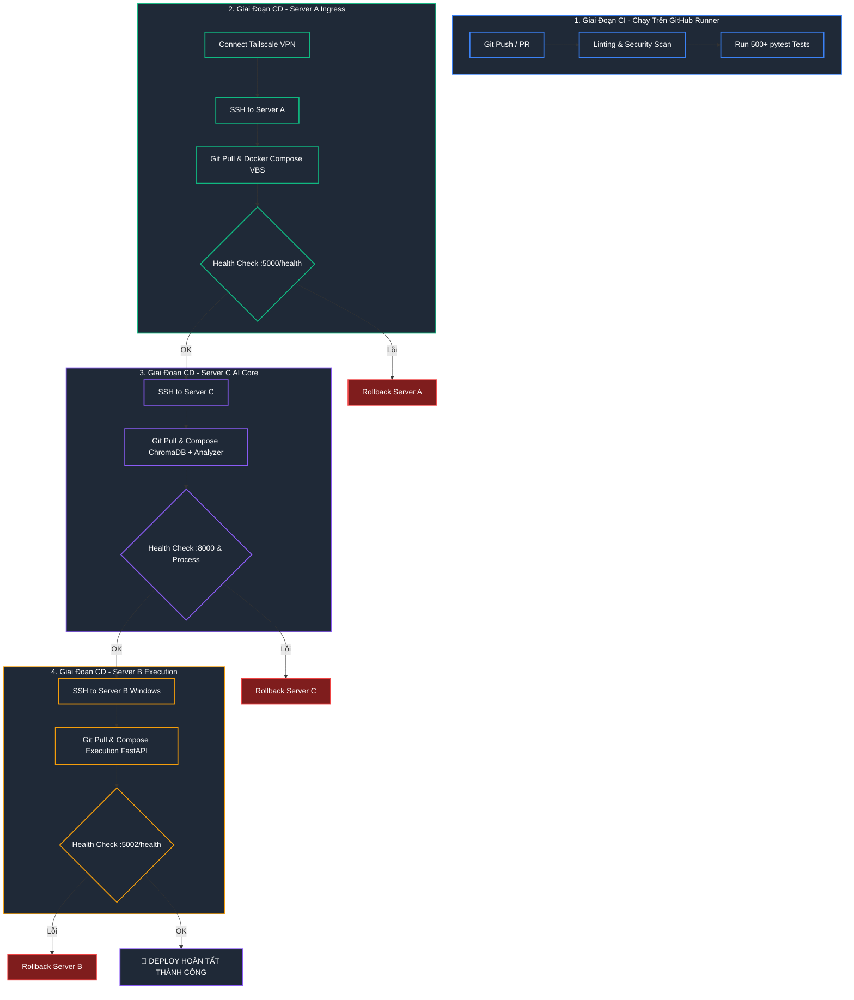

# 🚀 Kế Hoạch Chi Tiết CI/CD Pipeline — 3-Server Pipeline Forwarding

> **Version:** 1.0 | **Date:** 2026-05-29  
> **Architecture:** [VPS_BUFFER_ARCHITECTURE.md](file:///c:/Users/pesil/working/mj_trading/TradingViewProject/docs/plans/arhitectures/VPS_BUFFER_ARCHITECTURE.md)  
> **Target Servers:** Server A (Linux Ingress), Server C (Linux AI Core), Server B (Windows Execution Vault)

CI/CD Pipeline này được thiết kế theo tiêu chuẩn production của các hệ thống trading chuyên nghiệp: **Bảo mật tối đa** (kết nối qua Tailscale VPN, không mở port SSH ra WAN), **Deploy tuần tự có kiểm thử liveness (Zero-Downtime)**, và **Tự động rollback** về trạng thái ổn định gần nhất nếu phát hiện lỗi sau khi deploy.

---

## 🗺️ Quy Trình Tổng Quan (Pipeline Flow)



---

## 🛡️ Thiết Kế Bảo Mật & Kết Nối (Tailscale Integration)

Để triển khai CI/CD an toàn nhất cho Trading Bot, pipeline sẽ **không bao giờ mở cổng SSH công cộng (Port 22/WAN)** trên các Server. Thay vào đó, GitHub Actions Runner sẽ tự động tham gia vào mạng nội bộ ảo **Tailscale VPN** bằng cách sử dụng Ephemeral Auth Key.

1. **GitHub Runner khởi động** -> Chạy Action `tailscale/github-action` để kết nối vào Tailscale.
2. **Runner nhận IP ảo** -> Có quyền kết nối trực tiếp đến các IP Tailscale của Server:
   - **Server A (Gateway):** `100.x.x.1`
   - **Server C (AI Core):** `100.x.x.3`
   - **Server B (Execution - Windows):** `100.x.x.2`
3. **Runner thực hiện SSH nội bộ** -> Đẩy lệnh deploy một cách an toàn tuyệt đối.

---

## 🛠️ GitHub Actions Workflow Configuration

Dưới đây là cấu hình hoàn chỉnh của file `.github/workflows/deploy.yml` để tự động hóa toàn bộ quy trình từ kiểm thử đến triển khai và rollback.

### [`.github/workflows/deploy.yml`](file:///c:/Users/pesil/working/mj_trading/TradingViewProject/.github/workflows/deploy.yml)

```yaml
name: CI/CD Production Pipeline

on:
  push:
    branches:
      - main
  pull_request:
    branches:
      - main

# All actions upgraded to Node.js 24 native versions

jobs:
  # ── 0. CHANGE DETECTION ────────────────────────────────────────────
  changes:
    name: Detect Changes
    runs-on: ubuntu-latest
    outputs:
      code: ${{ steps.filter.outputs.code }}
      deploy: ${{ steps.filter.outputs.deploy }}
    steps:
      - name: Checkout Code
        uses: actions/checkout@v6

      - name: Check for changes
        id: filter
        uses: dorny/paths-filter@v4
        with:
          filters: |
            code:
              - 'nerves/workers/trading/**'
              - 'Dockerfile'
              - 'pine/**'
              - '.github/workflows/**'
            deploy:
              - 'nerves/workers/trading/**'
              - 'Dockerfile'
              - 'deploy/**'
              - 'vbs/**'
              - '.github/workflows/**'

  # ── 1A. LINT & SECURITY (Fast ~40s) ────────────────────────────────
  ci-lint-security:
    name: Lint & Security Scan
    needs: changes
    if: needs.changes.outputs.code == 'true'
    runs-on: ubuntu-latest
    steps:
      - name: Checkout Code
        uses: actions/checkout@v6

      - name: Create server symlink
        run: ln -s nerves/workers/trading server

      - name: Set up Python 3.11
        uses: actions/setup-python@v5
        with:
          python-version: "3.11"
          cache: "pip"
          cache-dependency-path: |
            nerves/workers/trading/requirements.txt
            nerves/workers/trading/requirements-test.txt

      - name: Install Dependencies
        run: |
          python -m pip install --upgrade pip
          pip install -r server/requirements.txt
          pip install -r server/requirements-test.txt

      - name: Code Linting (Ruff)
        run: ruff check server/ --exit-zero

      - name: Security AST Scan
        run: |
          cd server
          python -m security.cli scan || echo "Warning: Review security scan report"

  # ── 1B. TESTS (Slow ~4min — skipped if cache hit) ──────────────────
  ci-tests:
    name: Run Test Suite (520+ Tests)
    needs: changes
    if: needs.changes.outputs.code == 'true'
    runs-on: ubuntu-latest
    steps:
      - name: Checkout Code
        uses: actions/checkout@v6

      # Hash source code để bypass nếu test đã pass cho code giống hệt
      - name: Compute code hash for test cache
        id: code-hash
        run: |
          CODE_HASH=$(find nerves/workers/trading -type f -name '*.py' | sort | xargs sha256sum | sha256sum | cut -d' ' -f1)
          echo "hash=$CODE_HASH" >> $GITHUB_OUTPUT
          echo "📎 Code hash: $CODE_HASH"

      - name: Check test result cache
        id: test-cache
        uses: actions/cache@v5
        with:
          path: .test-passed
          key: test-passed-${{ steps.code-hash.outputs.hash }}

      - name: Skip tests (cache hit — code unchanged)
        if: steps.test-cache.outputs.cache-hit == 'true'
        run: echo "⚡ Tests already passed for this code hash. Skipping full test suite."

      - name: Create server symlink
        if: steps.test-cache.outputs.cache-hit != 'true'
        run: ln -s nerves/workers/trading server

      - name: Set up Python 3.11
        if: steps.test-cache.outputs.cache-hit != 'true'
        uses: actions/setup-python@v5
        with:
          python-version: "3.11"
          cache: "pip"
          cache-dependency-path: |
            nerves/workers/trading/requirements.txt
            nerves/workers/trading/requirements-test.txt

      - name: Install Dependencies
        if: steps.test-cache.outputs.cache-hit != 'true'
        run: |
          python -m pip install --upgrade pip
          pip install -r server/requirements.txt
          pip install -r server/requirements-test.txt

      - name: Cache Playwright browsers
        if: steps.test-cache.outputs.cache-hit != 'true'
        id: playwright-cache
        uses: actions/cache@v5
        with:
          path: ~/.cache/ms-playwright
          key: ${{ runner.os }}-playwright-${{ hashFiles('nerves/workers/trading/requirements*.txt') }}
          restore-keys: |
            ${{ runner.os }}-playwright-

      - name: Install Playwright Chromium Browser
        if: steps.test-cache.outputs.cache-hit != 'true' && steps.playwright-cache.outputs.cache-hit != 'true'
        run: python -m playwright install chromium

      - name: Run Test Suite (520+ Tests)
        if: steps.test-cache.outputs.cache-hit != 'true'
        env:
          VPS_BUFFER_ENABLED: "false"
          CHROMA_REMOTE: "false"
        run: |
          cd server
          python -m pytest tests/ -n auto --tb=short

      # Đánh dấu test đã pass cho hash này → lần sau bypass
      - name: Mark tests passed for cache
        if: steps.test-cache.outputs.cache-hit != 'true'
        run: |
          mkdir -p .test-passed
          echo "${{ steps.code-hash.outputs.hash }}" > .test-passed/hash.txt
          echo "$(date -u +%Y-%m-%dT%H:%M:%SZ)" > .test-passed/timestamp.txt

  # ── 2A. DEPLOY SERVER A (Gateway) ──────────────────────────────────
  deploy-server-a:
    name: Deploy Server A (Gateway)
    needs: [changes, ci-lint-security, ci-tests]
    if: |
      always() &&
      github.ref == 'refs/heads/main' && github.event_name == 'push' &&
      needs.changes.outputs.deploy == 'true' &&
      (needs.ci-lint-security.result == 'success' || needs.ci-lint-security.result == 'skipped') &&
      (needs.ci-tests.result == 'success' || needs.ci-tests.result == 'skipped')
    runs-on: ubuntu-latest
    steps:
      - name: Checkout Code
        uses: actions/checkout@v6

      - name: Connect to Tailscale VPN
        uses: tailscale/github-action@v4
        with:
          oauth-client-id: ${{ secrets.TS_OAUTH_CLIENT_ID }}
          oauth-secret: ${{ secrets.TS_OAUTH_SECRET }}
          tags: tag:ci

      - name: Setup SSH Agent
        uses: webfactory/ssh-agent@v0.10.0
        with:
          ssh-private-key: ${{ secrets.SSH_PRIVATE_KEY }}

      - name: Scan SSH Host Keys
        run: |
          mkdir -p ~/.ssh
          ssh-keyscan -H ${{ secrets.SERVER_A_IP }} >> ~/.ssh/known_hosts || true

      - name: Pre-check SSH connectivity
        id: ssh_check_a
        run: |
          echo "🔌 Testing SSH to Server A..."
          if ssh -o ConnectTimeout=10 -o BatchMode=yes botuser@${{ secrets.SERVER_A_IP }} "echo ok" 2>/dev/null; then
            echo "reachable=true" >> $GITHUB_OUTPUT
            echo "✅ Server A reachable"
          else
            echo "reachable=false" >> $GITHUB_OUTPUT
            echo "⚠️ Server A unreachable — skipping deploy"
          fi

      - name: Deploy Server A
        id: deploy_a
        if: steps.ssh_check_a.outputs.reachable == 'true'
        run: |
          echo "🚀 Deploying Server A..."
          ssh botuser@${{ secrets.SERVER_A_IP }} 'bash -s' << 'EOF'
            set -e
            cd /opt/trading-bot
            OLD_SHA=$(git rev-parse HEAD)
            echo "$OLD_SHA" > .rollback_sha
            git fetch origin
            git checkout main
            PULL_OUTPUT=$(git pull origin main 2>&1)
            echo "$PULL_OUTPUT"
            NEW_SHA=$(git rev-parse HEAD)
            
            # Nếu code không đổi → skip rebuild, health check only
            if [ "$OLD_SHA" = "$NEW_SHA" ]; then
              echo "📎 No new commits — skipping rebuild"
              if curl -sf http://localhost:5000/health > /dev/null 2>&1; then
                echo "✅ Server A already healthy (no changes)"
                exit 0
              fi
              echo "⚠️ No changes but service unhealthy — rebuilding..."
            fi
            
            # Đánh dấu đã deploy (cho rollback logic)
            echo "DEPLOYED" > /tmp/.deploy_state
            docker compose -f deploy/docker-compose.server-a.yml up -d --build
            
            echo "🔍 Testing Gateway Health..."
            for i in {1..10}; do
              if curl -sf http://localhost:5000/health > /dev/null; then
                echo "✅ Server A Healthy!"
                exit 0
              fi
              sleep 2
            done
            echo "❌ Server A Health Check Failed!"
            exit 1
          EOF

      - name: Rollback Server A (On Failure)
        if: failure() && steps.deploy_a.outcome == 'failure' && steps.ssh_check_a.outputs.reachable == 'true'
        run: |
          echo "⚠️ Checking if rollback is needed..."
          ssh botuser@${{ secrets.SERVER_A_IP }} 'bash -s' << 'EOF'
            cd /opt/trading-bot
            # Chỉ rollback nếu deploy đã thực sự thay đổi code
            if [ ! -f .rollback_sha ]; then
              echo "⏭️ No rollback SHA — nothing to revert"
              exit 0
            fi
            CURRENT_SHA=$(git rev-parse HEAD)
            ROLLBACK_SHA=$(cat .rollback_sha)
            if [ "$CURRENT_SHA" = "$ROLLBACK_SHA" ]; then
              echo "⏭️ Code unchanged — rollback not needed"
              exit 0
            fi
            echo "🔄 Reverting Server A to $ROLLBACK_SHA..."
            git checkout $ROLLBACK_SHA
            docker compose -f deploy/docker-compose.server-a.yml up -d --build
            echo "✅ Rollback Server A completed"
          EOF

  # ── 2B. DEPLOY SERVER C (AI Core) ──────────────────────────────────
  deploy-server-c:
    name: Deploy Server C (AI Core)
    needs: [changes, ci-lint-security, ci-tests]
    if: |
      always() &&
      github.ref == 'refs/heads/main' && github.event_name == 'push' &&
      needs.changes.outputs.deploy == 'true' &&
      (needs.ci-lint-security.result == 'success' || needs.ci-lint-security.result == 'skipped') &&
      (needs.ci-tests.result == 'success' || needs.ci-tests.result == 'skipped')
    runs-on: ubuntu-latest
    steps:
      - name: Checkout Code
        uses: actions/checkout@v6

      - name: Connect to Tailscale VPN
        uses: tailscale/github-action@v4
        with:
          oauth-client-id: ${{ secrets.TS_OAUTH_CLIENT_ID }}
          oauth-secret: ${{ secrets.TS_OAUTH_SECRET }}
          tags: tag:ci

      - name: Setup SSH Agent
        uses: webfactory/ssh-agent@v0.10.0
        with:
          ssh-private-key: ${{ secrets.SSH_PRIVATE_KEY }}

      - name: Scan SSH Host Keys
        run: |
          mkdir -p ~/.ssh
          ssh-keyscan -H ${{ secrets.SERVER_C_IP }} >> ~/.ssh/known_hosts || true

      - name: Pre-check SSH connectivity
        id: ssh_check_c
        run: |
          echo "🔌 Testing SSH to Server C..."
          if ssh -o ConnectTimeout=10 -o BatchMode=yes botuser@${{ secrets.SERVER_C_IP }} "echo ok" 2>/dev/null; then
            echo "reachable=true" >> $GITHUB_OUTPUT
            echo "✅ Server C reachable"
          else
            echo "reachable=false" >> $GITHUB_OUTPUT
            echo "⚠️ Server C unreachable — skipping deploy"
          fi

      - name: Deploy Server C
        id: deploy_c
        if: steps.ssh_check_c.outputs.reachable == 'true'
        run: |
          echo "🚀 Deploying Server C..."
          ssh botuser@${{ secrets.SERVER_C_IP }} 'bash -s' << 'EOF'
            set -e
            DEPLOY_DIR="/opt/trading-bot"
            [ ! -d "$DEPLOY_DIR/.git" ] && DEPLOY_DIR="/home/botuser/trading-bot"
            cd "$DEPLOY_DIR"
            OLD_SHA=$(git rev-parse HEAD)
            echo "$OLD_SHA" > .rollback_sha
            git fetch origin
            git checkout main
            PULL_OUTPUT=$(git pull origin main 2>&1)
            echo "$PULL_OUTPUT"
            NEW_SHA=$(git rev-parse HEAD)
            
            # Nếu code không đổi → skip rebuild
            if [ "$OLD_SHA" = "$NEW_SHA" ]; then
              echo "📎 No new commits — skipping rebuild"
              if curl -sf http://localhost:5000/health > /dev/null 2>&1 || curl -sf http://localhost:8000/api/v1/heartbeat > /dev/null 2>&1; then
                echo "✅ Server C already healthy (no changes)"
                exit 0
              fi
              echo "⚠️ No changes and no running service — soft-pass"
              exit 0
            fi
            
            if [ -f deploy/docker-compose.server-c.yml ]; then
              docker compose -f deploy/docker-compose.server-c.yml up -d --build
            fi
            
            echo "🔍 Testing Server C Health..."
            for i in {1..10}; do
              if curl -sf http://localhost:5000/health > /dev/null 2>&1; then
                echo "✅ Server C VBS Healthy!"
                exit 0
              elif curl -sf http://localhost:8000/api/v1/heartbeat > /dev/null 2>&1; then
                echo "✅ Server C ChromaDB Healthy!"
                exit 0
              fi
              sleep 2
            done
            echo "⚠️ No running service detected, but git pull succeeded. Soft-pass."
            exit 0
          EOF

      - name: Rollback Server C (On Failure)
        if: failure() && steps.deploy_c.outcome == 'failure' && steps.ssh_check_c.outputs.reachable == 'true'
        run: |
          echo "⚠️ Checking if rollback is needed..."
          ssh botuser@${{ secrets.SERVER_C_IP }} 'bash -s' << 'EOF'
            DEPLOY_DIR="/opt/trading-bot"
            [ ! -d "$DEPLOY_DIR/.git" ] && DEPLOY_DIR="/home/botuser/trading-bot"
            cd "$DEPLOY_DIR"
            if [ ! -f .rollback_sha ]; then
              echo "⏭️ No rollback SHA — nothing to revert"
              exit 0
            fi
            CURRENT_SHA=$(git rev-parse HEAD)
            ROLLBACK_SHA=$(cat .rollback_sha)
            if [ "$CURRENT_SHA" = "$ROLLBACK_SHA" ]; then
              echo "⏭️ Code unchanged — rollback not needed"
              exit 0
            fi
            echo "🔄 Reverting Server C to $ROLLBACK_SHA..."
            git checkout $ROLLBACK_SHA
            if [ -f deploy/docker-compose.server-c.yml ]; then
              docker compose -f deploy/docker-compose.server-c.yml up -d --build
            fi
            echo "✅ Rollback Server C completed"
          EOF

  # ── 2C. DEPLOY SERVER B (Execution Vault — Windows) ─────────────────
  deploy-server-b:
    name: Deploy Server B (Execution Vault)
    needs: [changes, ci-lint-security, ci-tests]
    if: |
      always() &&
      github.ref == 'refs/heads/main' && github.event_name == 'push' &&
      needs.changes.outputs.deploy == 'true' &&
      (needs.ci-lint-security.result == 'success' || needs.ci-lint-security.result == 'skipped') &&
      (needs.ci-tests.result == 'success' || needs.ci-tests.result == 'skipped')
    runs-on: ubuntu-latest
    steps:
      - name: Checkout Code
        uses: actions/checkout@v6

      - name: Connect to Tailscale VPN
        uses: tailscale/github-action@v4
        with:
          oauth-client-id: ${{ secrets.TS_OAUTH_CLIENT_ID }}
          oauth-secret: ${{ secrets.TS_OAUTH_SECRET }}
          tags: tag:ci

      - name: Setup SSH Agent
        uses: webfactory/ssh-agent@v0.10.0
        with:
          ssh-private-key: ${{ secrets.SSH_PRIVATE_KEY }}

      - name: Scan SSH Host Keys
        run: |
          mkdir -p ~/.ssh
          ssh-keyscan -H ${{ secrets.SERVER_B_IP }} >> ~/.ssh/known_hosts || true

      - name: Pre-check SSH connectivity
        id: ssh_check_b
        run: |
          echo "🔌 Testing SSH to Server B..."
          if ssh -o ConnectTimeout=10 -o BatchMode=yes Administrator@${{ secrets.SERVER_B_IP }} "echo ok" 2>/dev/null; then
            echo "reachable=true" >> $GITHUB_OUTPUT
            echo "✅ Server B reachable"
          else
            echo "reachable=false" >> $GITHUB_OUTPUT
            echo "⚠️ Server B unreachable — skipping deploy"
          fi

      - name: Deploy Server B (Windows)
        id: deploy_b
        if: steps.ssh_check_b.outputs.reachable == 'true'
        run: |
          echo "🚀 Deploying Server B (Windows)..."
          ssh Administrator@${{ secrets.SERVER_B_IP }} << 'EOF'
            $ErrorActionPreference = "Stop"
            cd C:\opt\trading-bot
            
            $OldSha = (git rev-parse HEAD).Trim()
            $OldSha | Out-File -FilePath .rollback_sha -Encoding utf8
            
            git fetch origin
            git checkout main
            git pull origin main
            
            $NewSha = (git rev-parse HEAD).Trim()
            
            # Nếu code không đổi → skip rebuild
            if ($OldSha -eq $NewSha) {
              Write-Output "📎 No new commits — skipping rebuild"
              try {
                $response = Invoke-RestMethod -Uri "http://localhost:5002/health" -Method Get -ErrorAction Stop
                if ($response.status -eq "healthy" -or $response.status -eq "ok") {
                  Write-Output "✅ Server B already healthy (no changes)"
                  exit 0
                }
              } catch {
                Write-Output "⚠️ No changes but service unavailable — rebuilding..."
              }
            }
            
            docker compose -f deploy/docker-compose.server-b.yml up -d --build
            
            echo "🔍 Testing Execution Server Health..."
            for ($i=1; $i -le 10; $i++) {
              try {
                $response = Invoke-RestMethod -Uri "http://localhost:5002/health" -Method Get
                if ($response.status -eq "healthy" -or $response.status -eq "ok") {
                  Write-Output "✅ Server B Healthy!"
                  exit 0
                }
              } catch {
                # Chờ dịch vụ boot
              }
              Start-Sleep -Seconds 2
            }
            Write-Error "❌ Server B Health Check Failed!"
            exit 1
          EOF

      - name: Rollback Server B (On Failure)
        if: failure() && steps.deploy_b.outcome == 'failure' && steps.ssh_check_b.outputs.reachable == 'true'
        run: |
          echo "⚠️ Checking if rollback is needed..."
          ssh Administrator@${{ secrets.SERVER_B_IP }} << 'EOF'
            cd C:\opt\trading-bot
            if (-not (Test-Path .rollback_sha)) {
              Write-Output "⏭️ No rollback SHA — nothing to revert"
              exit 0
            }
            $CurrentSha = (git rev-parse HEAD).Trim()
            $RollbackSha = (Get-Content .rollback_sha -Raw).Trim()
            if ($CurrentSha -eq $RollbackSha) {
              Write-Output "⏭️ Code unchanged — rollback not needed"
              exit 0
            }
            Write-Output "🔄 Reverting Server B to $RollbackSha..."
            git checkout $RollbackSha
            docker compose -f deploy/docker-compose.server-b.yml up -d --build
            Write-Output "✅ Rollback Server B completed"
          EOF
```

---

## 💻 Cấu Hình Đặc Thù Cho Windows Server (Server B)

Để GitHub Actions chạy mượt mà khi SSH và điều khiển Docker trên **Server B (Windows Server)**, ta cần cấu hình dịch vụ SSH trên Windows nhận **PowerShell** làm shell thực thi mặc định thay vì `cmd.exe`.

### 1. Kích hoạt SSH Server trên Windows Server (Chạy bằng PowerShell Administrator)
```powershell
# Cài đặt OpenSSH Server
Add-WindowsCapability -Online -Name OpenSSH.Server~~~~0.0.1.0

# Khởi động dịch vụ và cấu hình tự chạy khi bật máy
Start-Service sshd
Set-Service -Name sshd -StartupType 'Automatic'

# Xác nhận Firewall mở cổng 22
Get-NetFirewallRule -Name *ssh*
```

### 2. Ép OpenSSH dùng PowerShell làm Shell mặc định
```powershell
New-ItemProperty -Path "HKLM:\SOFTWARE\OpenSSH" -Name "DefaultShell" -Value "C:\Windows\System32\WindowsPowerShell\v1.0\powershell.exe" -PropertyType String -Force
```

### 3. Cấp quyền truy cập Git
Đảm bảo Git trên Server B được ủy quyền kéo code từ GitHub (ví dụ: đăng nhập `gh auth login` hoặc thiết lập SSH key cho Windows Server B).

---

## 🔒 Quản Lý GitHub Secrets

Hãy cấu hình các biến bảo mật sau trong mục **Settings > Secrets and variables > Actions** của Repository GitHub:

| Tên Secret | Kiểu Dữ Liệu | Vai Trò |
| :--- | :--- | :--- |
| `TS_OAUTH_CLIENT_ID` | Chuỗi (OAuth Client ID) | ID của client OAuth từ Tailscale Admin Console để Runner đăng nhập mạng ảo. |
| `TS_OAUTH_SECRET` | Chuỗi (OAuth Secret) | Client Secret tương ứng của Tailscale OAuth Client. |
| `SSH_PRIVATE_KEY` | Private Key PEM | Khóa SSH Private dùng để đăng nhập vào `botuser@Server A`, `botuser@Server C`, và `Administrator@Server B`. |
| `SERVER_B_SECRET` | Token Hex 64 kí tự | Token xác thực API giữa Server C và Server B. |
| `VPS_BUFFER_SECRET` | Token Hex 64 kí tự | Token bảo mật giữa Server C và Server A. |
| `WEBHOOK_SECRET` | Token Hex 64 kí tự | Token xác thực webhook TradingView gửi đến Server A. |
| `ANTHROPIC_API_KEY` | API Key | Key Claude Sonnet 3.5 (hoặc Gemini API Key nếu cấu hình dùng Gemini) để thực hiện RAG trên Server C. |

---

## 🎯 Chiến Lược Rollback (1-Command & Auto-Rollback)

Hệ thống được trang bị 2 lớp bảo vệ rollback:

1. **Auto-Rollback (Tự động):** 
   Tích hợp trực tiếp trong file YAML của GitHub Actions. Khi lệnh Deploy hoặc bước Health Check của bất kỳ server nào trả về mã lỗi (`exit 1`), job Deploy sẽ bị hủy lập tức và trigger job `Rollback Server X` tương ứng. Job này sẽ tìm file `.rollback_sha` để checkout ngược về commit an toàn cũ và build lại container.
2. **Manual Rollback (Bằng tay - Một dòng lệnh):**
   Nếu hệ thống không lỗi cứng (vẫn qua Health Check) nhưng sếp phát hiện bot trade sai logic hoặc có lỗi nghiệp vụ ẩn, sếp có thể chạy rollback trực tiếp từ máy của mình bằng một dòng lệnh SSH qua Tailscale:
   - **Đối với Server A:**
     ```bash
     ssh botuser@100.x.x.1 "cd /opt/trading-bot && git checkout HEAD@{1} && docker compose -f deploy/docker-compose.server-a.yml up -d --build"
     ```
   - **Đối với Server C:**
     ```bash
     ssh botuser@100.x.x.3 "cd /opt/trading-bot && git checkout HEAD@{1} && docker compose -f deploy/docker-compose.server-c.yml up -d --build"
     ```
   - **Đối với Server B (Windows):**
     ```bash
     ssh Administrator@100.x.x.2 "cd C:\opt\trading-bot; git checkout HEAD@{1}; docker compose -f deploy/docker-compose.server-b.yml up -d --build"
     ```

---

## 📈 Quy Trình Kiểm Thử Smoke Test Sau Deploy

Sau khi CI/CD chạy hoàn tất thành công, pipeline có thể kích hoạt một script gửi tín hiệu Webhook giả lập đến Server A để kiểm tra liveness thực tế của toàn bộ đường truyền:

```bash
# Lệnh chạy tích hợp giả lập trực tiếp trên GitHub Runner (Đang trong mạng Tailscale)
curl -X POST http://100.x.x.1:5000/ingest \
  -H "Content-Type: application/json" \
  -H "X-Buffer-Secret: ${{ secrets.VPS_BUFFER_SECRET }}" \
  -d '{"symbol": "BTCUSDT", "action": "buy", "price": 60000, "indicator_name": "SmokeTest"}'
```
*Tín hiệu sẽ tự động đi qua luồng: Ingest (A) -> Queue (A) -> Consume & Analyze (C) -> Execute Dry Run (B) -> Telegram báo kết quả Smoke Test thành công.*
