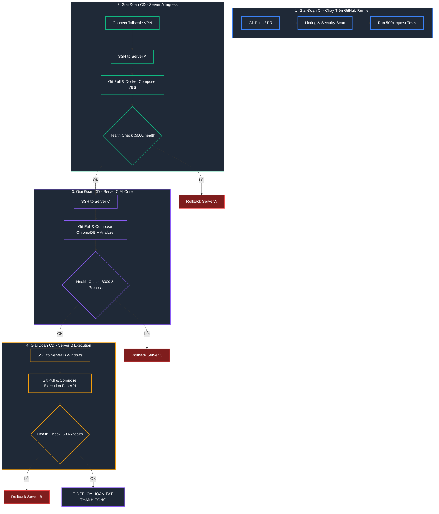

# 🚀 Kế Hoạch Chi Tiết CI/CD Pipeline — 3-Server Pipeline Forwarding

> **Version:** 1.0 | **Date:** 2026-05-29  
> **Architecture:** [VPS_BUFFER_ARCHITECTURE.md](file:///c:/Users/pesil/working/mj_trading/TradingViewProject/docs/plans/arhitectures/VPS_BUFFER_ARCHITECTURE.md)  
> **Target Servers:** Server A (Linux Ingress), Server C (Linux AI Core), Server B (Windows Execution Vault)

CI/CD Pipeline này được thiết kế theo tiêu chuẩn production của các hệ thống trading chuyên nghiệp: **Bảo mật tối đa** (kết nối qua Tailscale VPN, không mở port SSH ra WAN), **Deploy tuần tự có kiểm thử liveness (Zero-Downtime)**, và **Tự động rollback** về trạng thái ổn định gần nhất nếu phát hiện lỗi sau khi deploy.

---

## 🗺️ Quy Trình Tổng Quan (Pipeline Flow)



---

## 🛡️ Thiết Kế Bảo Mật & Kết Nối (Tailscale Integration)

Để triển khai CI/CD an toàn nhất cho Trading Bot, pipeline sẽ **không bao giờ mở cổng SSH công cộng (Port 22/WAN)** trên các Server. Thay vào đó, GitHub Actions Runner sẽ tự động tham gia vào mạng nội bộ ảo **Tailscale VPN** bằng cách sử dụng Ephemeral Auth Key.

1. **GitHub Runner khởi động** -> Chạy Action `tailscale/github-action` để kết nối vào Tailscale.
2. **Runner nhận IP ảo** -> Có quyền kết nối trực tiếp đến các IP Tailscale của Server:
   - **Server A (Gateway):** `100.x.x.1`
   - **Server C (AI Core):** `100.x.x.3`
   - **Server B (Execution - Windows):** `100.x.x.2`
3. **Runner thực hiện SSH nội bộ** -> Đẩy lệnh deploy một cách an toàn tuyệt đối.

---

## 🛠️ GitHub Actions Workflow Configuration

Dưới đây là cấu hình hoàn chỉnh của file `.github/workflows/deploy.yml` để tự động hóa toàn bộ quy trình từ kiểm thử đến triển khai và rollback.

### [`.github/workflows/deploy.yml`](file:///c:/Users/pesil/working/mj_trading/TradingViewProject/.github/workflows/deploy.yml)

```yaml
name: CI/CD Production Pipeline

on:
  push:
    branches:
      - main
  pull_request:
    branches:
      - main

jobs:
  # ── 1. CONTINUOUS INTEGRATION (CI) ───────────────────────────────────
  continuous-integration:
    name: Run Linting, Security Scan & Unit Tests
    runs-on: ubuntu-latest
    steps:
      - name: Checkout Code
        uses: actions/checkout@v4

      - name: Set up Python 3.11
        uses: actions/setup-python@v5
        with:
          python-version: "3.11"
          cache: "pip"

      - name: Install Dependencies
        run: |
          python -m pip install --upgrade pip
          pip install -r server/requirements.txt
          pip install -r server/requirements-test.txt

      - name: Code Linting (Ruff)
        run: |
          pip install ruff
          ruff check server/

      - name: Security AST Scan
        run: |
          cd server
          python -m security.cli scan || echo "Warning: Review security scan report"

      - name: Run Test Suite (520+ Tests)
        env:
          VPS_BUFFER_ENABLED: "false"
          CHROMA_REMOTE: "false"
        run: |
          cd server
          python -m pytest tests/ -v --tb=short

  # ── 2. CONTINUOUS DEPLOYMENT (CD) ────────────────────────────────────
  continuous-deployment:
    name: Deploy to 3-Server Pipeline (Sequential)
    needs: continuous-integration
    if: github.ref == 'refs/heads/main' && github.event_name == 'push'
    runs-on: ubuntu-latest
    steps:
      - name: Checkout Code
        uses: actions/checkout@v4

      # Thiết lập Tailscale VPN để runner truy cập IP nội bộ 100.x.x.x
      - name: Connect to Tailscale VPN
        uses: tailscale/github-action@v2
        with:
          authkey: ${{ secrets.TAILSCALE_AUTHKEY }}

      # Cấu hình SSH Agent để đăng nhập bằng Key
      - name: Setup SSH Agent
        uses: webfactory/ssh-agent@v0.9.0
        with:
          ssh-private-key: ${{ secrets.SSH_PRIVATE_KEY }}

      # Thêm các host key của 3 server vào known_hosts để tránh interactive prompt
      - name: Scan SSH Host Keys
        run: |
          mkdir -p ~/.ssh
          ssh-keyscan -H 100.x.x.1 >> ~/.ssh/known_hosts
          ssh-keyscan -H 100.x.x.3 >> ~/.ssh/known_hosts
          ssh-keyscan -H 100.x.x.2 >> ~/.ssh/known_hosts

      # ── DEPLOY SERVER A (Linux Gateway) ──────────────────────────────────
      - name: Deploy Server A (Gateway)
        id: deploy_a
        run: |
          echo "🚀 Deploying Server A..."
          ssh botuser@100.x.x.1 'bash -s' << 'EOF'
            set -e
            cd /opt/trading-bot
            # Lưu commit SHA cũ phòng trường hợp rollback
            git rev-parse HEAD > .rollback_sha
            git fetch origin
            git checkout main
            git pull origin main
            
            # Khởi chạy docker compose của Server A
            docker compose -f deploy/docker-compose.server-a.yml up -d --build
            
            # Health check liveness (timeout 20s)
            echo "🔍 Testing Gateway Health..."
            for i in {1..10}; do
              if curl -sf http://localhost:5000/health > /dev/null; then
                echo "✅ Server A Healthy!"
                exit 0
              fi
              sleep 2
            done
            echo "❌ Server A Health Check Failed!"
            exit 1
          EOF

      - name: Rollback Server A (On Failure)
        if: failure() && steps.deploy_a.outcome == 'failure'
        run: |
          echo "⚠️ Server A deployment failed! Initiating rollback..."
          ssh botuser@100.x.x.1 'bash -s' << 'EOF'
            cd /opt/trading-bot
            if [ -f .rollback_sha ]; then
              ROLLBACK_SHA=$(cat .rollback_sha)
              echo "🔄 Reverting Server A to $ROLLBACK_SHA..."
              git checkout $ROLLBACK_SHA
              docker compose -f deploy/docker-compose.server-a.yml up -d --build
              echo "✅ Rollback Server A completed"
            else
              echo "❌ Rollback SHA file not found!"
            fi
          EOF
          exit 1

      # ── DEPLOY SERVER C (Linux AI Core) ──────────────────────────────────
      - name: Deploy Server C (AI Core)
        id: deploy_c
        run: |
          echo "🚀 Deploying Server C..."
          ssh botuser@100.x.x.3 'bash -s' << 'EOF'
            set -e
            cd /opt/trading-bot
            git rev-parse HEAD > .rollback_sha
            git fetch origin
            git checkout main
            git pull origin main
            
            # Khởi chạy docker compose của Server C (ChromaDB + Analyzer)
            docker compose -f deploy/docker-compose.server-c.yml up -d --build
            
            # Health check ChromaDB
            echo "🔍 Testing ChromaDB Health..."
            for i in {1..10}; do
              if curl -sf http://localhost:8000/api/v1/heartbeat > /dev/null; then
                echo "✅ ChromaDB Healthy!"
                exit 0
              fi
              sleep 2
            done
            echo "❌ ChromaDB Health Check Failed!"
            exit 1
          EOF

      - name: Rollback Server C (On Failure)
        if: failure() && steps.deploy_c.outcome == 'failure'
        run: |
          echo "⚠️ Server C deployment failed! Initiating rollback..."
          ssh botuser@100.x.x.3 'bash -s' << 'EOF'
            cd /opt/trading-bot
            if [ -f .rollback_sha ]; then
              ROLLBACK_SHA=$(cat .rollback_sha)
              echo "🔄 Reverting Server C to $ROLLBACK_SHA..."
              git checkout $ROLLBACK_SHA
              docker compose -f deploy/docker-compose.server-c.yml up -d --build
              echo "✅ Rollback Server C completed"
            fi
          EOF
          exit 1

      # ── DEPLOY SERVER B (Windows Execution Vault) ──────────────────────────
      - name: Deploy Server B (Execution Vault)
        id: deploy_b
        run: |
          echo "🚀 Deploying Server B (Windows)..."
          # Sử dụng SSH vào Windows với PowerShell làm default shell
          ssh Administrator@100.x.x.2 << 'EOF'
            $ErrorActionPreference = "Stop"
            cd C:\opt\trading-bot
            
            # Lưu commit SHA cũ phòng trường hợp rollback
            git rev-parse HEAD | Out-File -FilePath .rollback_sha -Encoding utf8
            
            git fetch origin
            git checkout main
            git pull origin main
            
            # Khởi chạy docker compose của Server B
            docker compose -f deploy/docker-compose.server-b.yml up -d --build
            
            # Health check liveness (FastAPI cổng 5002)
            echo "🔍 Testing Execution Server Health..."
            for ($i=1; $i -le 10; $i++) {
              try {
                $response = Invoke-RestMethod -Uri "http://localhost:5002/health" -Method Get
                if ($response.status -eq "healthy" -or $response.status -eq "ok") {
                  Write-Output "✅ Server B Healthy!"
                  exit 0
                }
              } catch {
                # Chờ dịch vụ boot
              }
              Start-Sleep -Seconds 2
            }
            Write-Error "❌ Server B Health Check Failed!"
            exit 1
          EOF

      - name: Rollback Server B (On Failure)
        if: failure() && steps.deploy_b.outcome == 'failure'
        run: |
          echo "⚠️ Server B deployment failed! Initiating rollback..."
          ssh Administrator@100.x.x.2 << 'EOF'
            cd C:\opt\trading-bot
            if (Test-Path .rollback_sha) {
              $ROLLBACK_SHA = Get-Content .rollback_sha -Raw
              Write-Output "🔄 Reverting Server B to $ROLLBACK_SHA..."
              git checkout $ROLLBACK_SHA
              docker compose -f deploy/docker-compose.server-b.yml up -d --build
              Write-Output "✅ Rollback Server B completed"
            }
          EOF
          exit 1
```

---

## 💻 Cấu Hình Đặc Thù Cho Windows Server (Server B)

Để GitHub Actions chạy mượt mà khi SSH và điều khiển Docker trên **Server B (Windows Server)**, ta cần cấu hình dịch vụ SSH trên Windows nhận **PowerShell** làm shell thực thi mặc định thay vì `cmd.exe`.

### 1. Kích hoạt SSH Server trên Windows Server (Chạy bằng PowerShell Administrator)
```powershell
# Cài đặt OpenSSH Server
Add-WindowsCapability -Online -Name OpenSSH.Server~~~~0.0.1.0

# Khởi động dịch vụ và cấu hình tự chạy khi bật máy
Start-Service sshd
Set-Service -Name sshd -StartupType 'Automatic'

# Xác nhận Firewall mở cổng 22
Get-NetFirewallRule -Name *ssh*
```

### 2. Ép OpenSSH dùng PowerShell làm Shell mặc định
```powershell
New-ItemProperty -Path "HKLM:\SOFTWARE\OpenSSH" -Name "DefaultShell" -Value "C:\Windows\System32\WindowsPowerShell\v1.0\powershell.exe" -PropertyType String -Force
```

### 3. Cấp quyền truy cập Git
Đảm bảo Git trên Server B được ủy quyền kéo code từ GitHub (ví dụ: đăng nhập `gh auth login` hoặc thiết lập SSH key cho Windows Server B).

---

## 🔒 Quản Lý GitHub Secrets

Hãy cấu hình các biến bảo mật sau trong mục **Settings > Secrets and variables > Actions** của Repository GitHub:

| Tên Secret | Kiểu Dữ Liệu | Vai Trò |
| :--- | :--- | :--- |
| `TAILSCALE_AUTHKEY` | Chuỗi (Auth Key) | Khóa dùng một lần (Ephemeral Key) từ bảng điều khiển Tailscale để cho phép GitHub Runner join mạng ảo. |
| `SSH_PRIVATE_KEY` | Private Key PEM | Khóa SSH Private dùng để đăng nhập vào `botuser@Server A`, `botuser@Server C`, và `Administrator@Server B`. |
| `SERVER_B_SECRET` | Token Hex 64 kí tự | Token xác thực API giữa Server C và Server B. |
| `VPS_BUFFER_SECRET` | Token Hex 64 kí tự | Token bảo mật giữa Server C và Server A. |
| `WEBHOOK_SECRET` | Token Hex 64 kí tự | Token xác thực webhook TradingView gửi đến Server A. |
| `ANTHROPIC_API_KEY` | API Key | Key Claude Sonnet 3.5 (hoặc Gemini API Key nếu cấu hình dùng Gemini) để thực hiện RAG trên Server C. |

---

## 🎯 Chiến Lược Rollback (1-Command & Auto-Rollback)

Hệ thống được trang bị 2 lớp bảo vệ rollback:

1. **Auto-Rollback (Tự động):** 
   Tích hợp trực tiếp trong file YAML của GitHub Actions. Khi lệnh Deploy hoặc bước Health Check của bất kỳ server nào trả về mã lỗi (`exit 1`), job Deploy sẽ bị hủy lập tức và trigger job `Rollback Server X` tương ứng. Job này sẽ tìm file `.rollback_sha` để checkout ngược về commit an toàn cũ và build lại container.
2. **Manual Rollback (Bằng tay - Một dòng lệnh):**
   Nếu hệ thống không lỗi cứng (vẫn qua Health Check) nhưng sếp phát hiện bot trade sai logic hoặc có lỗi nghiệp vụ ẩn, sếp có thể chạy rollback trực tiếp từ máy của mình bằng một dòng lệnh SSH qua Tailscale:
   - **Đối với Server A:**
     ```bash
     ssh botuser@100.x.x.1 "cd /opt/trading-bot && git checkout HEAD@{1} && docker compose -f deploy/docker-compose.server-a.yml up -d --build"
     ```
   - **Đối với Server C:**
     ```bash
     ssh botuser@100.x.x.3 "cd /opt/trading-bot && git checkout HEAD@{1} && docker compose -f deploy/docker-compose.server-c.yml up -d --build"
     ```
   - **Đối với Server B (Windows):**
     ```bash
     ssh Administrator@100.x.x.2 "cd C:\opt\trading-bot; git checkout HEAD@{1}; docker compose -f deploy/docker-compose.server-b.yml up -d --build"
     ```

---

## 📈 Quy Trình Kiểm Thử Smoke Test Sau Deploy

Sau khi CI/CD chạy hoàn tất thành công, pipeline có thể kích hoạt một script gửi tín hiệu Webhook giả lập đến Server A để kiểm tra liveness thực tế của toàn bộ đường truyền:

```bash
# Lệnh chạy tích hợp giả lập trực tiếp trên GitHub Runner (Đang trong mạng Tailscale)
curl -X POST http://100.x.x.1:5000/ingest \
  -H "Content-Type: application/json" \
  -H "X-Buffer-Secret: ${{ secrets.VPS_BUFFER_SECRET }}" \
  -d '{"symbol": "BTCUSDT", "action": "buy", "price": 60000, "indicator_name": "SmokeTest"}'
```
*Tín hiệu sẽ tự động đi qua luồng: Ingest (A) -> Queue (A) -> Consume & Analyze (C) -> Execute Dry Run (B) -> Telegram báo kết quả Smoke Test thành công.*
