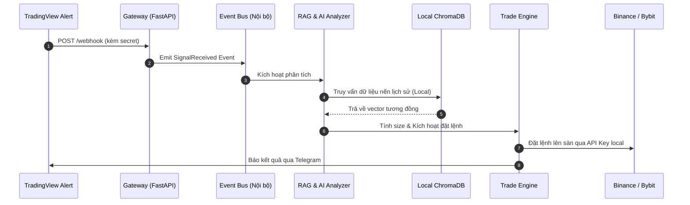
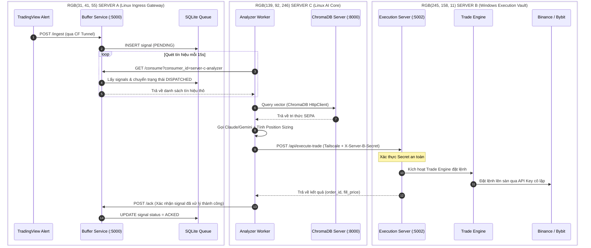

# 🏛️ Hướng Dẫn Kiến Trúc Lưỡng Hình (Hybrid/Dual-Mode Architecture)

> **Version:** 1.0 | **Date:** 2026-05-29  
> **Kiến trúc:** Chạy song song 2 chế độ: Local Monolith & 3-Server Pipeline Forwarding  
> **Source-of-Truth:** Cùng một mã nguồn duy nhất, phân nhánh hành vi qua Biến môi trường (.env)

Tài liệu này mô tả chi tiết cách mã nguồn Trading Bot tự động thay đổi hình thái vận hành (lưỡng hình) từ một **máy chủ đơn lẻ cục bộ (Monolith)** sang hệ thống **phân tán 3 server chuyên biệt (Decentralized)** mà không làm xáo trộn cấu trúc hoặc sửa đổi logic thuật toán cốt lõi.

---

## 📊 So Sánh 2 Chế Độ Vận Hành

| Tiêu chí | Chế độ 1: Local Monolith (Mặc định) | Chế độ 2: 3-Server Distributed (Kích hoạt qua Env) |
| :--- | :--- | :--- |
| **Môi trường chạy** | 1 máy duy nhất (Máy cá nhân hoặc 1 VPS) | 3 Servers độc lập nối qua Tailscale VPN |
| **Cơ chế Webhook** | Nhận trực tiếp và xử lý ngay lập tức | Nhận vào Server A -> Đẩy vào SQLite Queue |
| **Xử lý tín hiệu** | Chạy đồng bộ trong cùng tiến trình | Analyzer Worker trên Server C poll queue và phân tích |
| **Vector DB** | Lưu và đọc file ChromaDB tại thư mục cục bộ | Kết nối từ xa tới ChromaDB Server trên Server C |
| **Thực thi lệnh** | Gọi `TradeEngine` đặt lệnh sàn ngay trên máy | Đẩy payload đã ký bảo mật sang Server B thực thi |
| **Bảo mật API Keys** | API Keys sàn nằm trên cùng máy nhận webhook | API Keys sàn chỉ nằm trong Server B (Execution Vault) |
| **Độ trễ (Latency)** | Cực thấp (Xử lý trực tiếp trong bộ nhớ) | Thấp (~100-300ms do độ trễ mạng nội bộ Tailscale) |
| **Mục đích sử dụng** | Dev, Backtest, Chạy thử tài khoản nhỏ | Vận hành tài khoản lớn 24/7, bảo mật tối đa chìa khóa |

---

## 🗺️ Sơ Đồ So Sánh Luồng Dữ Liệu (Dataflow Diagrams)

### Chế độ 1: Luồng Chạy Local Monolith (Mặc định)



### Chế độ 2: Luồng Chạy Phân Tán (3-Server Pipeline Forwarding)



---

## ⚙️ Cấu Hình Switchboard (Bảng Điều Khiển Env)

Chế độ vận hành được quyết định hoàn toàn thông qua cấu hình trong file `.env` tại thư mục `/server/` (hoặc `nerves/workers/trading/` tùy cách bố trí repo).

### 1. File `.env` Cho Chế Độ Local Monolith (Mặc định)
```ini
# Chạy ở chế độ Monolith cục bộ
VPS_BUFFER_ENABLED=false
CHROMA_REMOTE=false

# Lắng nghe Webhook trực tiếp từ TradingView
PORT=5000
WEBHOOK_SECRET=your_secret_here

# API keys các sàn được đặt ngay tại đây
DEFAULT_EXCHANGE=binance
BINANCE_API_KEY=your_key
BINANCE_API_SECRET=your_secret
```

### 2. File `.env` Cho Server C (Trong kiến trúc 3-Server)
```ini
# Kích hoạt chế độ Client Phân Tán
VPS_BUFFER_ENABLED=true
VPS_BUFFER_URL=http://100.x.x.1:5000     # IP của Server A
VPS_BUFFER_SECRET=your_buffer_secret

# Kích hoạt kết nối ChromaDB từ xa
CHROMA_REMOTE=true
CHROMA_SERVER_HOST=localhost            # ChromaDB chạy local trên chính Server C
CHROMA_SERVER_PORT=8000

# Chuyển tiếp lệnh sang Server B thực thi
SERVER_B_EXECUTE_URL=http://100.x.x.2:5002
SERVER_B_SECRET=your_server_b_secret

# AI Keys nằm ở đây để chạy RAG
ANTHROPIC_API_KEY=your_claude_key
```

### 3. File `.env` Cho Server B (Trong kiến trúc 3-Server)
```ini
# Server B chỉ đóng vai trò Execution Vault nhận lệnh từ Server C
EXECUTION_MODE=true
HOST=0.0.0.0
PORT=5002

# Chỉ duy nhất Server C có secret này mới đẩy lệnh được
SERVER_B_SECRET=your_server_b_secret

# Bảo mật API Keys tại đây
BINANCE_API_KEY=your_real_key
BINANCE_API_SECRET=your_real_secret
```

---

## 🧩 Cơ Chế Phân Cô lập Mã Nguồn (Code Isolation Design)

Để không làm xáo trộn kiến trúc monolithic cũ, các cấu phần phục vụ chế độ đa server được đặt ở các thư mục và tệp tin độc lập hoàn toàn (**Additive-Only Policy**):

1.  **Thư mục độc lập `vbs/`**: Chứa toàn bộ API và SQLite của Server Ingress Gateway. Monolith hoàn toàn không động đến thư mục này.
2.  **File độc lập `server/workers/vps_analyzer.py`**: Chứa worker polling. Chỉ được import và khởi tạo trong `server/main.py` khi biến môi trường `VPS_BUFFER_ENABLED=True`.
3.  **File độc lập `server/execution_server.py`**: Chứa FastAPI server chạy trên Windows. Đây là file entry point riêng, tách biệt hoàn toàn khỏi tiến trình chính của bot `server/main.py`.

---

## 🔍 Hướng Dẫn Kiểm Tra Chuyển Chế Độ (Switch Verification)

Sếp có thể dễ dàng test cả 2 chế độ này trên máy local của mình bằng cách đổi biến môi trường và chạy thử:

### Test Chế độ Cục bộ (Monolith)
1. Cấu hình `.env` có `VPS_BUFFER_ENABLED=false` và `CHROMA_REMOTE=false`.
2. Khởi chạy bot: `python server/main.py`.
3. Bắn webhook test đến `http://localhost:5000/webhook` -> Tín hiệu lập tức được phân tích RAG và chạy qua TradeEngine cục bộ.

### Test Giả lập 3-Server (Mô phỏng trên cùng 1 máy qua các cổng khác nhau)
Sếp không cần thuê 3 VPS mới test được luồng phân tán. Hãy chạy test suite tự động tích hợp đã được thiết kế sẵn:
```bash
cd server
python -m pytest tests/test_pipeline_forwarding.py -v
```
*Test script này sẽ tự khởi động Gateway giả lập (cổng 5000), ChromaDB (cổng 8000), Analyzer Worker (cổng 5001) và Execution Server (cổng 5002) trên máy local để kiểm tra sự thông suốt của luồng phân tán.*
