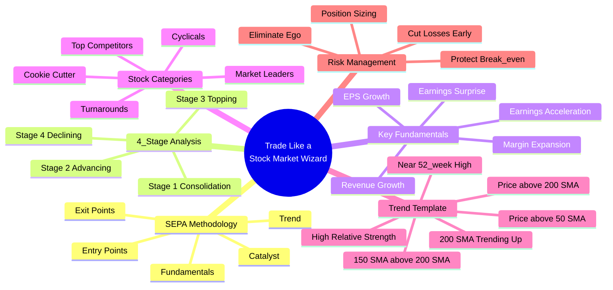

# 1. Master Overview
This is the high-level breakdown of the entire SEPA (Specific Entry Point Analysis) framework and trading philosophy.

```mermaid
mindmap
  root((Trade Like a
  Stock Market Wizard))
    SEPA Methodology
      Trend
      Fundamentals
      Catalyst
      Entry Points
      Exit Points
    4_Stage Analysis
      Stage 1 Consolidation
      Stage 2 Advancing
      Stage 3 Topping
      Stage 4 Declining
    Key Fundamentals
      EPS Growth
      Revenue Growth
      Earnings Acceleration
      Earnings Surprise
      Margin Expansion
    Stock Categories
      Market Leaders
      Top Competitors
      Turnarounds
      Cyclicals
      Cookie Cutter
    Trend Template
      Price above 200 SMA
      150 SMA above 200 SMA
      200 SMA Trending Up
      Price above 50 SMA
      Near 52_week High
      High Relative Strength
    Risk Management
      Cut Losses Early
      Protect Break_even
      Position Sizing
      Eliminate Ego
```

---