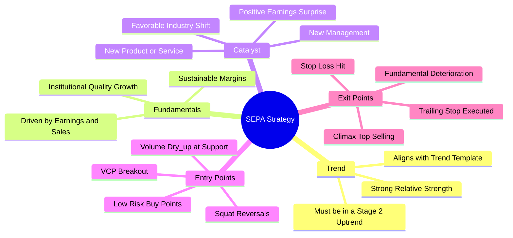

# 2. The SEPA Strategy Details
SEPA (Specific Entry Point Analysis) is the core methodology. Here is a deep-dive into its 5 fundamental elements.

```mermaid
mindmap
  root((SEPA Strategy))
    Trend
      Must be in a Stage 2 Uptrend
      Aligns with Trend Template
      Strong Relative Strength
    Fundamentals
      Driven by Earnings and Sales
      Institutional Quality Growth
      Sustainable Margins
    Catalyst
      New Product or Service
      Favorable Industry Shift
      New Management
      Positive Earnings Surprise
    Entry Points
      VCP Breakout
      Low Risk Buy Points
      Volume Dry_up at Support
      Squat Reversals
    Exit Points
      Stop Loss Hit
      Trailing Stop Executed
      Climax Top Selling
      Fundamental Deterioration
```

---