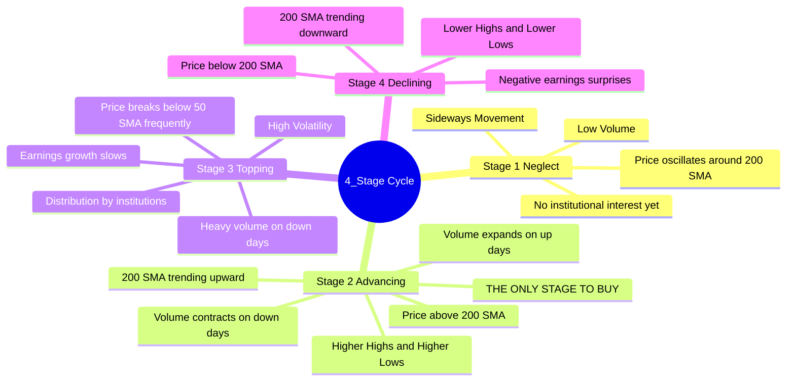

# 3. The 4-Stage Stock Cycle
Minervini emphasizes only trading in Stage 2. Here is what defines each stage.

```mermaid
mindmap
  root((4_Stage Cycle))
    Stage 1 Neglect
      Sideways Movement
      Low Volume
      Price oscillates around 200 SMA
      No institutional interest yet
    Stage 2 Advancing
      Price above 200 SMA
      200 SMA trending upward
      Higher Highs and Higher Lows
      Volume expands on up days
      Volume contracts on down days
      THE ONLY STAGE TO BUY
    Stage 3 Topping
      High Volatility
      Price breaks below 50 SMA frequently
      Heavy volume on down days
      Earnings growth slows
      Distribution by institutions
    Stage 4 Declining
      Price below 200 SMA
      200 SMA trending downward
      Lower Highs and Lower Lows
      Negative earnings surprises
```

---