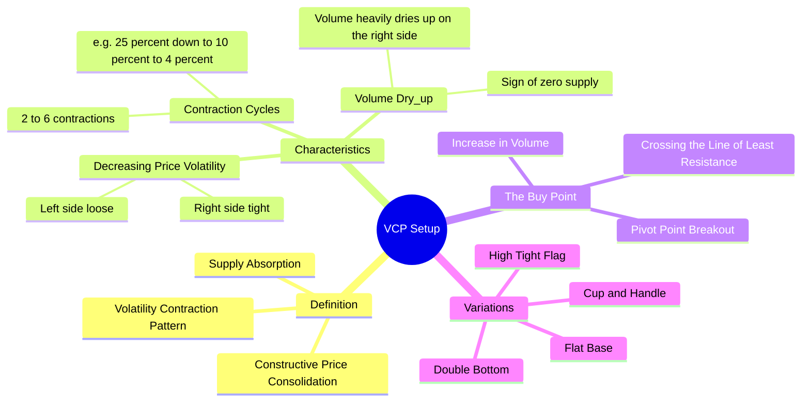

# 4. Volatility Contraction Pattern (VCP)
The VCP is Minervini's signature technical setup. It represents the absorption of supply.

```mermaid
mindmap
  root((VCP Setup))
    Definition
      Volatility Contraction Pattern
      Supply Absorption
      Constructive Price Consolidation
    Characteristics
      Decreasing Price Volatility
        Left side loose
        Right side tight
      Contraction Cycles
        2 to 6 contractions
        e.g. 25 percent down to 10 percent to 4 percent
      Volume Dry_up
        Volume heavily dries up on the right side
        Sign of zero supply
    The Buy Point
      Pivot Point Breakout
      Increase in Volume
      Crossing the Line of Least Resistance
    Variations
      Cup and Handle
      Double Bottom
      Flat Base
      High Tight Flag
```

---