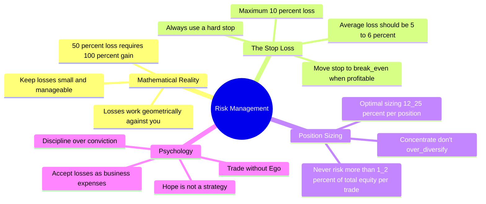

# 5. Risk Management & Mindset
Without risk management, the strategy fails. This is the psychological and mathematical foundation.

```mermaid
mindmap
  root((Risk Management))
    Mathematical Reality
      Losses work geometrically against you
      50 percent loss requires 100 percent gain
      Keep losses small and manageable
    The Stop Loss
      Always use a hard stop
      Maximum 10 percent loss
      Average loss should be 5 to 6 percent
      Move stop to break_even when profitable
    Position Sizing
      Never risk more than 1_2 percent of total equity per trade
      Optimal sizing 12_25 percent per position
      Concentrate don't over_diversify
    Psychology
      Trade without Ego
      Hope is not a strategy
      Accept losses as business expenses
      Discipline over conviction
```

---