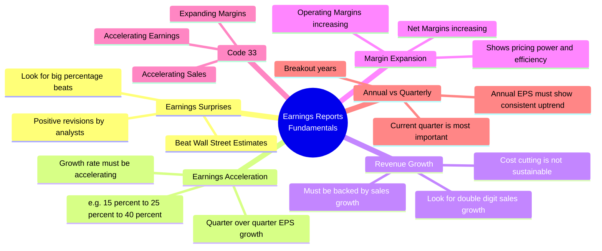

# 6. Earnings Reports & Fundamentals (Code 33)
Minervini heavily focuses on specific fundamental metrics found in Earnings Reports. "Code 33" represents the holy trinity of fundamental acceleration.

---