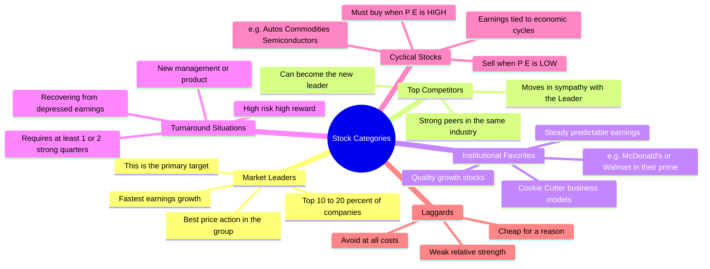

# 7. Stock Categorization Details
Knowing what category a stock belongs to dictates your expectations and holding period.

```mermaid
mindmap
  root((Stock Categories))
    Market Leaders
      Top 10 to 20 percent of companies
      Fastest earnings growth
      Best price action in the group
      This is the primary target
    Top Competitors
      Strong peers in the same industry
      Moves in sympathy with the Leader
      Can become the new leader
    Institutional Favorites
      Quality growth stocks
      Steady predictable earnings
      Cookie Cutter business models
      e.g. McDonald's or Walmart in their prime
    Turnaround Situations
      Recovering from depressed earnings
      New management or product
      Requires at least 1 or 2 strong quarters
      High risk high reward
    Cyclical Stocks
      Earnings tied to economic cycles
      e.g. Autos Commodities Semiconductors
      Must buy when P E is HIGH
      Sell when P E is LOW
    Laggards
      Avoid at all costs
      Cheap for a reason
      Weak relative strength
```