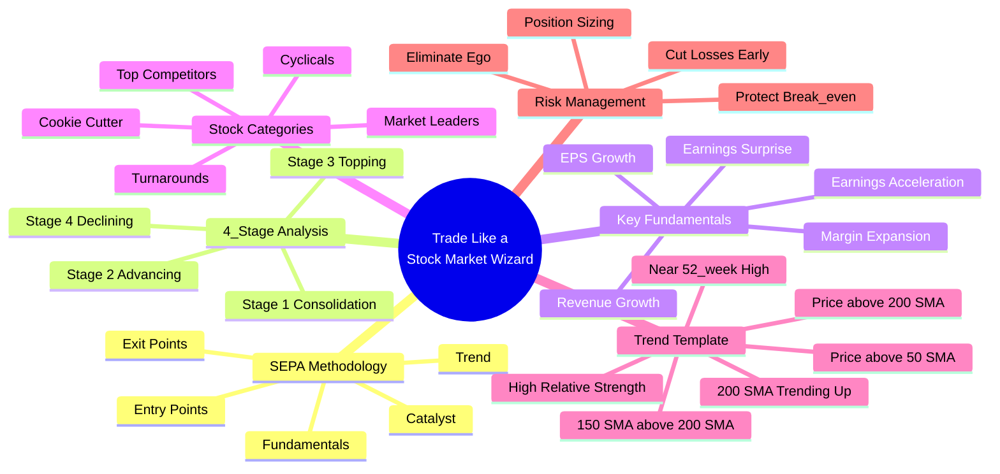
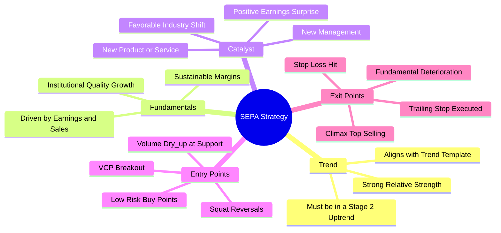
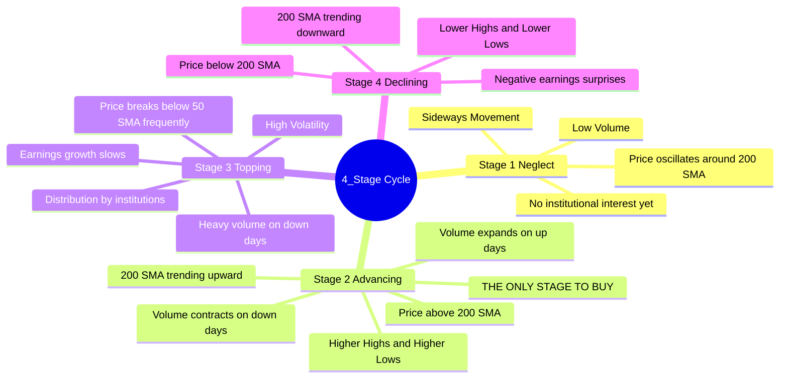
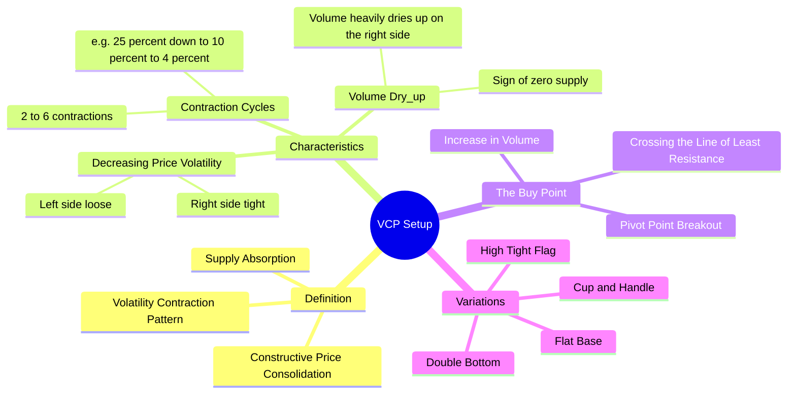
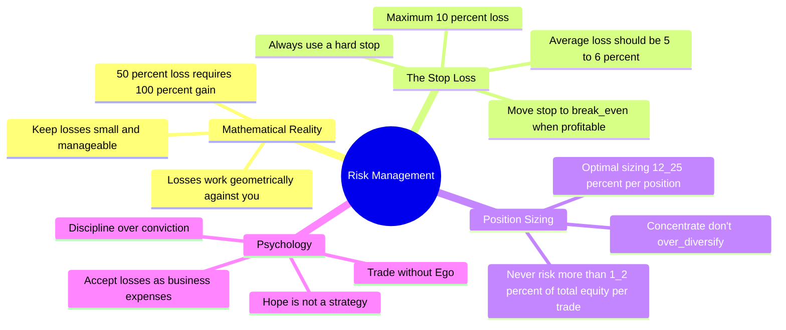
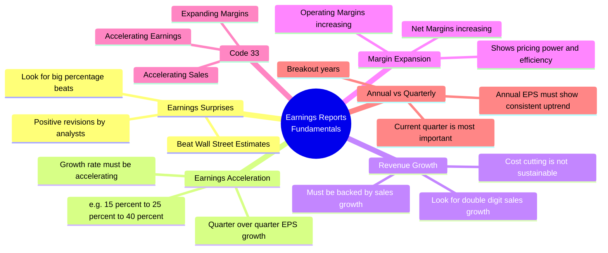
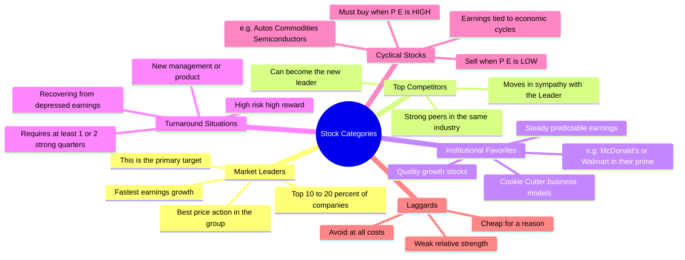

# Mind Maps: Trade Like a Stock Market Wizard

This document contains detailed, comprehensive Mind Maps in English based on Mark Minervini's book **"Trade Like a Stock Market Wizard"**. These mind maps are designed to be easily readable and provide a top-down view of his core trading concepts.

## 1. Master Overview
This is the high-level breakdown of the entire SEPA (Specific Entry Point Analysis) framework and trading philosophy.

---

## 2. The SEPA Strategy Details
SEPA (Specific Entry Point Analysis) is the core methodology. Here is a deep-dive into its 5 fundamental elements.

---

## 3. The 4-Stage Stock Cycle
Minervini emphasizes only trading in Stage 2. Here is what defines each stage.

---

## 4. Volatility Contraction Pattern (VCP)
The VCP is Minervini's signature technical setup. It represents the absorption of supply.

---

## 5. Risk Management & Mindset
Without risk management, the strategy fails. This is the psychological and mathematical foundation.

---

## 6. Earnings Reports & Fundamentals (Code 33)
Minervini heavily focuses on specific fundamental metrics found in Earnings Reports. "Code 33" represents the holy trinity of fundamental acceleration.

---

## 7. Stock Categorization Details
Knowing what category a stock belongs to dictates your expectations and holding period.

