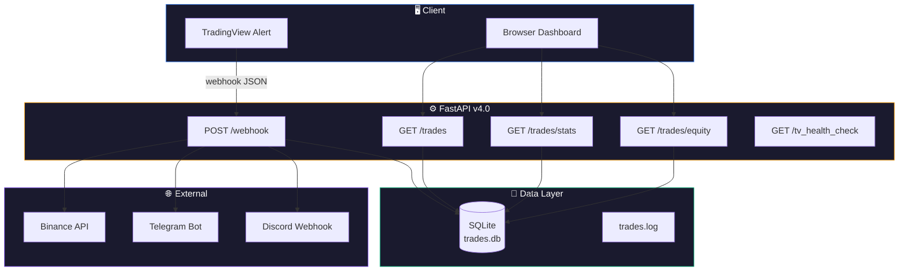

# P4 — FastAPI Production Server
**Branch:** `feat/minervini-strategy` (merged to `main`)  
**Status:** ✅ Completed  
**Version:** v4.0

---

## 🎯 Mục tiêu P4

Chuyển đổi dự án từ prototype sang **production-grade server**, bao gồm:

1. **Trade Logging** — SQLite database thay thế text log
2. **TradingView MCP** — Kết nối Claude AI với TradingView Desktop
3. **Performance Dashboard** — Web UI hiển thị metrics giao dịch
4. **Automated Testing** — Test suite đạt chuẩn production

---

## 📋 Sprints

| Sprint | Nội dung | Docs | Status |
|--------|---------|------|--------|
| **Sprint 4** | Trade Logging — SQLite + aiosqlite | [sprint4_trade_logging.md](sprint4_trade_logging.md) | ✅ Done |
| **Sprint 5** | TradingView MCP Integration — CDP | [sprint5_tradingview_mcp.md](sprint5_tradingview_mcp.md) | ✅ Done |
| **Sprint 6** | Performance Dashboard — Web UI | [sprint6_dashboard.md](sprint6_dashboard.md) | ✅ Done |
| **Sprint 7** | Server Testing — pytest suite | [sprint7_testing.md](sprint7_testing.md) | ✅ Done |

---

## 🏗️ Kiến trúc P4



---

## 📦 Deliverables

### Files đã tạo
```
server/
├── database.py          # SQLite async CRUD (signals + trades)
├── main.py              # FastAPI v4.0 (8 endpoints)
├── notifier.py          # Telegram + Discord notification
├── config.py            # Environment config
├── static/
│   ├── dashboard.html   # Premium dark UI
│   ├── css/dashboard.css
│   └── js/dashboard.js  # Chart.js equity curve
├── tests/
│   ├── conftest.py
│   ├── unit/
│   │   ├── test_database.py
│   │   └── test_config.py
│   ├── integration/
│   │   ├── test_webhook.py
│   │   ├── test_trades.py
│   │   └── test_dashboard.py
│   └── security/
│       ├── test_auth.py
│       └── test_ip.py
└── requirements-test.txt
```

### API Endpoints
| Method | Path | Mô tả |
|--------|------|--------|
| `POST` | `/webhook` | Nhận signal từ TradingView |
| `GET` | `/tv_health_check` | Server health status |
| `GET` | `/dashboard` | Performance Dashboard UI |
| `GET` | `/trades` | Lịch sử giao dịch (pagination + filter) |
| `GET` | `/trades/stats` | Win Rate, Profit Factor, Drawdown |
| `GET` | `/trades/equity` | Equity curve data (Chart.js) |

### Database Schema
- `signals` — Mọi tín hiệu TradingView (symbol, action, price, status)
- `trades` — Kết quả Binance execution (order_id, executed_qty, P&L)

---

## 🔗 Liên kết

- **Kế thừa từ:** P1-P3 (Pine Script V1, Webhook prototype, Minervini knowledge base)
- **Tiếp nối bởi:** [P5 — RAG Integration](../P5/) | [P6 — MCP Morning Brief](../P6/)

---

## 🔧 Tech Stack P4

| Component | Technology |
|-----------|-----------|
| Server | FastAPI + Uvicorn |
| Database | SQLite + aiosqlite |
| HTTP Client | aiohttp (Binance) |
| Dashboard | HTML + Vanilla JS + Chart.js CDN |
| Design | Glassmorphism + Dark mode |
| Testing | pytest + pytest-asyncio + httpx |
| Notifications | Telegram Bot API + Discord Webhook |
