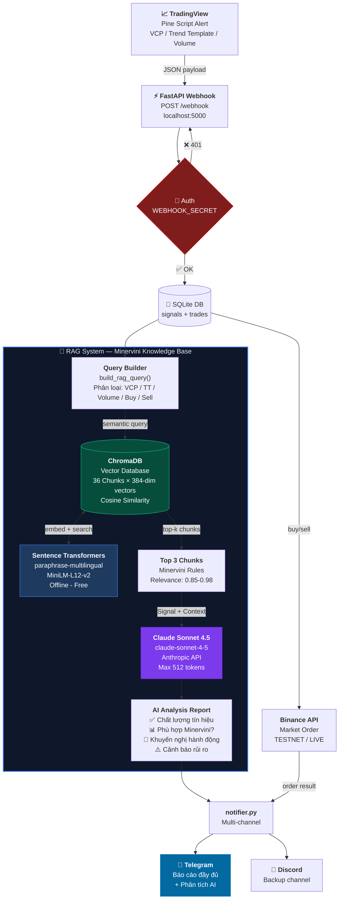
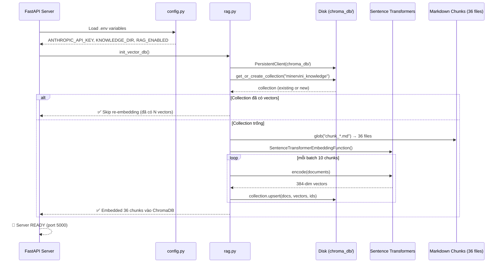
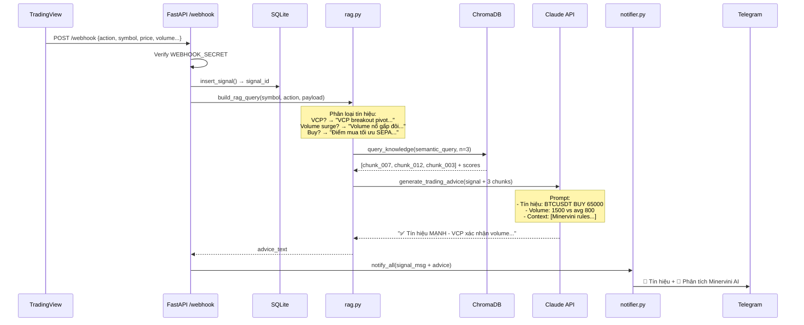
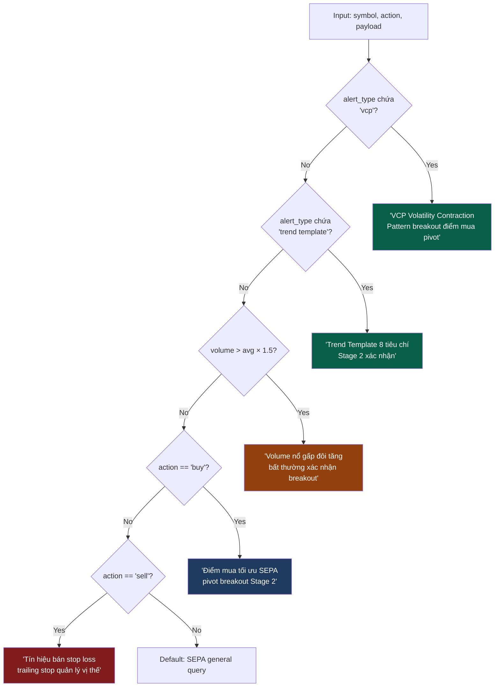
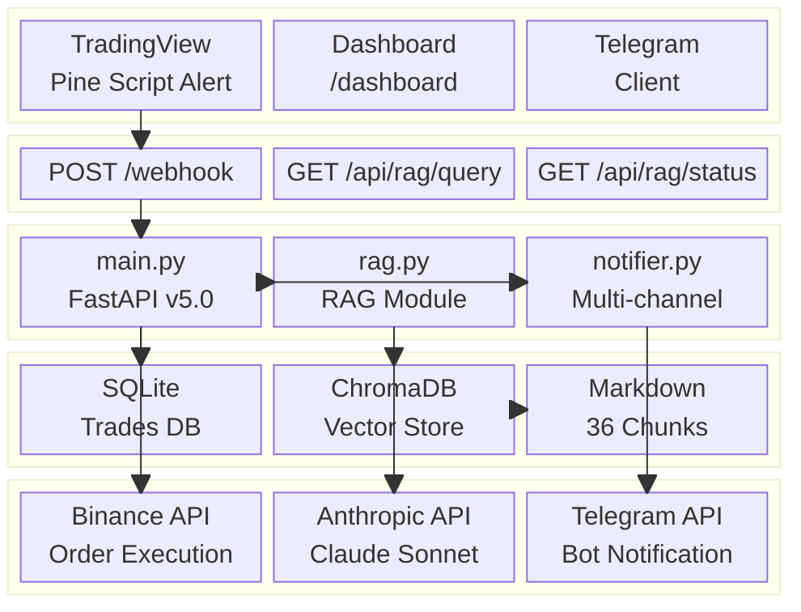

# Sơ đồ Kiến trúc RAG — TradingView × Minervini AI

## 1. Luồng chính (End-to-End)

---

## 2. Startup Sequence (Server Khởi động)

---

## 3. Webhook Processing Flow (Mỗi Alert)

---

## 4. RAG Query Logic (build_rag_query)

---

## 5. Phân tầng Kiến trúc (Stack Layers)

