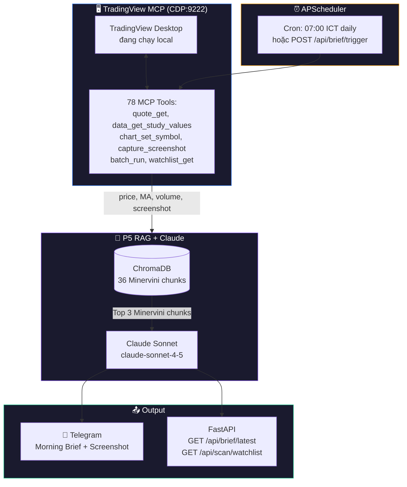
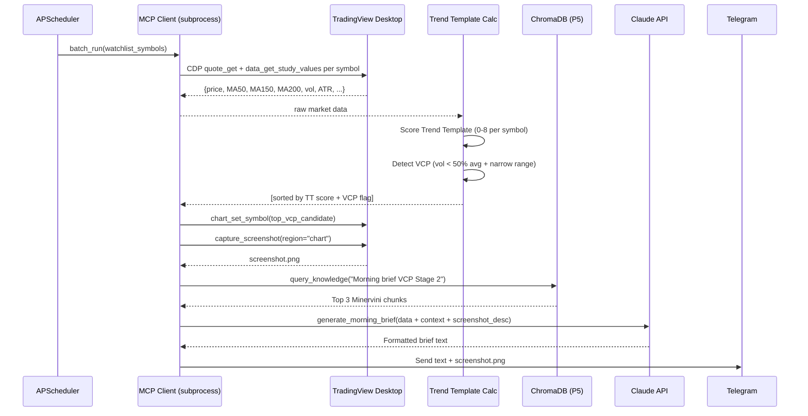

# P6 — TradingView MCP × RAG Morning Brief
**Branch:** `feat/p6-mcp-morning-brief`  
**Status:** 📋 Planning  
**Depends on:** P5 (RAG + ChromaDB + Claude) ✅  
**MCP Source:** [tradesdontlie/tradingview-mcp](https://github.com/tradesdontlie/tradingview-mcp) (78 tools via CDP)

---

## 🎯 Mục tiêu P6

Khai thác **TradingView MCP** đã sẵn có trong project, kết hợp với **RAG System (P5)** để tạo ra:

1. **Morning Brief tự động** — mỗi sáng 07:00 ICT, Claude đọc chart thực + tra Minervini rules → gửi báo cáo qua Telegram
2. **Real-time Visual Confirmation** — khi webhook nhận signal, Claude capture screenshot chart + xác nhận VCP pattern
3. **Watchlist Scanner** — tự động scan multi-symbol, filter theo Trend Template, gửi cảnh báo

> **Gap P5 còn lại:** Claude hiện chỉ đọc số liệu JSON. P6 cho Claude đọc biểu đồ trực quan (thứ FX Tactix đang làm) + screenshot chart.

---

## 🔌 MCP Capabilities (Đã khảo sát)

MCP dùng **Chrome DevTools Protocol (CDP port 9222)** — kết nối vào TradingView Desktop đang chạy.

### Tools dùng cho P6

| MCP Tool | Dùng cho |
|----------|---------|
| `quote_get` | Lấy price, OHLC, volume realtime |
| `data_get_ohlcv --summary` | Compact bar stats (500B) |
| `data_get_study_values` | Đọc MA50, MA150, MA200, RSI, Volume |
| `chart_set_symbol` | Switch sang symbol cần scan |
| `chart_set_timeframe` | Switch timeframe (D, W) |
| `capture_screenshot` | Chụp chart → gửi Telegram kèm phân tích |
| `watchlist_get` | Đọc watchlist TradingView của user |
| `batch_run` | Chạy action trên nhiều symbol cùng lúc |
| `tv_health_check` | Kiểm tra kết nối CDP |

### Khởi động MCP

```bash
# 1. Init submodule
git submodule update --init tradingview-mcp
cd tradingview-mcp && npm install

# 2. Launch TradingView với debug port
scripts\launch_tv_windows.bat   # Script đã có trong project!

# 3. Verify
node src/cli/index.js status
```

> ⚠️ **Lưu ý:** TradingView Desktop phải đang chạy với `--remote-debugging-port=9222`

---

## 🏗️ Kiến trúc P6



---

## 📋 Features

### Feature 1: Morning Brief (Priority: HIGH ⭐)

**Trigger:** `07:00 ICT` hàng ngày hoặc `POST /api/brief/trigger`

**Quy trình:**
```
APScheduler 07:00
    ↓
batch_run(watchlist) → quote_get + data_get_study_values + ohlcv(summary)
    ↓
Tính Trend Template score (0/8) cho từng symbol
Phát hiện VCP candidates (volume < 50% avg + narrow range < 0.5×ATR)
    ↓
capture_screenshot(region=chart) cho top candidates
    ↓
RAG query "Morning market scan Stage 2 VCP"
    ↓
Claude generate Morning Brief report
    ↓
Telegram: Text report + Chart screenshot
```

**Output Telegram mẫu:**
```
🌅 MORNING BRIEF — 04/05/2026 07:00 ICT

📊 Watchlist Scan (8 symbols):
• BTCUSDT  $65,200 (+2.3%)  TT: 7/8 ✅  Vol: 1.2× avg
• ETHUSDT  $3,100  (+1.1%)  TT: 6/8 ✅  Vol: 0.9× avg
• FPT      89,500  (+0.8%)  TT: 8/8 ⭐  Vol: 0.4× avg ← VCP!

🎯 VCP Setup đáng chú ý:
• FPT: Volume giảm 60% (contraction thứ 3) — pivot 91,000

🧠 Minervini AI:
"FPT đang trong VCP contraction chuẩn. Theo Rule #7 Minervini,
volume giảm liên tiếp 3 lần với biên độ hẹp là dấu hiệu tích cực.
Chờ breakout pivot 91,000 với volume >150% avg."

📸 [Chart screenshot FPT attached]
⚠️ Market risk: Neutral
```

### Feature 2: Webhook Visual Confirmation (Priority: MEDIUM)

Khi `/webhook` nhận BUY signal:
1. `chart_set_symbol(symbol)` + `chart_set_timeframe("D")`
2. `capture_screenshot(region="chart")`
3. Claude xem screenshot + RAG context → xác nhận/từ chối tín hiệu
4. Append vào Telegram: *"📸 Chart xác nhận VCP pattern: ..."*

### Feature 3: Watchlist Scanner API (Priority: MEDIUM)

```
GET /api/scan/watchlist?symbols=BTCUSDT,ETHUSDT,FPT&timeframe=D
```

Response:
```json
{
  "scanned": 3,
  "timestamp": "2026-05-04T07:00:00+07:00",
  "results": [
    {
      "symbol": "FPT",
      "price": 89500,
      "trend_template_score": 8,
      "vcp_detected": true,
      "volume_ratio": 0.41,
      "ai_note": "Contraction thứ 3, pivot 91,000"
    }
  ]
}
```

### Feature 4: Manual Trigger API (Priority: LOW)

```
POST /api/brief/trigger          → Chạy morning brief ngay lập tức
GET  /api/brief/latest           → Lấy brief mới nhất (JSON + text)
GET  /api/mcp/status             → Kiểm tra CDP connection
```

---

## 🗂️ Files cần tạo/sửa

```
server/
├── mcp_client.py        [NEW] Python wrapper gọi MCP CLI (subprocess)
├── brief.py             [NEW] Morning brief generator
├── watchlist.py         [NEW] Multi-symbol Trend Template scanner
├── scheduler.py         [NEW] APScheduler cron setup
├── main.py              [MODIFY] Thêm /api/brief/* /api/scan/* /api/mcp/* endpoints
└── config.py            [MODIFY] WATCHLIST_SYMBOLS, BRIEF_CRON_TIME, MCP_CDP_PORT

tradingview-mcp/         [INIT SUBMODULE] git submodule update --init

docs/plans/P6/
├── README.md            ← File này
└── architecture_mermaid.md
```

---

## 🔧 Dependencies cần thêm vào `requirements.txt`

```txt
apscheduler>=3.10.4      # Cron scheduler (async-compatible)
pillow>=10.0.0           # Image processing cho screenshot
aiofiles>=23.0.0         # Async file read
```

Node.js (cho MCP):
```bash
cd tradingview-mcp && npm install
```

---

## ⚙️ Config mới trong `.env`

```env
# === P6: MCP Morning Brief ===
MCP_ENABLED=true
MCP_CDP_PORT=9222                           # Chrome DevTools Protocol port
MCP_TRADINGVIEW_PATH=C:\...\TradingView.exe # Auto-detect nếu để trống

# Watchlist (comma-separated)
WATCHLIST_SYMBOLS=BTCUSDT,ETHUSDT,SOLUSDT,FPT,VCB,MWG

# Morning Brief schedule (cron format, Asia/Ho_Chi_Minh)
BRIEF_CRON_TIME=07:00                       # HH:MM
BRIEF_ENABLED=true
```

---

## 🔄 Luồng Morning Brief Chi tiết



---

## ✅ Acceptance Criteria

- [ ] `git submodule update --init tradingview-mcp` hoạt động
- [ ] `tv_health_check` → `{"connected": true}` khi TradingView chạy với CDP
- [ ] Morning Brief gửi đúng 07:00 ICT hàng ngày
- [ ] Brief bao gồm: TT score, VCP candidates, AI assessment, screenshot
- [ ] `POST /api/brief/trigger` hoạt động on-demand
- [ ] `GET /api/scan/watchlist` trả đúng JSON
- [ ] Webhook signal kèm chart confirmation (Feature 2)
- [ ] `GET /api/mcp/status` trả trạng thái CDP connection
- [ ] Tests cho `mcp_client.py`, `brief.py`, `watchlist.py`

---

## 📅 Phân tích Effort

| Task | Effort |
|------|--------|
| Init MCP submodule + verify CDP | 1h |
| `mcp_client.py` (Python → subprocess MCP CLI) | 3h |
| Trend Template calculator từ MA data | 2h |
| VCP detector (volume + range logic) | 2h |
| `brief.py` morning brief generator | 3h |
| APScheduler integration | 1h |
| FastAPI endpoints (4 endpoints) | 2h |
| Screenshot → Telegram send | 1h |
| Tests | 3h |
| **Total** | **~18h** |

---

## 📌 Open Questions — Cần quyết định

> [!IMPORTANT]
> 1. **Watchlist symbols:** BTCUSDT, ETHUSDT, SOLUSDT + VN stocks nào? (FPT, VCB, MWG?)
> 2. **Brief time:** 07:00 ICT hay khác?
> 3. **Screenshot:** Gửi kèm Telegram (tốn data) hay chỉ link dashboard?
> 4. **TradingView Desktop:** Bạn có đang dùng TradingView Desktop (paid) không? MCP cần app Desktop chạy với CDP port.
> 5. **Binance symbols:** Có cần scan Binance futures không hay chỉ spot?

> [!WARNING]
> TradingView MCP dùng Chrome DevTools Protocol — cần TradingView Desktop **đang chạy** trên cùng máy. Không hoạt động với TradingView Web app. Confirm trước khi bắt đầu code.
