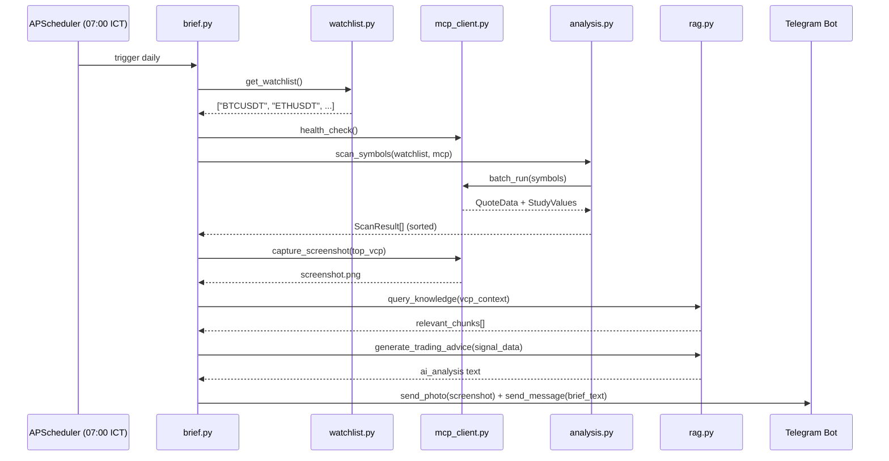

# Sprint 6.4 — Morning Brief + Scheduler
**Branch:** `feat/p6-mcp-morning-brief`  
**Commit:** `cf76141` (included in S1 batch)  
**Status:** ✅ Done

---

## Mục tiêu

Tự động hóa **Morning Brief** hàng ngày lúc 07:00 ICT — scan watchlist,
chụp screenshot chart, phân tích bằng RAG + Claude AI, gửi qua Telegram
với ảnh đính kèm.

---

## Kiến trúc



---

## Files

### [NEW] `server/brief.py`

**Orchestration flow:**

1. **Get watchlist** → `watchlist.get_watchlist()`
2. **MCP health check** → warn nếu không connected
3. **Scan symbols** → `analysis.scan_symbols()` → TT + VCP scores
4. **Screenshot top VCP** → `mcp.capture_screenshot()` → PNG file
5. **RAG + Claude analysis** → query knowledge base + generate advice
6. **Format brief text** → Telegram-friendly markdown
7. **Send Telegram** → photo + caption (hoặc text nếu no screenshot)
8. **Cache** → lưu latest brief in memory

**Key functions:**

| Function | Mô tả |
|----------|--------|
| `generate_morning_brief()` | Full orchestration — async |
| `get_latest_brief()` | Return cached brief dict |
| `_format_brief_text(results, ai, ts)` | Format Telegram message |

**Telegram output format:**
```
🌅 MORNING BRIEF — 04/05/2026 07:00 ICT
📊 Watchlist scan: 5 symbols

Symbol  │ Price     │ TT   │ Vol%  │ VCP
─────────────────────────────────────────────
BTCUSDT  │  68,500.00 │ 7/8  │  35%  │ ⭐VCP
ETHUSDT  │   3,850.00 │ 5/8  │  82%  │
SOLUSDT  │     185.00 │ 6/8  │  45%  │

🎯 VCP Setups đáng chú ý:
• BTCUSDT: VCP xác nhận: vol=35% avg, range=40% ATR — gần 52w high ⭐
  → Pivot breakout: 69,200.50

🧠 Minervini AI Assessment:
[Claude analysis based on RAG context]
```

### [NEW] `server/scheduler.py`

**APScheduler với CronTrigger:**

```python
scheduler.add_job(
    _run_morning_brief_job,
    trigger=CronTrigger(hour=7, minute=0, timezone="Asia/Ho_Chi_Minh"),
    id="morning_brief",
    misfire_grace_time=300,  # 5 phút grace period
)
```

**Config vars:**
- `BRIEF_ENABLED` — bật/tắt scheduler
- `BRIEF_CRON_TIME` — `HH:MM` format (default: `07:00`)

**Lifecycle:**
- `start_scheduler()` — gọi trong FastAPI lifespan startup
- `stop_scheduler()` — gọi trong lifespan shutdown

### [MODIFY] `server/main.py`

**2 endpoints mới:**

| Method | Path | Mô tả |
|--------|------|--------|
| `POST` | `/api/brief/trigger` | Chạy brief ngay (background task) |
| `GET` | `/api/brief/latest` | Xem brief mới nhất |

**Lifespan update:**
```python
# Startup
if config.BRIEF_ENABLED:
    scheduler_module.start_scheduler()

# Shutdown
scheduler_module.stop_scheduler()
```

### [MODIFY] `server/config.py`

```python
BRIEF_ENABLED = os.getenv("BRIEF_ENABLED", "false")
BRIEF_CRON_TIME = os.getenv("BRIEF_CRON_TIME", "07:00")
WATCHLIST_DEFAULT = ["BTCUSDT", "ETHUSDT", "SOLUSDT"]
```

### [MODIFY] `server/requirements.txt`

```
+ apscheduler>=3.10.4
+ pillow>=10.0.0
+ requests>=2.31.0
```

---

## API Examples

```bash
# Trigger manual morning brief
curl -X POST http://localhost:5000/api/brief/trigger
# → {"triggered": true, "message": "Morning Brief đang chạy..."}

# Check latest brief
curl http://localhost:5000/api/brief/latest
# → {"available": true, "timestamp": "...", "scan_results": [...], ...}
```

---

## Cấu hình .env

```env
# Bật scheduler
BRIEF_ENABLED=true
BRIEF_CRON_TIME=07:00

# Dependencies
MCP_ENABLED=true            # cần cho screenshot + data
RAG_ENABLED=true            # cần cho AI analysis
ANTHROPIC_API_KEY=sk-ant-...  # cần cho Claude
TELEGRAM_BOT_TOKEN=...     # cần cho delivery
TELEGRAM_CHAT_ID=...       # cần cho delivery
```

---

## Verification

1. **Manual trigger:**
   ```bash
   curl -X POST http://localhost:5000/api/brief/trigger
   ```
2. **Kiểm tra Telegram** → nhận brief text + screenshot chart
3. **Auto-schedule:** Để server chạy overnight → 07:00 ICT tự động trigger
4. **Check latest:**
   ```bash
   curl http://localhost:5000/api/brief/latest
   ```
