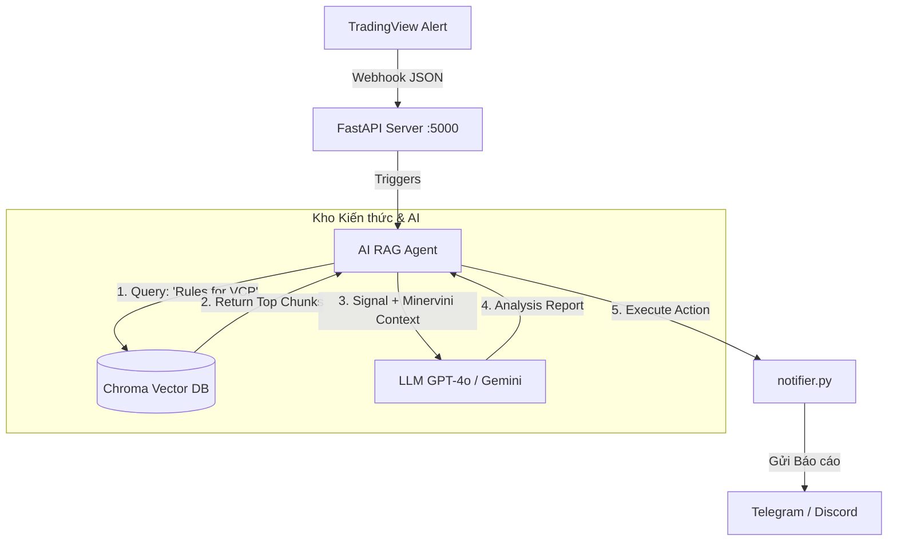

# Kiến trúc Hệ thống: Automated RAG Flow (TradingView & AI Agent)

Tài liệu này mô tả luồng kiến trúc (Architecture Flow) kết nối tín hiệu từ TradingView Webhook với Hệ thống Trí tuệ Nhân tạo (AI Agent) sử dụng cơ chế RAG (Retrieval-Augmented Generation). Mục đích là để AI tự động tra cứu bộ quy tắc của Mark Minervini (từ Knowledge Base) và phân tích tín hiệu giao dịch trước khi gửi thông báo.

## 1. Sơ đồ Luồng hoạt động (Architecture Flow)


Viewed RAG_ARCHITECTURE_FLOW.md:1-39

Dưới đây là hình ảnh render trực quan của **Sơ đồ Luồng hoạt động (Architecture Flow)** từ file tài liệu của chúng ta:


*(Lưu ý: Nếu bạn mở file `docs/GPT_GEMINI_RAG_ARCHITECTURE_FLOW.md` trên GitHub hoặc có cài Extension hỗ trợ Mermaid trên VS Code, sơ đồ này cũng sẽ tự động được hiển thị y hệt như trên).*


## 2. Chi tiết các Bước thực thi

1. **TradingView bắn Webhook (Trigger):**
   - Khi công cụ Pine Script phát hiện tín hiệu (ví dụ: `VCP Breakout` hoặc đạt chuẩn `Trend Template`), TradingView bắn một gói dữ liệu JSON về server thông qua Cloudflare Tunnel (`localhost:5000/webhook`).

2. **Agent Nhận Tín Hiệu & Truy Vấn (Retrieval):**
   - Server FastAPI không gửi thông báo ngay. Thay vào đó, nó kích hoạt AI Agent.
   - Dựa trên loại tín hiệu (ví dụ: VCP), Agent tự động tạo truy vấn tìm kiếm và gọi vào **Vector Database** (được xây dựng từ các file `chunks` Markdown của cuốn sách).
   - Vector DB tính toán độ tương đồng và trả về 2-3 đoạn trích dẫn luật giao dịch chuẩn xác nhất liên quan đến điểm mua VCP.

3. **LLM Phân Tích (Generation):**
   - Agent nạp Dữ liệu Tín Hiệu (Mã cổ phiếu, Giá, Volume) + Dữ liệu Kiến Thức (Đoạn trích luật Minervini) vào cho LLM (Large Language Model).
   - LLM sẽ đóng vai trò là một chuyên gia giao dịch, đối chiếu tín hiệu thực tế với lý thuyết trong sách để đánh giá chất lượng của tín hiệu này (Tốt, Xấu, Cần lưu ý gì).

4. **Gửi Báo Cáo (Action):**
   - Thông qua module `notifier.py`, hệ thống đẩy một bản báo cáo phân tích chuyên sâu (kèm đánh giá của AI) về điện thoại của người dùng qua Telegram hoặc Discord.

## 3. Cấu trúc Triển khai Kỹ thuật dự kiến

Để xây dựng kiến trúc này, thư mục `server/` sẽ cần được bổ sung 2 thành phần chính:

*   **`build_vector_db.py` (Chạy 1 lần):** 
    - Script dùng `LangChain` hoặc `LlamaIndex` để đọc thư mục `docs/knowledge/trading_wizard/chunks/`, embedding nội dung và lưu vào cơ sở dữ liệu `chroma_db/`.
*   **`rag_agent.py` (Chạy Runtime):**
    - Script chứa Logic kết nối với Vector DB và gọi API của LLM.
    - Code mẫu tích hợp vào FastAPI (`main.py`):

```python
from fastapi import Request
from rag_agent import get_trading_advice
import notifier

@app.post("/webhook")
async def receive_webhook(data: Request):
    signal = await data.json() # Ví dụ: {"symbol": "FPT", "signal": "VCP"}
    
    # AI tự động quét Vector DB và phân tích
    analysis_report = await get_trading_advice(signal)
    
    # Gửi kết quả phân tích chuyên sâu qua Telegram
    await notifier.send_telegram(analysis_report)
```
