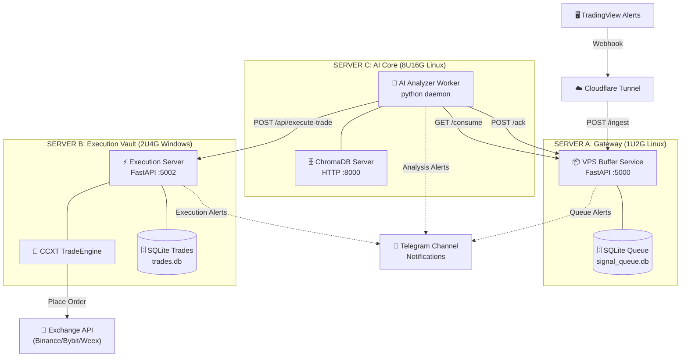
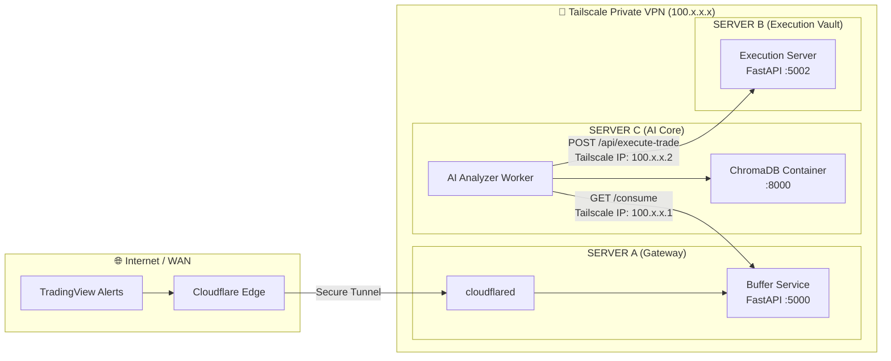
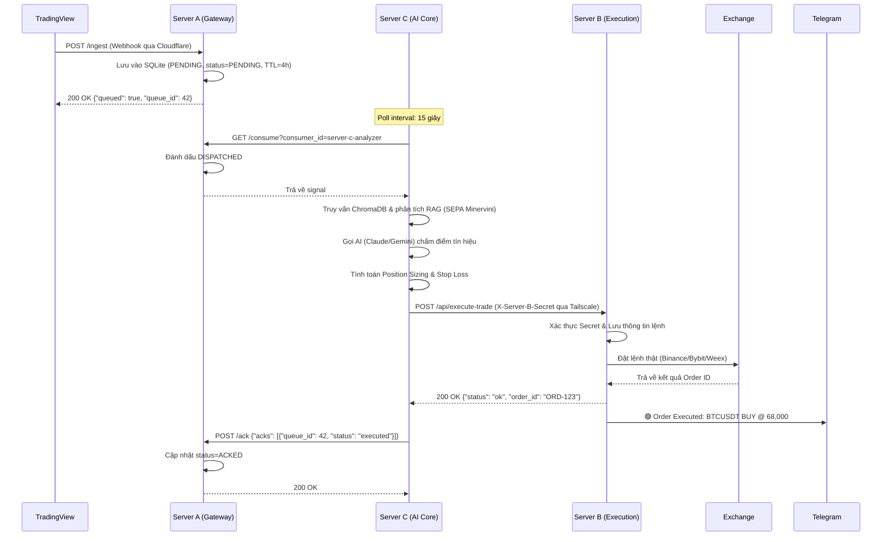
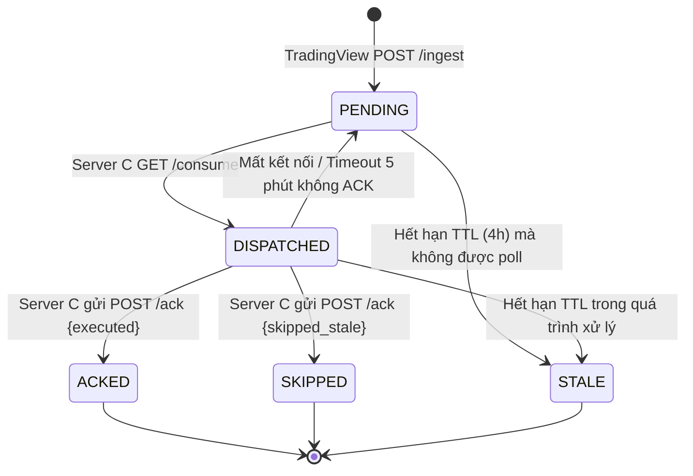

# 🏛️ 3-Server Pipeline Forwarding Architecture
## Tài Liệu Kiến Trúc — Minervini Trading Bot Signal Pipeline

> **Project:** TradingViewProject  
> **Module:** VPS Buffer Service (vbs) · AI Analyzer · Execution Vault  
> **Version:** 2.0.0  
> **Date:** 2026-05-29  
> **Status:** ✅ Approved & Implemented  

---

## 📋 MỤC LỤC

1. [Vấn Đề & Bối Cảnh](#1-vấn-đề--bối-cảnh)
2. [Mục Tiêu Kiến Trúc](#2-mục-tiêu-kiến-trúc)
3. [Sơ Đồ Kiến Trúc Tổng Thể](#3-sơ-đồ-kiến-trúc-tổng-thể)
4. [State Machine — Vòng Đời Tín Hiệu](#4-state-machine--vòng-đời-tín-hiệu)
5. [Use Cases](#5-use-cases)
6. [Yêu Cầu Hệ Thống (Requirements)](#6-yêu-cầu-hệ-thống-requirements)
7. [API Contract](#7-api-contract)
8. [Database Schema](#8-database-schema)
9. [Chiến Lược Lõi (Core Strategy)](#9-chiến-lược-lõi-core-strategy)
10. [CI/CD & Hardening Pipeline](#10-cicd--hardening-pipeline)
11. [Rủi Ro & Biện Pháp Đối Phó](#11-rủi-ro--biện-pháp-đối-phó)

---

## 1. Vấn Đề & Bối Cảnh

### 1.1 Hiện Trạng (Kiến trúc cũ)
Trước đây, tín hiệu được đẩy trực tiếp từ TradingView về máy Local để chạy phân tích và đặt lệnh. Máy Local thường bị ngủ (sleep), mất mạng hoặc mất điện, gây thất thoát các tín hiệu quan trọng khi thị trường đạt điểm phá vỡ (breakout).

### 1.2 Giải Pháp: Mô hình 3-Server Pipeline Forwarding
Chúng ta tách biệt hệ thống thành 3 vùng độc lập, kết nối với nhau qua VPN an toàn (Tailscale) để đạt độ tin cậy và bảo mật tối đa:

* **SERVER A (Gateway - Linux 1U2G):** Hứng Webhook 24/7 qua Cloudflare Tunnel, lưu tín hiệu tạm thời vào SQLite Queue. Không có API key sàn, không có AI logic.
* **SERVER C (AI Core - Linux 8U16G):** Poll tín hiệu từ Server A, thực hiện RAG (ChromaDB) và phân tích AI (Claude/Gemini) kết hợp bộ lọc kỹ thuật để tính Position Sizing.
* **SERVER B (Execution Vault - Windows Server 2U4G):** Nằm cô lập tuyệt đối, chỉ nhận lệnh giao dịch đã được phê duyệt đầy đủ từ Server C, đặt lệnh trực tiếp lên sàn (Binance/Bybit/Weex) và báo Telegram.

---

## 2. Mục Tiêu Kiến Trúc

| ID | Mục Tiêu | Mức Độ | Trạng thái |
|----|---------|--------|------------|
| G-01 | **Không mất tín hiệu** khi các server phân tích hoặc đặt lệnh tạm thời offline. | 🔴 CRITICAL | ✅ Đạt được (Server A hứng 24/7) |
| G-02 | **Stale Signal Protection** — Ngăn ngừa đặt lệnh đuổi theo giá cũ quá hạn. | 🔴 CRITICAL | ✅ Đạt được (TTL 4h double-check) |
| G-03 | **Tách biệt Ingress & Vault** — API keys chỉ nằm trên máy đặt lệnh (Server B). | 🔴 CRITICAL | ✅ Đạt được (Server A & C không có keys) |
| G-04 | **Fault Isolation** — Lỗi ở Server C hoặc B không được làm sập Gateway Server A. | 🟠 HIGH | ✅ Đạt được (Decoupled queue) |
| G-05 | **Bảo mật kênh truyền** — Toàn bộ traffic giao tiếp chéo qua Tailscale VPN mã hóa. | 🟠 HIGH | ✅ Đạt được (WireGuard mesh) |
| G-06 | **Dashboard Visibility** — Hiển thị real-time trạng thái hàng đợi trên giao diện. | 🟡 MEDIUM | ✅ Đạt được (Endpoints tích hợp) |

---

## 3. Sơ Đồ Kiến Trúc Tổng Thể

### 3.1 Component Diagram



### 3.2 Deployment Diagram (Tailscale Mesh)



### 3.3 Sequence Diagram — Luồng Chạy Hoàn Hảo (Happy Path)



---

## 4. State Machine — Vòng Đời Tín Hiệu



---

## 5. Use Cases

### UC-01: Ingest Signal (Hứng tín hiệu)
* **Actor:** TradingView Alert.
* **Mô tả:** Nhận tín hiệu qua cổng WAN bảo vệ bởi Cloudflare Tunnel, xác thực `BUFFER_SECRET`, ghi nhận vào SQLite Queue trên Server A và chuyển tiếp cảnh báo nhanh lên Telegram.

### UC-02: Consume Signal (Tiêu thụ tín hiệu)
* **Actor:** AI Analyzer Worker (Server C).
* **Mô tả:** Poll định kỳ 15s qua Tailscale VPN IP để lấy các tín hiệu `PENDING`, khóa dòng bằng trạng thái `DISPATCHED` để tránh xử lý trùng lặp.

### UC-03: Execute Order (Thực thi giao dịch)
* **Actor:** Execution Server (Server B).
* **Mô tả:** Nhận gói tin đặt lệnh đầy đủ (gồm quantity, sl, tp, RAG analysis) từ Server C, xác thực chữ ký bảo mật `X-Server-B-Secret`, gọi API CCXT khớp lệnh sàn và gửi Telegram báo cáo.

---

## 6. Yêu Cầu Hệ Thống (Requirements)

### 6.1 Yêu cầu chức năng
* **FR-01:** Server A phải đảm bảo nhận tín hiệu 24/7 với độ trễ phản hồi `< 100ms`.
* **FR-02:** Mỗi tín hiệu phải lưu kèm thời gian nhận gốc (`received_at`) từ Server A để đồng nhất tính tuổi.
* **FR-03:** Cơ chế Autorecover: Tự động đưa tín hiệu `DISPATCHED` về lại `PENDING` nếu quá 5 phút Server C không trả về ACK (đề phòng Server C sập nguồn giữa chừng).

### 6.2 Yêu cầu bảo mật
* **SEC-01:** Server B chỉ mở cổng `5002` trong mạng nội bộ Tailscale, chặn hoàn toàn lưu lượng WAN.
* **SEC-02:** Xác thực Secret chéo: `X-Buffer-Secret` trên Server A và `X-Server-B-Secret` trên Server B.
* **SEC-03:** Không lưu vết `BUFFER_SECRET` hoặc `SERVER_B_SECRET` trong log tệp tin.

---

## 7. API Contract

### 7.1 `POST /ingest` (TradingView -> Server A)
* **Headers:** `X-Buffer-Secret` (Xác thực với Server A).
* **Body:** JSON chứa thông tin Alert thô (action, symbol, price, interval, exchange).

### 7.2 `GET /consume` (Server C -> Server A)
* **Headers:** `X-Buffer-Secret`.
* **Params:** `consumer_id=server-c-analyzer&limit=10`.
* **Response:** Danh sách các signal chưa xử lý kèm theo `age_minutes`.

### 7.3 `POST /api/execute-trade` (Server C -> Server B)
* **Headers:** `X-Server-B-Secret`.
* **Body:**
  ```json
  {
    "symbol": "BTCUSDT",
    "action": "buy",
    "price": 68420.5,
    "quantity": 0.002,
    "sl_price": 63000.0,
    "tp_price": 80000.0,
    "exchange": "binance",
    "rag_advice": "Strong breakout setup...",
    "ai_confidence": 85
  }
  ```

---

## 8. Database Schema

### 8.1 Server A Database (signal_queue.db)
```sql
CREATE TABLE IF NOT EXISTS signal_queue (
    id              INTEGER PRIMARY KEY AUTOINCREMENT,
    received_at     TEXT    NOT NULL DEFAULT (datetime('now')),
    dispatched_at   TEXT,
    acked_at        TEXT,
    expires_at      TEXT    NOT NULL,
    status          TEXT    NOT NULL DEFAULT 'PENDING',
    symbol          TEXT    NOT NULL,
    action          TEXT    NOT NULL,
    price           REAL,
    quote_qty       REAL,
    interval        TEXT,
    exchange        TEXT    NOT NULL DEFAULT 'binance',
    sl              TEXT,
    tp              TEXT,
    source          TEXT,
    payload_json    TEXT    NOT NULL,
    consumer_id     TEXT,
    retry_count     INTEGER NOT NULL DEFAULT 0,
    ack_status      TEXT,
    error_msg       TEXT
);
```

### 8.2 Server B Database (trades.db)
```sql
CREATE TABLE IF NOT EXISTS trades (
    id              INTEGER PRIMARY KEY AUTOINCREMENT,
    signal_id       INTEGER,
    symbol          TEXT    NOT NULL,
    side            TEXT    NOT NULL,
    order_id        TEXT,
    status          TEXT    NOT NULL,
    requested_qty   REAL,
    executed_qty    REAL,
    executed_price  REAL,
    pnl             REAL,
    error_message   TEXT,
    timestamp       TEXT    NOT NULL DEFAULT (datetime('now'))
);
```

---

## 9. Chiến Lược Lõi (Core Strategy)

### 9.1 Idempotency Guard (Bảo vệ trùng lặp lệnh)
Để ngăn ngừa việc mạng chập chờn khiến Server C gửi yêu cầu đặt lệnh nhiều lần cho cùng một tín hiệu, Server B lưu vết `vbs_queue_id` của từng lệnh được khớp. Mọi yêu cầu trùng lặp `queue_id` đã thực hiện sẽ được bỏ qua và tự động trả về kết quả thành công trước đó (Idempotent success).

### 9.2 Fallback Circuit Breaker
Khi API của OpenAI/Anthropic gặp sự cố hoặc timeout vượt ngưỡng $5\text{s}$, Server C tự động chuyển sang chế độ **Algorithmic Fallback** sử dụng quy tắc Minervini thuần để quyết định lệnh mà không chặn đứng đường ống phân tích.

---

## 10. CI/CD & Hardening Pipeline

Hệ thống được trang bị bộ pipeline CI/CD tự động bằng GitHub Actions tích hợp kiểm thử sâu:

1. **Ruff Linting & AST Security Scan:** Tự động lọc các điểm yếu bảo mật tĩnh của mã nguồn hệ thống.
2. **Hanging Test Shield:** Khắc phục triệt để lỗi treo test suite bằng cách mock toàn bộ hành vi `asyncio.sleep` trong kiểm thử `test_lifecycle_restart_budget`.
3. **Cross-Platform Compatibility:** Tự động phát hiện môi trường Linux của runner và sử dụng `@unittest.skipIf` để bỏ qua các kiểm thử liên quan đến tệp tin Windows `angati.exe` giúp pipeline không bao giờ bị nghẽn.
4. **Tailscale Deployment Integration:** GHA kết nối an toàn vào mạng Tailscale qua AuthKey bí mật để thực hiện SSH deploy và khởi chạy Docker Compose trên từng server tương ứng.

---

## 11. Rủi Ro & Biện Pháp Đối Phó

| Rủi Ro | Mức Độ | Biện Pháp Đối Phó |
|--------|--------|-------------------|
| **Lệch múi giờ hệ thống (Clock Skew)** | 🔴 HIGH | Cấu hình dịch vụ w32time trên Server B Windows và chrony trên Server A/C Linux đồng bộ qua Google NTP. |
| **Lộ key bảo mật chéo** | 🔴 HIGH | Thay đổi định kỳ (Rotation) các khóa `BUFFER_SECRET` và `SERVER_B_SECRET` qua biến môi trường Docker. |
| **Đầy ổ đĩa do log file** | 🟠 MEDIUM | Cấu hình giới hạn ghi log tối đa `max-size=10m` cho Docker Daemon trên tất cả các máy chủ. |
