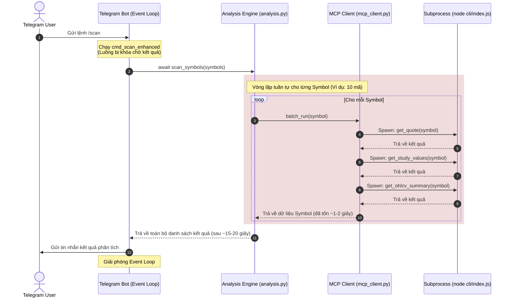
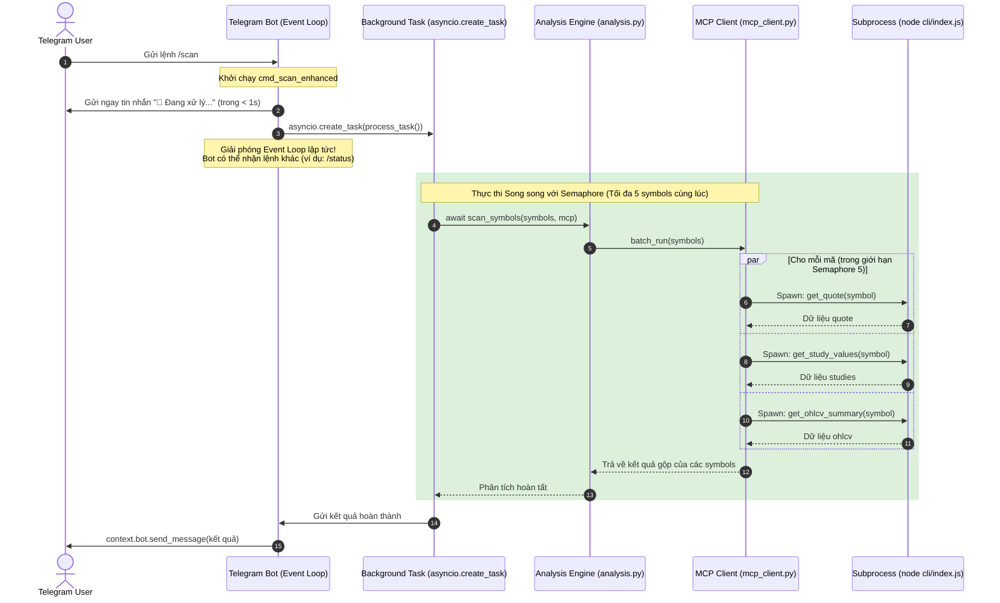

# Kiến trúc Hệ thống Telegram & MCP Client

Tài liệu này trình bày chi tiết về kiến trúc hệ thống của Trading Bot trước và sau khi được tối ưu hóa hiệu năng, cải thiện tốc độ phản hồi trên Telegram.

---

## 1. Kiến trúc Trước Nâng Cấp (Before Upgrade)

Hệ thống cũ xử lý tuần tự và đồng bộ, dẫn đến việc Event Loop của bot Telegram bị nghẽn (blocked) trong thời gian dài khi quét watchlist.

### Nhược điểm:
1. **Blocking Event Loop:** Toàn bộ lệnh quét chạy đồng bộ bằng `await` trực tiếp trong Handler của Telegram, khiến Bot không thể xử lý bất kỳ tin nhắn nào khác (như lệnh `/status`) trong suốt thời gian quét.
2. **Sequential Spawn:** Spawn tiến trình con Node.js một cách tuần tự (1 symbol chạy xong mới spawn symbol tiếp theo), đẩy tổng thời gian xử lý lên $O(N \times 3)$ tiến trình con.

---

## 2. Kiến trúc Sau Nâng Cấp (After Upgrade)

Kiến trúc mới áp dụng cơ chế xử lý bất đồng bộ hoàn toàn (Asynchronous Offloading) trên Telegram Bot, song song hóa tiến trình MCP thông qua Semaphore, và tối ưu hóa hàng đợi Semaphore ở lớp REST Fallback.

### Ưu điểm vượt trội:
1. **Telegram Phản hồi Tức thì (Offloading):** Telegram Bot phản hồi ngay tin nhắn xử lý và chuyển giao việc quét cho một `asyncio.create_task` ngầm. Điều này giải phóng luồng chính của bot, giúp bot hoạt động trơn tru không bị nghẽn.
2. **Quét Song song (MCP Parallelization):** Nhờ `asyncio.gather` và `asyncio.Semaphore(5)`, việc quét Watchlist diễn ra đồng thời. Thay vì chờ đợi từng mã một, tối đa 5 mã được xử lý song song, giảm thời gian chờ đợi tổng thể xuống còn khoảng 1/4 so với trước.
3. **Mở khóa Semaphore khi Rate Limit (REST Fallback):** Trong hàm `fetch_candles_with_retry`, Semaphore chỉ được giữ trong thời gian thực thi request (`session.get`). Nếu nhận mã lỗi `429` (Rate limited), Semaphore sẽ được **giải phóng ngay lập tức** trước khi sleep. Nhờ đó, các request của các symbol khác không bị block oan và vẫn có thể tiếp tục chạy.
